# Universidad Peruana de Ciencias Aplicadas

<p align="center">
  
</p>

### Carrera: Ingeniería de Software  
### Curso: Aplicaciones Web 
### Sección: 1ASI0730  
### Profesor: Oscar Ivan Villafuerte Bazan

## Informe de Trabajo Final  
**"BloomTech"**  
**Producto: "TimeBloom"**

**Team Members:**

- Guerrero Tomas, Nelson Fabrizio **U202222745**
- Vásquez Villalobos, Elverth Jair **U202213070**
- Huaman Hinostroza, Milenio **U20211C245**
- Asmad Padilla, Fatima **U20221B490**
- Inga Hernandez, Ayrton **U201924756**
- Ramirez Tello, Sebastian **U202316122**
  
**Abril, 2025**  

**URL del proyecto:** [https://github.com/Aplicaciones-Web-Grupo-2](https://github.com/Aplicaciones-Web-Grupo-2)

---

## Registro de Versiones del Informe

| Versión | Fecha       | Autor | Descripción |
|---------|-------------|-------|-------------|
| TB1     | 17/04/2025  |  Nelson Guerrero Tomas, Elverth Vásquez Villalobos, Milenio Huaman Hinostroza, Fatima Asmad Padilla, Ayrton Inga Hernandez, Sebastian Ramirez Tello | Desarrollo del capitulo 1 y 2 |
| TB1     | 24/04/2025  | Nelson Guerrero Tomas, Elverth Vásquez Villalobos, Milenio Huaman Hinostroza, Fatima Asmad Padilla, Ayrton Inga Hernandez, Sebastian Ramirez Tello | Desarrollo del capitulo 3 |
| TB1     | 26/04/2025  | Fatima Asmad Padilla, Nelson Guerrero Tomas | Correcciones del capitulo 1, 2 y 3 |
| TB1     | 27/04/2025  | Nelson Guerrero Tomas, Elverth Vásquez Villalobos, Milenio Huaman Hinostroza, Fatima Asmad Padilla, Ayrton Inga Hernandez, Sebastian Ramirez Tello | Desarrollo del capitulo 4 y 5 |
| TP1     | 16/05/2025  | Nelson Guerrero Tomas, Elverth Vásquez Villalobos, Milenio Huaman Hinostroza, Fatima Asmad Padilla, Ayrton Inga Hernandez, Sebastian Ramirez Tello | Desarrollo del Sprint Backlog 2 |

---

## Project Report Collaboration Insights

- **URL de la organización del proyecto:**  
  [https://github.com/Aplicaciones-Web-Grupo-2](https://github.com/Aplicaciones-Web-Grupo-2)

- **URL del repositorio del informe:**  
  [https://github.com/Aplicaciones-Web-Grupo-2/Documentation](https://github.com/Aplicaciones-Web-Grupo-2/Documentation)

Todas las tareas correspondientes a la entrega de la TB1 han sido completadas y están documentadas en el repositorio de GitHub de la organización del equipo. Para la elaboración del informe, cada integrante del equipo se encargó de redactar y generar gráficos en formato Markdown, según los puntos que le fueron asignados, realizando commits para dejar constancia del progreso en el repositorio.

Aquí se pueden visualizar todos los commits realizados para la TB1, lo cual evidencia el trabajo colaborativo del equipo.

<p align="center">
  
</p>

Para facilitar el desarrollo del trabajo, optamos por seguir el flujo de trabajo Gitflow. En este esquema, cada subtítulo del informe fue tratado como una feature, pero en lugar de crear ramas específicas para cada una, todos los miembros trabajamos directamente en la rama develop. De esta manera, la colaboración fue más fluida y la revisión constante del equipo permitió asegurar la calidad del contenido. Una vez finalizado el desarrollo de cada sección, todo el equipo revisaba el contenido y, tras obtener el consenso, se realizaba el merge hacia la rama develop. Además, organizamos las tareas considerando su nivel de dificultad, asegurando una distribución equitativa del trabajo entre todos los integrantes.

A lo largo del desarrollo de la TB1, trabajamos exclusivamente en la rama develop, evitando la creación de ramas adicionales. Solo utilizamos las ramas main, develop, feature y release según las necesidades del flujo de trabajo. Este enfoque nos permitió trabajar de manera ordenada y colaborativa, asegurando que cada parte del informe fuera desarrollada y revisada de forma continua antes de su integración final.

<p align="center">
  
</p>

---


# CONTENIDO

# Tabla de Contenidos

1. [Capítulo I: Introducción](#capítulo-i-introducción)<br>
   1.1. [Startup Profile](#startup-profile)<br>
      1.1.1. [Descripción de la Startup](#descripción-de-la-startup)<br>
      1.1.2. [Perfiles de integrantes del equipo](#perfiles-de-integrantes-del-equipo)<br>
   1.2. [Solution Profile](#solution-profile)<br>
      1.2.1. [Antecedentes y problemática](#antecedentes-y-problemática)<br>
      1.2.2. [Lean UX Process](#lean-ux-process)<br>
         1.2.2.1. [Lean UX Problem Statements](#principio-1)<br>
         1.2.2.2. [Lean UX Assumptions](#principio-2)<br>
         1.2.2.3. [Lean UX Hypothesis Statements](#principio-3)<br>
         1.2.2.4. [Lean UX Canvas](#principio-4)<br>
   1.3. [Segmentos objetivo](#lean-ux-problem-statements-assumptions-hypothesis-statements-canvas-segmentos-objetivo)<br>
2. [Capítulo II: Requirements Elicitation & Analysis](#capítulo-ii-requirements-elicitation-analysis)<br>
   2.1. [Competidores](#competidores)<br>
      2.1.1. [Análisis competitivo](#análisis-competitivo)<br>
      2.1.2. [Estrategias y tácticas frente a competidores](#estrategias-y-tácticas-frente-a-competidores)<br>
   2.2. [Entrevistas](#entrevistas)<br>
      2.2.1. [Diseño de entrevistas](#diseño-de-entrevistas)<br>
      2.2.2. [Registro de entrevistas](#registro-de-entrevistas)<br>
      2.2.3. [Análisis de entrevistas](#análisis-de-entrevistas)<br>
   2.3. [Needfinding](#needfinding)<br>
      2.3.1. [User Personas](#user-personas)<br>
      2.3.2. [User Task Matrix](#user-task-matrix)<br>
      2.3.3. [User Journey Mapping](#user-journey-mapping)<br>
      2.3.4. [Empathy Mapping](#empathy-mapping)<br>
      2.3.5. [As-is Scenario Mapping](#as-is-scenario-mapping)<br>
   2.4. [Ubiquitous Language](#ubiquitous-language)<br>
3. [Capítulo III: Requirements Specification](#capítulo-iii-requirements-specification)<br>
   3.1. [To-Be Scenario Mapping](#to-be-scenario-mapping)<br>
   3.2. [User Stories](#user-stories)<br>
   3.3. [Impact Mapping](#impact-mapping)<br>
   3.4. [Product Backlog](#product-backlog)<br>
4. [Capítulo IV: Product Design](#capítulo-iv-product-design)<br>
   4.1. [Style Guidelines](#style-guidelines)<br>
      4.1.1. [General Style Guidelines](#general-style-guidelines)<br>
      4.1.2. [Web Style Guidelines](#web-style-guidelines)<br>
   4.2. [Information Architecture](#information-architecture)<br>
      4.2.1. [Organization Systems](#organization-systems)<br>
      4.2.2. [Labeling Systems](#labeling-systems)<br>
      4.2.3. [SEO Tags and Meta Tags](#seo-tags-and-meta-tags)<br>
      4.2.4. [Searching Systems](#searching-systems)<br>
      4.2.5. [Navigation Systems](#navigation-systems)<br>
   4.3. [Landing Page UI Design](#landing-page-ui-design)<br>
      4.3.1. [Landing Page Wireframe](#landing-page-wireframe)<br>
      4.3.2. [Landing Page Mock-up](#landing-page-mock-up)<br>
   4.4. [Web Applications UX/UI Design](#web-applications-uxui-design)<br>
      4.4.1. [Web Applications Wireframes](#web-applications-wireframes)<br>
      4.4.2. [Web Applications Wireflow Diagrams](#web-applications-wireflow-diagrams)<br>
      4.4.2. [Web Applications Mock-ups](#web-applications-mock-ups)<br>
      4.4.3. [Web Applications User Flow Diagrams](#web-applications-user-flow-diagrams)<br>
   4.5. [Web Applications Prototyping](#web-applications-prototyping)<br>
   4.6. [Domain-Driven Software Architecture](#domain-driven-software-architecture)<br>
      4.6.1. [Software Architecture Context Diagram](#software-architecture-context-diagram)<br>
      4.6.2. [Software Architecture Container Diagrams](#software-architecture-container-diagrams)<br>
      4.6.3. [Software Architecture Components Diagrams](#software-architecture-components-diagrams)<br>
   4.7. [Software Object-Oriented Design](#software-object-oriented-design)<br>
      4.7.1. [Class Diagrams](#class-diagrams)<br>
      4.7.2. [Class Dictionary](#class-dictionary)<br>
   4.8. [Database Design](#database-design)<br>
      4.8.1. [Database Diagram](#database-diagram)<br>
5. [Capítulo V: Product Implementation, Validation & Deployment](#capítulo-v-product-implementation-validation-deployment)<br>
   5.1. [Software Configuration Management](#software-configuration-management)<br>
      5.1.1. [Software Development Environment Configuration](#software-development-environment-configuration)<br>
      5.1.2. [Source Code Management](#source-code-management)<br>
      5.1.3. [Source Code Style Guide & Conventions](#source-code-style-guide-conventions)<br>
      5.1.4. [Software Deployment Configuration](#software-deployment-configuration)<br>
   5.2. [Landing Page, Services & Applications Implementation](#landing-page-services-applications-implementation)<br>
      5.2.1. [Sprint 1](#sprint-1)<br>
         5.2.1.1. [Sprint Planning 1 2 3](#sprint-planning-1)<br>
         5.2.1.2. [Sprint Backlog 1 2 3](#sprint-backlog-1)<br>
         5.2.1.3. [Development Evidence for Sprint Review](#development-evidence-for-sprint-review)<br>
         5.2.1.4. [Testing Suite Evidence for Sprint Review](#testing-suite-evidence-for-sprint-review)<br>
         5.2.1.5. [Execution Evidence for Sprint Review](#execution-evidence-for-sprint-review)<br>
         5.2.1.6. [Services Documentation Evidence for Sprint Review](#services-documentation-evidence-for-sprint-review)<br>
         5.2.1.7. [Software Deployment Evidence for Sprint Review](#software-deployment-evidence-for-sprint-review)<br>
         5.2.1.8. [Team Collaboration Insights during Sprint](#team-collaboration-insights-during-sprint)<br>
          5.3. [Validation Interviews](#team-collaboration-insights-during-sprint)<br>
         5.3.1. [Diseño de Entrevistas](#team-collaboration-insights-during-sprint)<br>
         5.3.2. [Registro de Entrevistas](#team-collaboration-insights-during-sprint)<br>
         5.3.3. [Evaluaciones según heurísticas](#team-collaboration-insights-during-sprint)<br>
         5.4. [Video About-the-Product.](#team-collaboration-insights-during-sprint)<br>
[Conclusiones](#conclusiones)<br>
  [Conclusiones y recomendaciones](#conclusiones-y-recomendaciones)<br>
[Video About-the-Team](#video-about-the-team)<br>
[Bibliografía](#bibliografía)<br>
[Anexos](#anexos)<br>

---

**ABET – EAC - Student Outcome 5**  
**Criterio:** La capacidad de funcionar efectivamente en un equipo cuyos miembros juntos proporcionan liderazgo, crean un entorno de colaboración e inclusivo, establecen objetivos, planifican tareas y cumplen objetivos.  

En el siguiente cuadro se describen las acciones realizadas y conclusiones del equipo que sustentan el logro del ABET - EAC - Student Outcome 5:

| Criterio específico | Acciones realizadas | Conclusiones |
|---------------------|---------------------|--------------|
| Trabaja en equipo para proporcionar liderazgo en forma conjunta | Ayrton Inga Hernández y Sebastián Ramirez Tello: Asumieron el rol de facilitadores en las reuniones, promoviendo la participación equitativa y asegurando que las decisiones se tomaran en consenso. Fatima Andrea Asmad Padilla: Impulsó iniciativas de mejora dentro del equipo, motivando a los demás a colaborar y fortalecer las propuestas en conjunto. Nelson Guerrero Tomas: Coordinó acciones entre el equipo y otros grupos, asegurando que las metas compartidas se alinearan y fortalecieran la colaboración intergrupal. Milenio Huaman Hinostroza: Apoyó al equipo asumiendo tareas técnicas complejas y brindando orientación a sus compañeros para alcanzar los objetivos comunes. Elverth Vásquez Villalobos: Fomentó un ambiente de trabajo colaborativo, mediando en las diferencias de opinión y buscando siempre el consenso grupal.| El equipo logró crear un entorno colaborativo e inclusivo mediante la distribución equitativa de tareas, la planificación organizada de actividades y el establecimiento de metas claras y alcanzables. Cada integrante aportó desde sus fortalezas, promoviendo la participación activa, el apoyo mutuo y la resolución conjunta de problemas. Gracias a una comunicación abierta y una coordinación efectiva, el equipo cumplió los objetivos propuestos dentro de los plazos establecidos, demostrando compromiso, adaptabilidad y enfoque en el trabajo grupal. |
| Crea un entorno colaborativo e inclusivo, establece metas, planifica tareas y cumple objetivos | Nelson Guerrero Tomas: Fomentó un ambiente de respeto y participación durante las reuniones, promoviendo que todos los integrantes aportaran sus ideas. Elverth Jair Vásquez Villalobos: Propuso y ayudó a definir metas claras al inicio de cada fase del proyecto, asegurando que el equipo mantuviera una dirección común. Fatima Asmad Padilla: Se encargó de estructurar y distribuir tareas equitativamente entre los miembros, asegurando que las cargas de trabajo fueran justas. Milenio Huamán Hinostroza: Facilitó la integración de ideas diversas en las propuestas del equipo, garantizando que todas las voces fueran consideradas. Ayrton Inga Hernández: Apoyó la ejecución de tareas asignadas de manera puntual, contribuyendo al cumplimiento de los plazos establecidos. Sebastián Ramírez Tello: Realizó seguimientos periódicos del avance grupal, ayudando a identificar desviaciones y proponiendo acciones de mejora para alcanzar los objetivos. | El equipo logró crear un entorno colaborativo e inclusivo donde todos los miembros pudieron expresar sus ideas de manera respetuosa, fortaleciendo la participación activa. Se establecieron metas claras y se planificaron las tareas de forma organizada, lo que permitió distribuir responsabilidades equitativamente y mantener el enfoque en los objetivos del proyecto. La integración de diversas perspectivas enriqueció las soluciones propuestas, mientras que el seguimiento constante del avance facilitó la identificación oportuna de desvíos, asegurando así el cumplimiento exitoso de los objetivos establecidos. |

---


# Capítulo I: Introducción
## 1.1. Startup Profile
### 1.1.1. Descripción de la Startup

**BloomTech** es una startup dedicada a la investigacion y solucion problemas como la baja productividad en jovenes y adultos.

Nuestra principal solución, **TimeBloom** surge para enfrentar uno de los problemas más comunes y perjudiciales en estudiantes y jóvenes profesionales: la procrastinación. Nuestro objetivo es ayudar a las personas a cumplir sus metas personales y profesionales, no solo organizándolas, sino también manteniendo la motivación durante todo el proceso.

TimeBloom es una plataforma digital que integra múltiples funcionalidades: gestión de metas y hábitos, técnicas de estudio como el método Pomodoro y un sistema de recompensas basado en niveles y puntos. Además, proporciona 
notificaciones inteligentes y un dashboard visual que permite monitorear el progreso en áreas clave como estudio y gestion de hábitos hábitos.

**Visión**

Ser la plataforma líder en productividad consciente, donde las personas no solo logren más, sino que también  aprendan a gestionar su energía mental y encuentren satisfacción duradera en el camino hacia sus metas.

**Misión**

Empoderar a los usuarios a través de herramientas y experiencias que conecten su propósito personal con acciones diarias, promoviendo una productividad sostenible.

### 1.1.2. Perfiles de integrantes del equipo
---

#### **Nelson Fabrizio Guerrero Tomas – Ingeniería de Software – U202222745**  


Mi nombre es Nelson Fabrizio Guerrero Tomas. tengo 20 años, estudiante de la carrera Ingenieria de Software (UPC), actualmente estoy cursando mi 5to ciclo de la carrera. Considero que soy colaborativo y me gusta consultar cualquier duda que tengo, para realizar un buen proyecto, esto se evidente en los proyectos entregados por mi equipo de trabajo. Uno de mis pasatiempos favoritos es nadar y escuchar musica, pero ultimamente la lectura y las artes marciales me esta agrando muchisimo.


---

#### **Fatima Andrea Asmad Padilla – Ingeniería de Software – U20221B490**  


Mi perfil se caracteriza por la responsabilidad, disciplina y compromiso en cada tarea que realizo, buscando siempre dar lo mejor de mí en cualquier proyecto o actividad asignada. Actualmente curso el sexto ciclo de la carrera de Ingeniería de Software, lo cual me ha permitido adquirir una base sólida en distintas áreas del desarrollo tecnológico.


---

#### **Ayrton Damian Inga Hernandez – Ingeniería de Software – U201924756**  


Soy estudiante de Ingenieria de Software en la UPC. Me caracterizo por dar todo lo posible tanto en los trabajos como en la vida personal, cuento con conocimientos impartidos anteriormente que me ayudarán a desarrollar este nuevo projecto de forma correcta y a llevar un buen trabajo en equipo.


---

#### **Elverth Jair Vasquez Villalobos – Ingeniería de Software – U202213070**  


Mi perfil se basa en ser una persona que cuando enfrenta un problema no se rinde hasta encontrar una solución. Considero que tengo una buena capacidad de análisis al momento de realizar algoritmos necesarios para el funcionamiento de algunos requerimientos en el software. Así mismo, me gusta siempre estar en comunicación con mi equipo de trabajo de una manera asertiva. Me apasiona el mundo de la tecnología y el emprendimiento, por ello trato de aportar al desarrollo del startup con mis habilidades en programación e investigación.

---

#### **Milenio Huaman Hinostroza – Ingeniería de Software – U20211c245**  

Soy estudiante de Ingeniería de Software con enfoque en el desarrollo de aplicaciones web y soluciones digitales. Manejo tecnologías como HTML5, CSS3, JavaScript, Vue.js para el frontend, y C# con ASP.NET Core para el backend, permitiéndome contribuir de forma integral al proyecto.

Dentro del equipo BloomTech, aporto en la planificación de funcionalidades, el diseño de arquitecturas eficientes, la implementación de módulos clave como el sistema de recompensas, así como en la organización de tareas y gestión de versiones en GitHub. Mi interés principal es crear soluciones tecnológicas que impacten positivamente en el bienestar y la eficiencia de las personas, siguiendo metodologías ágiles de desarrollo como Lean UX y Scrum.

---

#### **Sebastian Ramirez Tello – Ingeniería de Software – U202316122**  


Me llamo Sebastián Ramírez, y estoy cursando el 5to ciclo de Ingeniería de Software. Me considero una persona que se destaca en el trabajo en equipo. Me adapto rápidamente a nuevas situaciones y aprendo con facilidad, lo que me permite enfrentar desafíos con confianza. Valoro mucho el respeto y la cooperación en un entorno de equipo, y siempre busco contribuir a un ambiente positivo.


---
## 1.2. Solution Profile
### 1.2.1. Antecedentes y Problemática

La procrastinación académica es un fenómeno ampliamente documentado en la literatura científica, caracterizado por la postergación voluntaria de actividades académicas a pesar de conocer las consecuencias negativas que esto conlleva. En el contexto universitario peruano, estudios recientes han evidenciado que un porcentaje significativo de estudiantes presenta altos niveles de procrastinación, asociados a factores como la ansiedad, la baja motivación y la falta de estrategias de autorregulación ([Steel, 2007]; [Picho & Salaman, 2020]).

La procrastinación impacta negativamente en el rendimiento académico y el bienestar emocional de los estudiantes, manifestándose principalmente en la postergación de tareas hasta el último momento. A pesar de la disponibilidad de herramientas digitales de gestión de tiempo, muchas de ellas carecen de componentes motivacionales o de apoyo emocional, lo que contribuye a su abandono temprano.

---

#### Aplicación de la técnica 5W2H

- **Who (¿Quiénes son los afectados?)**  
  Estudiantes universitarios y jóvenes profesionales que enfrentan desafíos para gestionar eficazmente su tiempo y cumplir con sus responsabilidades académicas o laborales.

- **What (¿Qué sucede?)**  
  Tienden a posponer tareas importantes, lo que conduce a bajo rendimiento académico y altos niveles de estrés y ansiedad.

- **Where (¿Dónde ocurre?)**  
  Principalmente en entornos educativos y laborales que requieren autodisciplina y autogestión del tiempo.

- **When (¿Cuándo ocurre?)**  
  Durante períodos de alta carga académica o laboral, especialmente ante tareas percibidas como difíciles, extensas o poco atractivas.

- **Why (¿Por qué ocurre?)**  
  Debido a factores como ansiedad ante evaluaciones, falta de motivación, deficiencias en estrategias de autorregulación y perfeccionismo ([Amelica; ResearchGate]).

- **How (¿Cómo se manifiesta?)**  
  A través de la acumulación de pendientes, la postergación constante y sentimientos de culpa o frustración al no cumplir con las obligaciones.

- **How Much (¿Qué tan grave es el impacto?)**  
  Se estima que entre el 80% y el 95% de los estudiantes universitarios procrastinan, y aproximadamente el 50% lo hace de manera crónica ([Steel, 2007]; [Revista Científica de Sevilla, 2023]; [Repositorio Continental, 2020]).

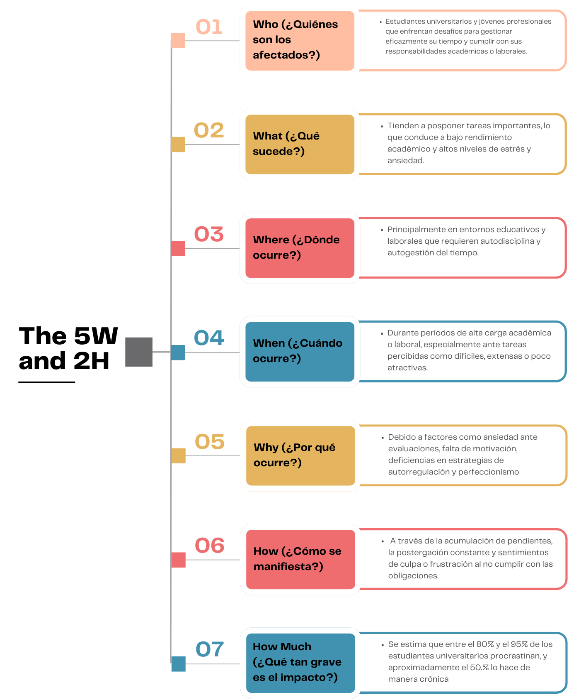

---

### 1.2.2 Lean UX Process.

Esta sección desarrolla la visión del modelo de negocio que soporta nuestra solución, basado en el enfoque Lean UX. Se identifican los segmentos de clientes, sus principales necesidades (pain points), los vacíos actuales (gaps), la estrategia de valor, y el segmento inicial al que se enfocará la primera versión del producto. Además, se detallan los supuestos (assumptions) e hipótesis de diseño (hypothesis statements) que guiarán la validación del producto.

#### 1.2.2.1. Lean UX Problem Statements

Problem Statement 1:<br>

Los estudiantes universitarios de 18 a 25 años enfrentan dificultades para gestionar sus metas académicas y mantener la constancia en sus estudios. Aunque utilizan herramientas de organización, muchas veces abandonan su uso debido a la falta de conexión emocional y motivacional que los ayude a sostener hábitos a largo plazo. Esta desconexión emocional contribuye a la procrastinación y al sentimiento de frustración, afectando su rendimiento académico.<br>

Problem Statement 2:<br>

Los jóvenes profesionales de 22 a 30 años que trabajan de manera remota o freelance experimentan altos niveles de procrastinación crónica y dificultades para mantener una rutina productiva. A pesar de tener flexibilidad en sus horarios, la falta de apoyo emocional y motivacional genera ansiedad, desorganización y sensación de aislamiento, lo que impacta negativamente en su desempeño y bienestar.<br>

Problem Statement 3:<br>

Estudiantes y jóvenes profesionales que han probado aplicaciones de productividad como Notion, Trello o Google Keep suelen abandonar estas herramientas con el tiempo. Aunque cumplen funciones técnicas de organización, no satisfacen su necesidad de acompañamiento emocional ni promueven una conexión personal con el proceso productivo, lo que dificulta la adopción sostenida de hábitos y genera una sensación de desmotivación progresiva.<br>

#### 1.2.2.2. Lean UX Assumptions

**¿Quiénes son nuestros usuarios?**

Estudiantes universitarios (18-25 años) que buscan mejorar su concentración y administrar mejor su tiempo de estudio y Jóvenes profesionales (22-30 años) que trabajan de forma remota o híbrida y quieren maximizar su productividad diaria.

**¿Dónde encaja nuestro producto en su trabajo o vida?**

Se usa durante sesiones de estudio o trabajo, especialmente en ambientes donde hay muchas distracciones (casa, coworkings, bibliotecas). Encaja como herramienta complementaria a planners, apps de calendario o listas de tareas.

**¿Qué problema podría afrontar nuestro producto y cómo podemos resolverlo?**

Problema: Les cuesta mantener la concentración durante periodos largos de trabajo.<br>
Solución: TimeBloom aplica la técnica Pomodoro para dividir el tiempo en bloques productivos con pausas programadas. Además, motiva con un sistema de recompensas gamificado que refuerza el hábito de enfocarse.

**¿Cuándo y cómo se utiliza?**

Durante el horario de estudio o jornada laboral.El usuario inicia sesiones Pomodoro (25/5 o configurables), realiza una actividad específica y obtiene puntos o recompensas tras completar ciclos.

**¿Qué características son importantes?**

- Temporizador configurable con ciclos Pomodoro.
- Sistema de recompensas/puntos por completar sesiones.
- Historial o estadísticas de productividad.
- Notificaciones y alertas para inicio/fin de sesiones.
- UI clara, minimalista y sin distracciones.

**¿Cómo debe verse nuestro producto y cómo comportarse?**

- Visualmente: Interfaz limpia, moderna y motivadora (tipo dashboard gamificado).
- Comportamiento: Fluido, con feedback inmediato al usuario (sonidos, animaciones suaves, insignias al ganar recompensas). Debe ser rápido de configurar y fácil de usar desde el primer momento.

#### 1.2.2.3. Lean UX Hypothesis Statements

1. **Creemos que** permitir a los usuarios establecer metas personales conectadas a un propósito emocional **ayudará a mantener su constancia en el cumplimiento diario**,  
   **y sabremos que estamos en lo correcto** cuando al menos el 70% de los usuarios registren actividades por 7 días consecutivos.

2. **Creemos que** ofrecer frases motivacionales y micro-recompensas en momentos críticos **disminuirá los eventos de procrastinación**,  
   **y sabremos que estamos en lo correcto** cuando la tasa de "snoozes" sin acción posterior se reduzca en un 30%.

3. **Creemos que** mostrar un dashboard de progreso visual **mejorará el nivel de satisfacción de los usuarios con respecto a su avance personal**,  
   **y sabremos que estamos en lo correcto** cuando el 60% de los usuarios consulte su dashboard al menos 3 veces por semana.

4. **Creemos que** integrar sesiones de meditación breve como herramienta de pausa activa **reducirá los niveles de estrés asociados al estudio o trabajo**,  
   **y sabremos que estamos en lo correcto** mediante encuestas donde al menos el 50% de usuarios reporten menor sensación de ansiedad después de 2 semanas de uso.

5. **Creemos que** gamificar el avance mediante niveles y recompensas simbólicas **incrementará la retención semanal de usuarios**,  
   **y sabremos que estamos en lo correcto** si superamos una retención semanal del 50% en el primer mes posterior al lanzamiento de la versión beta.

#### 1.2.2.4. Lean UX Canvas

El Lean UX Canvas es una herramienta que ayuda a definir y validar hipótesis sobre el producto de forma colaborativa y ágil. Permite alinear al equipo en torno al problema, los usuarios, sus necesidades y las soluciones propuestas, fomentando el aprendizaje continuo y la toma de decisiones basadas en evidencia. A continuación, se presenta el Lean UX Canvas aplicado al proyecto.

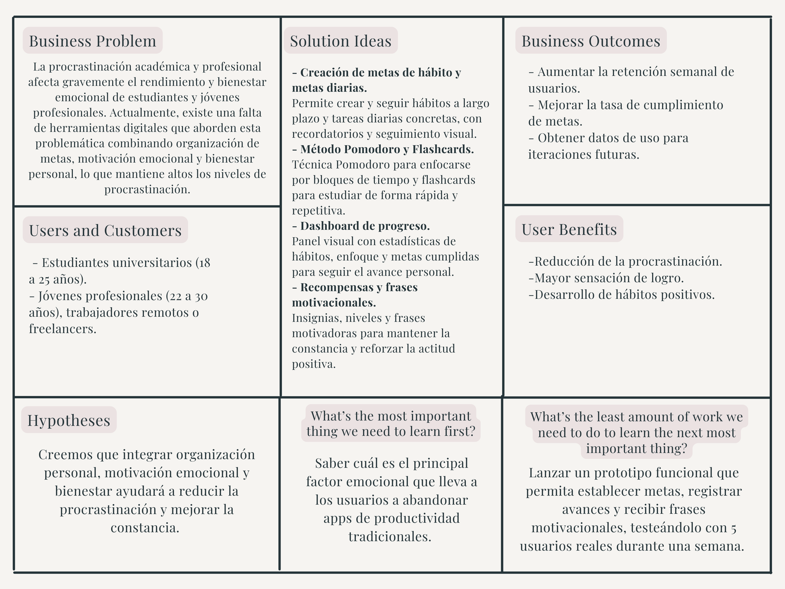

---
## 1.3. Segmentos Objetivo

Esta sección describe los segmentos de usuarios asociados al dominio del problema de la procrastinación académica y profesional, incluyendo sus características demográficas principales y sustentándolos con información estadística.

---

###  Segmento principal: Estudiantes universitarios (18 a 25 años)

**Descripción:**  
Estudiantes de pregrado que, debido a la carga académica, la presión de plazos y la exposición constante a distracciones digitales, tienden a postergar actividades académicas importantes. Este segmento experimenta altos niveles de procrastinación, afectando su desempeño académico y bienestar emocional.

**Características demográficas:**
- Edad: 18 a 25 años.
- Nivel educativo: Estudios universitarios en curso.
- Ocupación: Estudiantes a tiempo completo o parcial.
- Ubicación: Principalmente en zonas urbanas con acceso a internet y dispositivos digitales.
- Dispositivos principales: Smartphone y laptop.
- Competencia digital: Alta (uso de plataformas de gestión académica, apps de productividad, redes sociales).

**Información estadística de respaldo:**
- Entre el 80% y el 95% de los estudiantes universitarios procrastinan, y aproximadamente el 50% lo hace de manera crónica ([Steel, 2007]).
- Un estudio peruano de la Universidad Continental (Picho & Salaman, 2020) concluye que la procrastinación académica es un fenómeno altamente prevalente, asociado con bajos niveles de autorregulación emocional y mayores niveles de ansiedad.

---

### Segmento secundario: Jóvenes profesionales (22 a 30 años)

**Descripción:**  
Jóvenes egresados que inician su vida laboral en entornos flexibles o remotos. Debido a la falta de supervisión directa y la necesidad de autogestionar su tiempo, experimentan dificultades similares en la organización de sus actividades, lo que genera procrastinación y disminución en su productividad personal y profesional.

**Características demográficas:**
- Edad: 22 a 30 años.
- Nivel educativo: Egresados técnicos o universitarios.
- Ocupación: Freelancers, trabajadores remotos o profesionales en sus primeros años de carrera.
- Ubicación: Zonas urbanas y zonas conectadas digitalmente.
- Dispositivos principales: Laptop y smartphone.
- Competencia digital: Muy alta (uso de herramientas colaborativas, plataformas de trabajo remoto, apps de gestión de proyectos).

**Información estadística de respaldo:**
- Estudios recientes revelan que la procrastinación no desaparece tras el egreso universitario: cerca del 50% de jóvenes profesionales sigue procrastinando tareas importantes, impactando su desempeño laboral y su bienestar emocional ([Revista Científica Fuentes, 2023]; [Repositorio Continental, 2020]).
---
# Capítulo II: Requirements Elicitation & Analysis
## 2.1 Competidores

**FocusMate**<br>


FocusMate es una plataforma de productividad basada en la rendición de cuentas mediante sesiones de co-working virtual. Los usuarios se emparejan en línea con otra persona para trabajar en silencio durante intervalos de tiempo definidos, lo que promueve la concentración a través de la presencia mutua. Su propuesta de valor radica en combatir la procrastinación mediante el compromiso social y la estructura temporal.

**Todoist**<br>

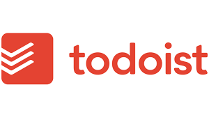

Todoist es una de las aplicaciones más populares de gestión de tareas personales y profesionales. Su diseño minimalista y sus potentes funciones de organización (etiquetas, prioridades, recordatorios, proyectos compartidos) la convierten en una herramienta versátil para quienes buscan mantener el control sobre sus responsabilidades diarias. Aunque carece de elementos emocionales o motivacionales, se destaca por su eficiencia y escalabilidad.

**Trello**<br>


Trello es una herramienta de gestión de proyectos visualmente intuitiva basada en el sistema Kanban. Es ampliamente utilizada en entornos colaborativos gracias a su estructura de tableros, listas y tarjetas personalizables. Trello permite a los equipos planificar, coordinar y ejecutar tareas de manera clara y visual, pero se enfoca más en la organización de flujos de trabajo que en la experiencia personal del usuario.

**Forest**<br>


Forest es una aplicación que combina técnicas de enfoque con un estilo gamificado que premia la concentración. Cada vez que el usuario evita distracciones y se mantiene productivo, crece un árbol virtual; si interrumpe la sesión, el árbol muere. Esta metáfora ecológica convierte el tiempo de concentración en una experiencia visual y emocional, fomentando hábitos de trabajo sostenibles, especialmente entre usuarios jóvenes.

### 2.1.1. Análisis competitivo.

<table>
   <tr>
      <td align="center" colspan="6">Competitive Analysis Landscape</td>
   </tr>
   <tr>
      <td colspan="2" rowspan="2">¿Porqué llevar a cabo este análisis?</td><td colspan="4">Este análisis nos permitirá conocer nuestra posición frente a nuestros competidores. Además, podremos identificar nuestras fortalezas y debilidades.</td>
   </tr>
   <tr>
      <td colspan="4">¿Cómo podríamos resolver el problema de procrastinación en los jóvenes estudiantes y emprendedores de manera que no se desmotiven durante el intento?</td>
   </tr>
   <tr align="center">
      <td colspan="2"></td><td>TimeBloom</td><td>TODOIST</td><td>TRELLO</td><td>FOREST</td>
   </tr>
   <tr>
      <td rowspan="2">Perfil</td><td>Overview</td><td>Es una aplicación de gestión de tareas con recursos de bienestar emocional para ayudar en la productividad y el cansancio mental.</td><td>Es una aplicación de gestión de tareas y listas por hacer, que ayuda a organizar la vida personal y profesional de un usuario.</td><td>Es una herramienta colaborativa que ayuda a individuos o equipos a organizar tareas para una mayor productividad.</td><td>Es una app de productividad que te ayuda a mantenerte enfocado alejándote del celular.</td>
   </tr>
   <tr>
      <td>Ventaja competitiva ¿Qué valor ofrece a los clientes?</td><td>Planificación de tareas y técnicas de estudio, fomento de la motivación productiva y evaluación de mejora.</td><td>Agrupa tareas dependiendo de áreas de la vida y división de tareas principales en subtareas.</td><td>Organización de tareas flexible tanto para uso personal o profesional.</td><td>Uso de técnicas para mejorar la concentración evitar usar el celular.</td>
   </tr>
   <tr>
      <td rowspan="2">Perfil de Marketing</td><td>Mercado objetivo</td><td>Estudiantes universitarios y jóvenes profesionales.</td><td>Profesionales independientes, estudiantes y pequeños equipos.</td><td>Freelancers, planificadores de eventos y para uso personal.</td><td>Estudiantes y FreeLancers que quieran enfocarse sin distracciones.</td>
   </tr>
   <tr>
      <td>Estrategias de marketing</td><td>Enfoque en que el producto se venda solo por su funcionalidad y anuncios por Google.</td><td>Enfoque en que el producto se venda solo por su experiencia y simplicidad, historias de usuarios y anuncios.</td><td>Enfoque en que el producto se venda solo, blog con artículos sobre productividad e integraciones con herramientas populares.</td><td>Asociación con ONGs y promueve su enfoque como acción con impacto ambiental.</td>
   </tr>
   <tr>
      <td rowspan="3">Perfil de Producto</td><td>Productos & Servicios</td><td>Ofrece una plataforma que integre herramientas de enfoque y motivacionales para la continua salud mental.</td><td>Ofrece una plataforma de ayuda para aumentar la productividad por medio de tareas.</td><td>Ofrece un aumento de productividad por medio de tarjetas y colaboración en tiempo real.</td><td>Ofrece el establecimiento de un temporizador para mantenerte fuera del celular.</td>
   </tr>
   <tr>
      <td>Precios & Costos</td><td>Versión gratuita con funciones principales y suscripción de bajo costo para mayores herramientas.</td><td>Gratuito hasta 5 proyectos y suscripción de bajo costo por usuario.</td><td>Ofrece versión gratuita y suscripciones de bajo costo por usuario.</td><td>Versión gratis con funciones limitadas y versión de paga única de bajo costo.</td>
   </tr>
   <tr>
      <td>Canales de distribución (Web y/o Móvil)</td><td>- Plataforma web y móvil</td><td>- Plataforma web y móvil</td><td>- Plataforma web y móvil</td><td>- Plataforma web y móvil</td>
   </tr>
   <tr>
      <td rowspan="4">Análisis SWOT</td><td>Fortalezas</td><td>Enfoque en la salud mental para mejorar la motivación del usuario, multiplataforma y simplicidad de interfaz.</td><td>Simplicidad de interfaz, multiplataforma y posicionado mundialmente.</td><td>Facilidad de aprendizaje, atractivo visual y altamente personalizable.</td><td>Enfoque ambiental, recompensas visuales y diseño atractivo.</td>
   </tr>
   <tr>
      <td>Debilidades</td><td>Desarrollo aun en la fase inicial y poca experiencia dentro del mercado laboral.</td><td>Falta de herramientas para gestión de proyectos complejos y funciones importantes bloqueadas en la versión de prueba.</td><td>Funciones avanzadas bloqueadas por pago y propenso a ser caótico por una mala organización.</td><td>Funciones limitadas más allá del enfoque individual, no es adaptable al trabajo en equipo.</td>
   </tr>
   <tr>
      <td>Oportunidades</td><td>Potencial para expandir funciones, integración de extensiones y tendencia creciente de la salud mental.</td><td>Enfocado en el público que prefiere una interfaz menos visual.</td><td>Enfocado en la colaboración de equipos y el uso de extensiones para aumentar la funcionalidad.</td><td>Integracion con herramientas de productividad y expansión a empresas o escuelas</td>
   </tr>
   <tr>
      <td>Amenazas</td><td>Competencia con apps ya establecidas con otros tipos de funcionalidades, limitado desarrollo por el periodo de tiempo establecido.</td><td>Personalización limitada y falta de uso de calendarios.</td><td>EUsuarios avanzados migran a plataformas más complejas y fuerte competencia entre plataformas colaborativas.</td><td>Desmotivación por mecánica repetitiva y apps gratuitas pueden ofrecer alternativas similares.</td>
   </tr>
</table>
<br/>

### 2.1.2. Estrategias y tácticas frente a competidores.

##### Gestión del Tiempo y Técnicas de Estudio (Pomodoro)

- Estrategia: Ofrecer un módulo de gestión del tiempo que integre la técnica Pomodoro, diseñado específicamente para estudiantes y freelancers, orientado a combatir la procrastinación.

- Táctica: 
  - Temporizador Pomodoro: Un temporizador integrado que permite sesiones de enfoque, con alarmas y notificaciones de pausas cortas y descansos largos.
  - Personalización de Sesiones: Posibilidad de ajustar la duración de los intervalos de trabajo y descanso según la preferencia o el tipo de tarea.

Mientras aplicaciones como FocusMate utilizan el método Pomodoro en un formato de coworking virtual, nuestra solución se enfoca en adaptar la técnica de manera individual, permitiendo una mayor personalización del usuario sin necesidad de interacción externa.

##### Creación de Metas y Hábitos

- Estrategia: Facilitar el establecimiento y seguimiento de metas y hábitos, creando una estructura que motive a los usuarios a comprometerse con sus objetivos académicos o profesionales.

- Táctica:
  - Definición de Objetivos: Herramientas para que el usuario defina metas a corto y mediano plazo, con recordatorios y seguimiento de su progreso.
  - Plan de Hábitos: Integrar un sistema para registrar hábitos diarios (por ejemplo, lectura, ejercicio o estudio) y ver estadísticas sobre la consistencia en su ejecución.

A diferencia de las aplicaciones orientadas a listas de tareas genéricas (como Todoist o Trello), nuestro enfoque consiste en una planificación que fomente la mejora personal continua, priorizando la creación de hábitos que respalden la productividad y el bienestar.

##### Seguimiento del Progreso

- Estrategia: Proporcionar a los usuarios una visión clara y dinámica de su progreso para mantener la motivación y poder realizar ajustes en su estrategia de trabajo.

- Táctica:
  - Dashboard de Progreso: Un panel central que muestre estadísticas de sesiones Pomodoro completadas, metas alcanzadas y evolución en la formación de hábitos.
  - Análisis y Retroalimentación: Gráficos y reportes semanales que permitan identificar patrones, logros y áreas de mejora.

Al consolidar los datos en un formato visual y de fácil comprensión, se facilita la autogestión y la toma de decisiones, generando un valor diferencial frente a aplicaciones que solo registran tareas sin ofrecer análisis profundos.

##### Sistema de Recompensas Motivacionales

- Estrategia: Incentivar el cumplimiento de metas y la constancia a través de un sistema de recompensas que potencie la motivación intrínseca del usuario.

- Táctica:
  - Recompensas Virtuales: Otorgar medallas, puntos o logros digitales por completar sesiones de trabajo, alcanzar metas o mantener hábitos.
  - Gamificación Ligera: Integrar dinámicas simples de gamificación que reconozcan el esfuerzo y fomenten la competencia sana, sin sobrecargar el sistema.

Al combinar técnicas de gamificación con seguimiento concreto del progreso, la aplicación logra mantener a los usuarios comprometidos, diferenciándose de herramientas enfocadas únicamente en la organización de tareas.

## 2.2. Entrevistas.
### 2.2.1. Diseño de entrevistas.
#### Preguntas generales
- ¿Cuál es su nombre completo?
- ¿Cuántos años tienes?
- ¿Cuál es su situación actual? ¿Trabaja, estudia o ambos?
- ¿En qué ciudad resides?
- ¿Qué navegador es el que usa con mayor frecuencia?
- ¿Qué dispositivo utiliza con frecuencia para realizar tus actividades (móvil, laptop o pc) ? 
- ¿Qué sistema operativo usa el dispositivo que más frecuentas?
- ¿Qué aplicaciones o marcas reconoces que trabajen para ayudar a las personas a mejorar su productividad?
#### Preguntas para el segmento Estudiates Universitarios
- ¿Cómo sueles organizar tus tareas académicas? ¿ Usas alguna app o método en específico ?
- ¿Qué tan seguido sueles dejar tus tareas para último momento? ¿A que crees que se deba eso?
- ¿Qué herramientas digitales usas para organizar tus actividades?
- ¿Cómo te sueles sentir cuando sabes que tienes muchas tareas pendientes?
- ¿Qué te motiva a empezar una tarea que inicialmente no querías hacer?
- ¿Sientes que las herramientas y métodos que usas actualmente influyen emocionalmente en ti o simplemente te ayudan a organizarte?
- ¿Tienes alguna técnica que te ayude a concentrarte cuando tienes que estudiar o trabajar?
- ¿Cómo te sentirías si vieras tu progreso reflejado en estadísticas o dashboards?
- ¿Qué opinas de las apps que usan recompensas simbólicas como medallas, frases motivadoras o niveles?
- ¿Te sentirías más motivado si la app reconociera tus logros aunque sean pequeños?
- ¿Qué características debería tener una app para que realmente la uses todos los días?
- ¿Qué te haría abandonar una app después de pocos días de usarla?
- ¿Cómo te gustaría que se vea o sienta la app ideal para ayudarte a ser más productivo y sentirte mejor emocionalmente?
- ¿Estarías dispuesto a pagar por una app que te ayude a mejorar tu productividad?
#### Preguntas para el segmento Jóvenes Profesionales 
- ¿Cómo organizas tus actividades laborales y personales durante el día?
- ¿Qué dificultades enfrentas para mantenerte enfocado o cumplir tus tareas?
- ¿Qué aplicaciones o métodos usas actualmente para gestionar tu productividad?
- ¿En qué momentos sientes que más procrastinas o te desconcentras?
- ¿Qué tipo de tareas tiendes a postergar más y por qué?
- ¿Qué estrategias has intentado para evitar la procrastinación?
- ¿De qué maera manejas el estrés cuando tienes muchas responsabilidades?
- ¿Usas algún tipo de recurso como meditar o pausas activas para controlar la ansiedad ? ¿ Consideras que si te están funcionando?
- ¿Cual es tu motivación para realizar tu rutina diaria y tus actividades laborales?
- ¿Que buscas cuando te animas a descargar una app sobre productividad?
- ¿Que te hace seguir utilizando una app después de los primeros días?
- ¿Te resulta interesante la idea de recibir estadísticas o retroalimentación sobre tu progreso?
- ¿Qué opinas de tener un sistema de recompensas dentro de una app que premie tus logros diarios?
- ¿Estarías dispuesto a pagar por una app que te ayude a mejorar tu productividad?
### 2.2.2. Registro de entrevistas.
En esta sección se documenta la recolección de información a través de entrevistas realizadas a representantes de los segmentos objetivo. Para esta investigación, se consideraron dos grupos clave: Estudiantes universitarios (18 a 25 años) y Jóvenes profesionales (22 a 30 años). El propósito es comprender sus necesidades, desafíos y expectativas para el desarrollo de la aplicación, enfocada en mejorar la productividad de nuestros usuarios.

&nbsp;

| **Entrevista 1** |
|------------------|
| <strong>Nombre:</strong> liz Espinal Hinostroza |
| <strong>Edad:</strong> 18 |
| <strong>Procedencia:</strong> La Molina, Lima |
| <strong>Segmento:</strong> Estudiantes universitarios (18 a 25 años) |
| <strong>Resumen:</strong> Liz, una estudiante universitaria de 18 años que cursa Derecho en la UPC, se considera organizada pero tiende a procrastinar, especialmente cuando le falta motivación o presión. Usa un calendario académico y, a veces, el método Pomodoro, pero prefiere herramientas simples y funcionales. Se siente estresada y frustrada por la procrastinación, y su estrategia para iniciar tareas es dividirlas en partes pequeñas. Valora aplicaciones rápidas, visualmente atractivas y sin muchas notificaciones. Le parece útil la idea de un dashboard visual de progreso en TimeBloom, así como las recompensas simbólicas. Aceptaría pagar por la app si mejora su desempeño académico.|
| <strong>Enlace de video:</strong> [Microsoft Stream – Entrevistas](https://upcedupe-my.sharepoint.com/:v:/g/personal/u20221b490_upc_edu_pe/EdAwXosyHTVBouMP0u50SfoBJg2nHZJBvGK5OdCh9si1hg?e=C3ZjbO&nav=eyJyZWZlcnJhbEluZm8iOnsicmVmZXJyYWxBcHAiOiJTdHJlYW1XZWJBcHAiLCJyZWZlcnJhbFZpZXciOiJTaGFyZURpYWxvZy1MaW5rIiwicmVmZXJyYWxBcHBQbGF0Zm9ybSI6IldlYiIsInJlZmVycmFsTW9kZSI6InZpZXcifSwicGxheWJhY2tPcHRpb25zIjp7fX0%3D) |
| <strong>Foto del entrevistado:</strong><br> |

&nbsp;

| **Entrevista 2** |
|------------------|
| <strong>Nombre:</strong> Fabián Alonso Reyes Trujillano |
| <strong>Edad:</strong> 20 años |
| <strong>Procedencia:</strong> San Martin de Porres |
| <strong>Segmento:</strong> Estudiantes universitarios (18 a 25 años) |
| <strong>Resumen:</strong> Fabián es un joven de 20 años que estudia Ingeniería de Software en la UPC y vive en San Martín de Porres. Realiza sus actividades principalmente en su laptop, y utiliza su celular cuando está fuera de casa. Aunque tiende a procrastinar debido a la distracción, trata de ser responsable y está trabajando en mejorar ese hábito. Se organiza usando Notion y a veces anota en un cuaderno físico. Fabián reconoce que tener muchas tareas pendientes lo hace sentir ansioso, pero las fechas límite lo motivan a actuar. Está interesado en apps de productividad que permitan ver el progreso mediante dashboards, ofrezcan recompensas simbólicas y notificaciones. Considera importante que una app se sincronice con sus dispositivos y lo ayude a mantenerse organizado. Estaría dispuesto a pagar por una aplicación si demuestra ser realmente útil. Usa principalmente navegadores como Chrome y ha probado otros como Brave y Opera. |
| <strong>Enlace de video:</strong> [Microsoft Stream – Entrevistas](https://upcedupe-my.sharepoint.com/:v:/g/personal/u20221b490_upc_edu_pe/EdAwXosyHTVBouMP0u50SfoBJg2nHZJBvGK5OdCh9si1hg?e=C3ZjbO&nav=eyJyZWZlcnJhbEluZm8iOnsicmVmZXJyYWxBcHAiOiJTdHJlYW1XZWJBcHAiLCJyZWZlcnJhbFZpZXciOiJTaGFyZURpYWxvZy1MaW5rIiwicmVmZXJyYWxBcHBQbGF0Zm9ybSI6IldlYiIsInJlZmVycmFsTW9kZSI6InZpZXcifSwicGxheWJhY2tPcHRpb25zIjp7fX0%3D) |
| <strong>Foto del entrevistado:</strong><br>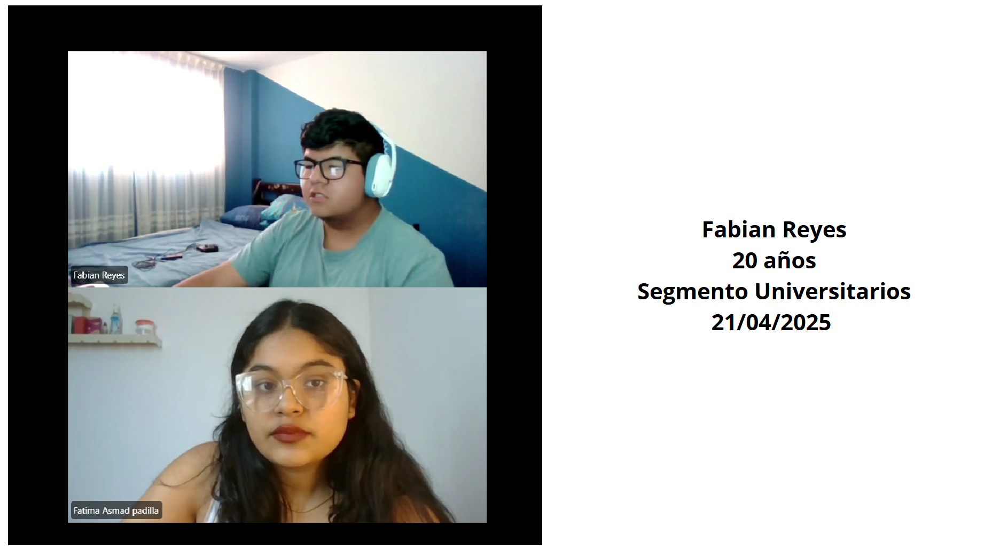 |

&nbsp;

| **Entrevista 3** |
|------------------|
| <strong>Nombre:</strong> Gonzalo Quintanilla  |
| <strong>Edad:</strong> 19 |
| <strong>Procedencia:</strong> Lima |
| <strong>Segmento:</strong> Estudiantes universitarios (18 a 25 años) |
| <strong>Resumen:</strong> Gonzalo es un joven de 19 años que estudia en la universidad y organiza sus actividades principalmente desde su laptop usando un Excel que él mismo programó, además de apoyarse en un blog de notas. No sigue un método estructurado, simplemente revisa sus pendientes y los marca al completarlos. Suele procrastinar cuando llega cansado, lo que lo lleva a aplazar tareas constantemente. Esta acumulación de pendientes le genera cansancio y sensación de agobio. Reconoce que las herramientas que usa no son las más adecuadas, pero las utiliza por practicidad. Le atrae la idea de una app con un dashboard que le muestre su progreso, ya que eso lo motivaría a seguir avanzando. También se sentiría más comprometido si la app ofreciera recompensas, logros o medallas. Valora que una aplicación sea dinámica, visualmente atractiva e intuitiva, y estaría dispuesto a pagar por una que realmente le ayude a mejorar su productividad. |
| <strong>Enlace de video:</strong> [Microsoft Stream – Entrevistas](https://upcedupe-my.sharepoint.com/:v:/g/personal/u20221b490_upc_edu_pe/EdAwXosyHTVBouMP0u50SfoBJg2nHZJBvGK5OdCh9si1hg?e=C3ZjbO&nav=eyJyZWZlcnJhbEluZm8iOnsicmVmZXJyYWxBcHAiOiJTdHJlYW1XZWJBcHAiLCJyZWZlcnJhbFZpZXciOiJTaGFyZURpYWxvZy1MaW5rIiwicmVmZXJyYWxBcHBQbGF0Zm9ybSI6IldlYiIsInJlZmVycmFsTW9kZSI6InZpZXcifSwicGxheWJhY2tPcHRpb25zIjp7fX0%3D) |
| <strong>Foto del entrevistado:</strong><br> |

&nbsp;

| **Entrevista 4** |
|------------------|
| <strong>Nombre:</strong> Iván Jesús Lavado Vallejos |
| <strong>Edad:</strong> 20 |
| <strong>Procedencia:</strong> Chiclayo, Lambayeque |
| <strong>Segmento:</strong> Jóvenes profesionales (22 a 30 años) |
| <strong>Resumen:</strong> Iván Lavado Vallejos es un joven de 20 años que estudia Ingeniería Civil y realiza prácticas en el consorcio JJ en Chiclayo, organiza sus actividades con agendas digitales en su laptop y celular. Aunque él reconoce que la procrastinación, especialmente en las mañanas, y las distracciones como el celular dificultan su enfoque, intenta combatirlas apagando el dispositivo durante tareas importantes. Usa métodos como escuchar música y meditar para manejar el estrés. Su motivación diaria es convertirse en un profesional exitoso. Está interesado en aplicaciones de productividad que ofrezcan estadísticas, retroalimentación y recompensas, y estaría dispuesto a pagar si estas funciones lo ayudan a mejorar. Usa principalmente laptop y celular con Windows e iOS. Iván no conoce muchas marcas de apps de productividad pero está dispuesto a explorar soluciones tecnológicas que lo ayuden a ser más eficiente. |
| <strong>Enlace de video:</strong> [Microsoft Stream – Entrevistas](https://upcedupe-my.sharepoint.com/:v:/g/personal/u20221b490_upc_edu_pe/EdAwXosyHTVBouMP0u50SfoBJg2nHZJBvGK5OdCh9si1hg?e=C3ZjbO&nav=eyJyZWZlcnJhbEluZm8iOnsicmVmZXJyYWxBcHAiOiJTdHJlYW1XZWJBcHAiLCJyZWZlcnJhbFZpZXciOiJTaGFyZURpYWxvZy1MaW5rIiwicmVmZXJyYWxBcHBQbGF0Zm9ybSI6IldlYiIsInJlZmVycmFsTW9kZSI6InZpZXcifSwicGxheWJhY2tPcHRpb25zIjp7fX0%3D) |
| <strong>Foto del entrevistado:</strong><br> |

&nbsp;

| **Entrevista 5** |
|------------------|
| <strong>Nombre:</strong> Antonella Silva Hernandez |
| <strong>Edad:</strong> 27 |
| <strong>Procedencia:</strong> Lima, Lima Metropolitana, SJL |
| <strong>Segmento:</strong> Jóvenes profesionales (22 a 30 años) |
| <strong>Resumen:</strong> La entrevistada, Antonella Silva, destaca su dificultad para mantener actividades en su vida privada debido a su rol como administradora y la alta carga de tareas que conlleva ese tipo de trabajo impidiendole realizar sus ejercicios para reducir estres. Nos comenta que la forma en la que trata de gestionar su productividad para tener mas tiempo privado es por medio de la creacion de horarios ya sea por excel o en una hoja fisica, pero continua buscando mas formas de lidiar con la falta de tiempo. Ademas nos menciona que, con respecto al uso de aplicaciones, es necesario que tenga una version movil y estaria dispuesta a pagar con tal de encontrar una aplicacion que sea dinamica y que principalmente le ayude en verdad a mejorar su productividad.|
| <strong>Enlace de video:</strong> [Microsoft Stream – Entrevistas](https://upcedupe-my.sharepoint.com/:v:/g/personal/u20221b490_upc_edu_pe/EdAwXosyHTVBouMP0u50SfoBJg2nHZJBvGK5OdCh9si1hg?e=C3ZjbO&nav=eyJyZWZlcnJhbEluZm8iOnsicmVmZXJyYWxBcHAiOiJTdHJlYW1XZWJBcHAiLCJyZWZlcnJhbFZpZXciOiJTaGFyZURpYWxvZy1MaW5rIiwicmVmZXJyYWxBcHBQbGF0Zm9ybSI6IldlYiIsInJlZmVycmFsTW9kZSI6InZpZXcifSwicGxheWJhY2tPcHRpb25zIjp7fX0%3D) |
| <strong>Foto del entrevistado:</strong><br> |

&nbsp;

| **Entrevista 6** |
|------------------|
| <strong>Nombre:</strong> Mario Pinedo del Río |
| <strong>Edad:</strong> 22 |
| <strong>Procedencia:</strong> Lima, Lima Metropolitana, San Miguel |
| <strong>Segmento:</strong> Jóvenes profesionales (22 a 30 años) |
| <strong>Resumen:</strong> El entrevistado, Mario Pinedo, es un desarrollador web que trabaja de forma híbrida. Suele procrastinar tareas repetitivas o que requieren mucha concentración, especialmente cuando se siente abrumado o distraído. Ha usado herramientas como Pomodoro y Todoist, pero le cuesta ser constante por lo tedioso de configurarlas. Le interesaría una app sencilla que combine tareas, bienestar emocional y recompensas simbólicas como logros o niveles. También valora mensajes motivacionales, retroalimentación rápida y funciones que lo ayuden a dar el primer paso al comenzar sus tareas. |
| <strong>Enlace de video:</strong> [Microsoft Stream – Entrevistas](https://upcedupe-my.sharepoint.com/:v:/g/personal/u20221b490_upc_edu_pe/EdAwXosyHTVBouMP0u50SfoBJg2nHZJBvGK5OdCh9si1hg?e=C3ZjbO&nav=eyJyZWZlcnJhbEluZm8iOnsicmVmZXJyYWxBcHAiOiJTdHJlYW1XZWJBcHAiLCJyZWZlcnJhbFZpZXciOiJTaGFyZURpYWxvZy1MaW5rIiwicmVmZXJyYWxBcHBQbGF0Zm9ybSI6IldlYiIsInJlZmVycmFsTW9kZSI6InZpZXcifSwicGxheWJhY2tPcHRpb25zIjp7fX0%3D) |
| <strong>Foto del entrevistado:</strong><br> |


### 2.2.3. Análisis de entrevistas.

En esta sección se presenta el análisis de las entrevistas realizadas a los usuarios objetivo de TimeBloom, con el fin de identificar patrones y características comunes en su experiencia con la productividad y las herramientas tecnológicas. A través de gráficos estadísticos, se visualizarán las principales preferencias y necesidades de los usuarios, permitiendo una comprensión más clara de sus expectativas respecto a las funcionalidades clave de la aplicación, como la simplicidad, la motivación, y las características visuales. Este análisis proporciona una base sólida para guiar el desarrollo y las decisiones estratégicas de la app.

En el análisis de las entrevistas, la procrastinación aparece como un patrón dominante en ambos segmentos (universitarios y jóvenes profesionales). Los principales factores que la provocan son el cansancio, las distracciones (especialmente el uso del celular), la falta de presión externa y el tedio frente a tareas repetitivas o exigentes.

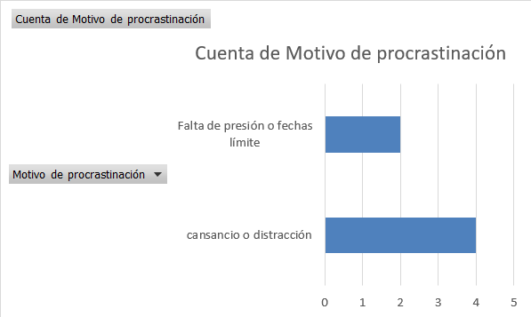

La mayoría de los entrevistados usa herramientas simples y personalizadas como Excel, Notion o cuadernos físicos, aunque buscan métodos más efectivos. Prefieren aplicaciones visuales, intuitivas y fáciles de configurar, valorando la practicidad. Esto indica una oportunidad para ofrecer una herramienta centralizada, visual y fácil de usar, sin una curva de aprendizaje elevada.

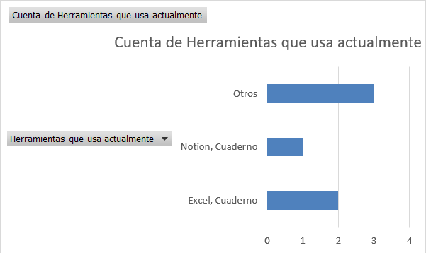

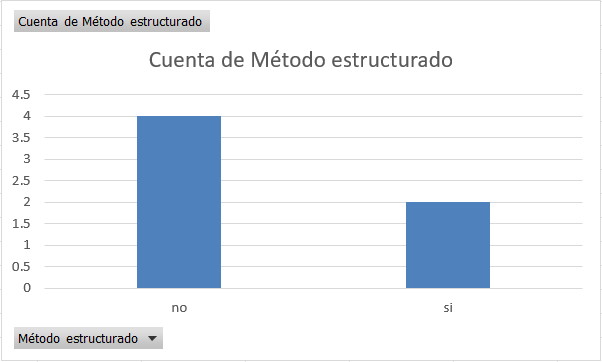

La mayoría de los entrevistados valora contar con un dashboard visual, ya que ver su progreso les motiva y les ayuda a mantenerse enfocados. Esta preferencia es común tanto en universitarios como en jóvenes profesionales.

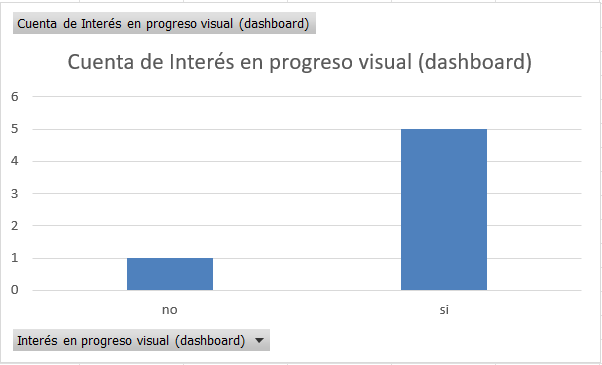

La mayoría de los entrevistados ven las recompensas simbólicas como un fuerte motivador para mantenerse productivos. Logros, medallas y niveles son percibidos como estímulos positivos, indicando que la gamificación puede ser clave para aumentar el compromiso con la app.

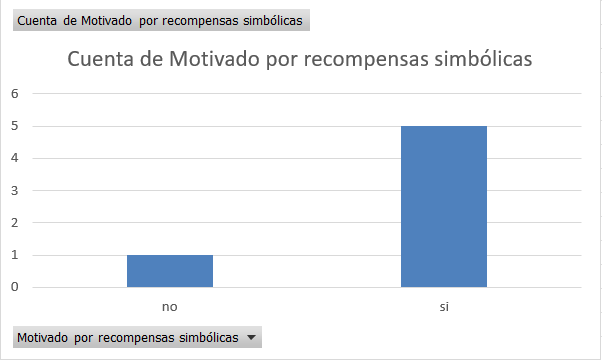

Todos los entrevistados usan laptop y celular, y valoran que las apps de productividad puedan sincronizarse entre ambos para facilitar su organización diaria.

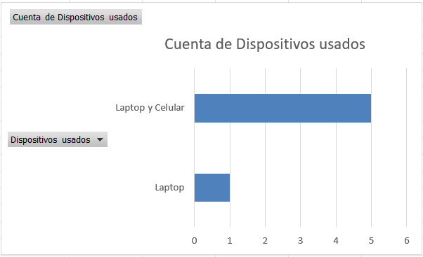

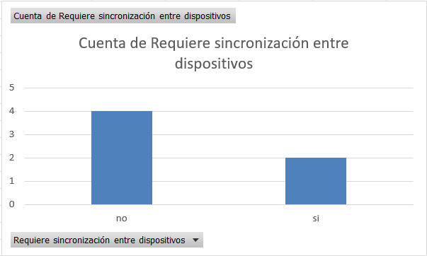

Las emociones asociadas a la productividad incluyen estrés, ansiedad y frustración, principalmente por la procrastinación y la carga de tareas. Sin embargo, herramientas que muestren el progreso visual y ofrezcan recompensas simbólicas podrían reducir estas emociones, generando motivación y satisfacción al completar tareas.

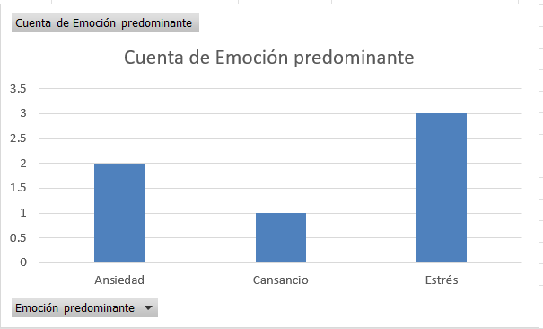

Los entrevistados valoran aplicaciones simples, visualmente atractivas y con un dashboard para seguir su progreso. La gamificación, como recompensas y logros, es importante, al igual que los mensajes motivacionales y la retroalimentación rápida para mantener la productividad y la motivación.

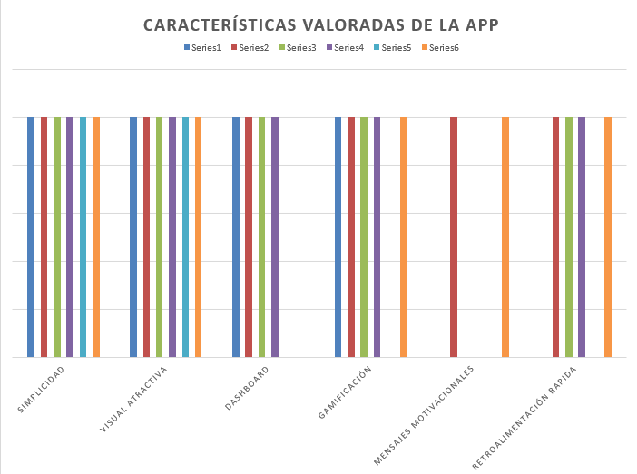

## 2.3. Needfinding.
#### 2.3.1. User Personas.

Para comprender mejor a nuestros usuarios objetivo, hemos desarrollado perfiles detallados que representan sus características, necesidades, motivaciones y frustraciones. Estos User Personas nos permiten diseñar soluciones más alineadas con sus expectativas y comportamientos reales. A continuación, presentamos a los perfiles que guiarán las decisiones de diseño y desarrollo del proyecto.

##### Segmento principal: Estudiantes universitarios (18 a 25 años)

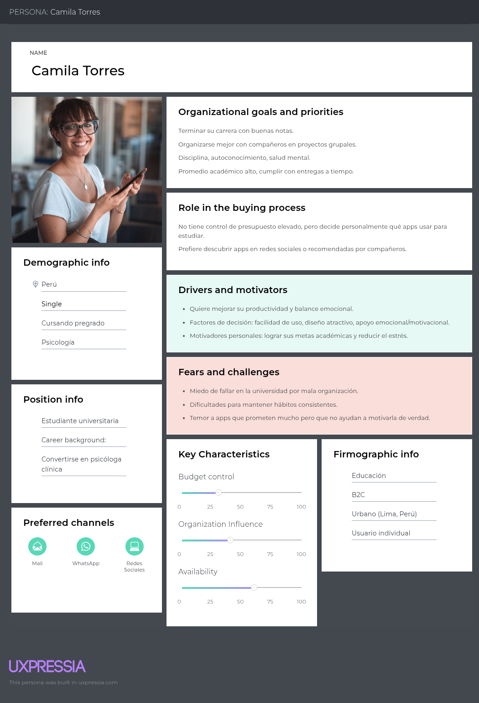

##### Segmento secundario: Jóvenes profesionales (22 a 30 años)


### 2.3.2. User Task Matrix.
El User Task Matrix es una herramienta que ayuda a visualizar qué actividades realizan nuestros usuarios, con qué frecuencia y cuán críticas son para su éxito. Esta técnica, también llamada matriz usuario-tarea, permite priorizar el esfuerzo de diseño y desarrollo hacia las funcionalidades de mayor impacto en la experiencia de usuario. Al cruzar la Frecuencia (“Always”, “Sometimes”, “Rarely”, “Never”) con la Importancia (“High”, “Medium”, “Low”), se identifica rápidamente qué tareas requieren un mayor grado de detalle y usabilidad.

| Task                                                | Camila Frequency (USE 1) | Camila Importance (USE 1) | Andrés Frequency (USE 2) | Andrés Importance (USE 2) |
|------------------------------------------------------|-----------------|------------------|------------------|-------------------|
| 1. Definir metas principales y subtareas             | Sometimes       | High             | Sometimes        | High              |
| 2. Dividir proyectos grandes en subtareas manejables | Sometimes       | High             | Sometimes        | High              |
| 3. Planificar rutinas diarias (mañana, tarde, noche) | Sometimes       | Medium           | Sometimes        | Medium            |
| 4. Marcar cumplimiento de hábitos/rutinas            | Always          | High             | Sometimes        | Medium            |
| 5. Iniciar sesión Pomodoro                           | Always          | High             | Sometimes        | Medium            |
| 6. Revisar flashcards durante descansos              | Sometimes       | Medium           | Rarely           | Low               |
| 7. Consultar dashboard de progreso                   | Always          | High             | Always           | High              |
| 8. Sincronizar eventos con Google Calendar           | Rarely          | Low              | Always           | High              |
| 9. Configurar notificaciones inteligentes            | Always          | High             | Always           | High              |
| 10. Reclamar recompensas (medallas, puntos)          | Sometimes       | Medium           | Sometimes        | Medium            |
| 11. Compartir logros en redes o comunidad            | Rarely          | Low              | Sometimes        | Low               |
| 12. Ajustar prioridades o reprogramar tareas         | Sometimes       | Medium           | Always           | High              |

### 2.3.3. User Journey Mapping.
 A través de este mapeo, identificamos cada etapa, pensamiento, emoción y necesidad que experimentan, desde el primer contacto hasta la adopción y uso continuo. Esta herramienta nos ayuda a detectar oportunidades de mejora, eliminar puntos de fricción y diseñar soluciones que realmente conecten con las expectativas y motivaciones de nuestros usuarios.

En esta seccion, se presenta un User Journey Mapping por por cada **User Personas**:  

1. **Camila Torres** (Estudiantes universitarios).


   
2. **Andres Rivas** (Jóvenes profesionales).


 
### 2.3.4. Empathy Mapping.

Para comprender de manera más profunda a nuestros usuarios, hemos desarrollado un Empathy Map que nos permite visualizar lo que piensan, sienten, dicen y hacen. Esta herramienta nos ayuda a ponernos en su lugar, identificar sus necesidades reales, y descubrir oportunidades de mejora en nuestra propuesta de valor. A través de este proceso, buscamos construir una conexión más auténtica con nuestros usuarios y diseñar soluciones que realmente respondan a sus expectativas y desafíos.

En esta seccion, se presenta un Empathy Mapping por cada **User Personas**:  

1. **Camila Torres** (Estudiantes universitarios).
   
   
   
2. **Andres Rivas** (Jóvenes profesionales).
   
 
 
### 2.3.5. As-is Scenario Mapping.

Para comprender mejor las necesidades, frustraciones y comportamientos de nuestros usuarios objetivo, hemos desarrollado un As-Is Scenario Mapping. Esta herramienta nos permite visualizar cómo interactúan actualmente con soluciones existentes (o la ausencia de ellas), identificando los puntos de dolor y oportunidades de mejora.

Este análisis ha sido realizado y visualizado mediante la herramienta Lucidchart. Se puede acceder al diagrama completo en el siguiente enlace [https://lucid.app/lucidspark/92b841d0-08ce-4fd3-b87d-7a17b662cafc/edit?viewport_loc=7154%2C-1841%2C2390%2C2345%2C0_0&invitationId=inv_fc4d10a1-d450-4682-93eb-fb2c0d8a6412](https://lucid.app/lucidspark/92b841d0-08ce-4fd3-b87d-7a17b662cafc/edit?viewport_loc=7154%2C-1841%2C2390%2C2345%2C0_0&invitationId=inv_fc4d10a1-d450-4682-93eb-fb2c0d8a6412)

Figura :

User Persona 1: Estudiantes Universitarios - Gestión del Tiempo

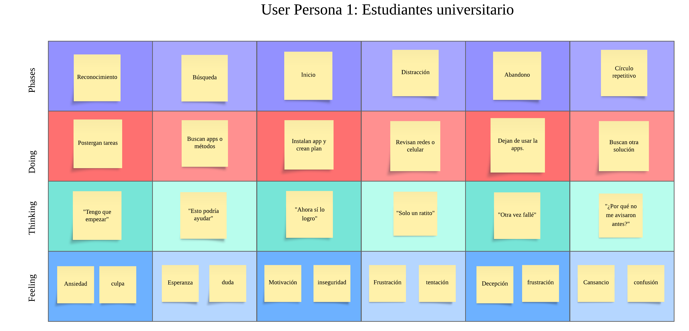
Nota: Este mapeo describe las experiencias actuales de los Estudiantes Universitarios en su busqueda de gestionar su tiempo.

Figura :

User Persona 2: Jóvenes Profesionales - Manejo de Distracciones

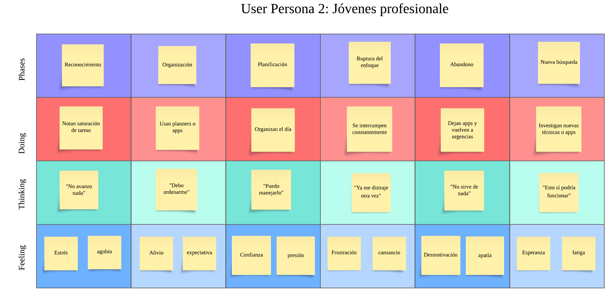
Nota: Este mapeo describe las experiencias actuales de los Jóvenes Profesionales en su manejo de distracciones.

## 2.4. Ubiquitous Language.

El Lenguaje Ubicuo establece un vocabulario común entre desarrolladores, diseñadores de experiencia de usuario y usuarios finales, asegurando una comunicación clara y coherente durante todo el desarrollo de la plataforma. Este glosario define los términos clave del dominio y se utiliza de forma consistente en la aplicación, la documentación y la interacción con los stakeholders.

| Term | Definition |
|------|-----------------|
| User | Persona que lo utiliza para mejorar su productividad y bienestar emocional. Puede ser estudiante universitario o joven profesional. |
| Focus Session | Periodo de trabajo o estudio en el que el usuario se concentra en una tarea específica usando . |
| Emotional State | Autoevaluación que el usuario realiza sobre su estado de ánimo antes y después de una Sesión de Enfoque. |
| Task | Actividad o compromiso que el usuario registra en   para trabajar durante una sesión. |
| Focus Streak | Serie consecutiva de días en que el usuario completa al menos una Sesión de Enfoque. |
| Microbreak | Pequeña pausa recomendada por la app para promover el bienestar entre sesiones largas. | 
| Focus Space | Ambiente virtual donde el usuario personaliza su experiencia de trabajo (música, mensajes motivacionales, etc.). |
| Daily Plan | Lista de tareas y sesiones planificadas para un día específico. |
| Wellness Reminder | Notificación que invita al usuario a evaluar su bienestar emocional o a tomar un descanso. |
| Productivity Report | Resumen visual de las sesiones completadas, tareas realizadas y estados emocionales registrados. |
| Energy Level | Valor que representa cómo se siente el usuario respecto a su capacidad para trabajar (alto, medio, bajo). |
| Focus Technique | Estrategia sugerida para mejorar la concentración (ejemplo: Técnica Pomodoro, trabajo profundo). |
| Personal Goal | Objetivo a largo plazo que el usuario define y divide en tareas más pequeñas dentro de la app. |
| Emotional Feedback | Reflexión corta que el usuario escribe al finalizar una sesión para registrar cómo se sintió. |
| Gamification | Elementos de juego (logros, medallas, niveles) incorporados para motivar el uso continuo de la app. |
| Focus Buddy | Funcionalidad que conecta a usuarios que desean compartir sesiones virtuales de trabajo de forma anónima o entre amigos. |
| Quality Time | Métrica que combina la duración de sesiones efectivas con el bienestar emocional reportado. |
| Offline Mode | Permite al usuario usar sin conexión a internet, sincronizando los datos luego automáticamente. |
| Productivity Calendar | Vista semanal o mensual de las sesiones realizadas, tareas completadas y estados emocionales. |
| Environment Personalization | Opciones para configurar temas visuales, sonidos y mensajes dentro del Espacio de Enfoque. |
| Focus Challenges | Retos opcionales que los usuarios pueden aceptar para mejorar su hábito de concentración. |
| Smart Notification | Alertas adaptativas basadas en el historial de uso y el estado emocional del usuario. |
| Wellness Dashboard | Sección de la app donde se visualizan tendencias emocionales y consejos personalizados. |
|   Community | Espacio donde los usuarios pueden compartir experiencias, consejos y logros. |
| Guided Session | Sesión de Enfoque acompañada por instrucciones o meditaciones breves para iniciar o cerrar la actividad. |
| User Profile | Información personal, metas, historial de productividad y configuración de preferencias. |
| Progress Evaluation | Análisis automático de los avances del usuario en relación con sus metas personales. |
| Obstacles Log | Función donde el usuario identifica barreras o distracciones que afectaron su sesión. |
| Mindful State | Estado de conciencia plena que promueve antes y después de las sesiones. |
| Emotional Recovery | Proceso guiado para que el usuario gestione emociones negativas detectadas tras sesiones difíciles. |

# Capítulo III: Requirements Specification
## 3.1. To-Be Scenario Mapping.
En esta sección, presentamos la visión futura idealizada de la experiencia del usuario al interactuar con nuestro producto. A partir de los hallazgos en el análisis del escenario actual (As-Is Scenario Mapping), se identificaron oportunidades de mejora y se diseñaron nuevos flujos que optimizan la eficiencia, reducen la fricción y elevan la satisfacción del usuario. El To-Be Scenario Mapping sirve como guía para alinear las soluciones propuestas con las necesidades reales de nuestros segmentos objetivo, asegurando que cada interacción aporte valor de manera intuitiva, fluida y centrada en el usuario.

Este análisis ha sido realizado y visualizado mediante la herramienta Lucidchart. Se puede acceder al diagrama completo en el siguiente enlace [https://lucid.app/lucidspark/b0b3813f-5885-4036-b0c0-bd330983b0f1/edit?invitationId=inv_dd9b81e1-667b-4918-ae89-07f69ec231ac](https://lucid.app/lucidspark/b0b3813f-5885-4036-b0c0-bd330983b0f1/edit?invitationId=inv_dd9b81e1-667b-4918-ae89-07f69ec231ac)

En esta seccion, se presenta un To-Be Scenario Mapp por cada **User Personas**:  

1. **Camila Torres** (Estudiantes universitarios).
   
   
   
2. **Andres Rivas** (Jóvenes profesionales).
   
  
  
## 3.2. User Stories.

Las siguientes historias de usuario (HU) se desarrollaron a partir de entrevistas realizadas a los segmentos de clientes, enfocándose en sus necesidades para mejorar la gestión del tiempo, reducir la procrastinación y fortalecer el bienestar emocional. Cada historia refleja los desafíos identificados y las soluciones o funcionalidades que la app debe ofrecer para ayudar a estudiantes universitarios y jóvenes profesionales a mantenerse enfocados, motivados y organizados en su vida diaria.

| Epic / Story ID | Título                                | Descripción | Criterios de Aceptación | Relacionado con (Epic ID) |
|------------------|----------------------------------------|-------------|--------------------------|----------------------------|
| US-01 | Iniciar Sesión | Como usuario, quiero iniciar sesión para acceder a mis sesiones y progreso. | - Given el usuario está registrado, when ingresa sus credenciales correctamente, then accede a su cuenta.<br>- Given el usuario ingresa mal las credenciales, then se muestra un mensaje de error. | EP-01 |
| US-02 | Registro de Usuario | Como visitante, quiero poder registrarme para comenzar a usar la aplicación. | - Given el visitante accede al registro, when completa los datos válidamente, then se crea su cuenta.<br>- Given los datos son inválidos, then se muestra un mensaje indicando el error. | EP-01 |
| US-03 | Comenzar sesión de enfoque | Como usuario, quiero iniciar una sesión Pomodoro para concentrarme mejor. | - Given el usuario tiene tareas pendientes, when inicia una sesión, then se activa el temporizador.<br>- Given finaliza la sesión, then se registra en su progreso. | EP-02 |
| US-04 | Recibir frases motivacionales | Como usuario, quiero recibir frases motivacionales al iniciar o completar tareas para mantenerme motivado. | - Given el usuario completa una tarea, when finaliza, then se muestra una frase positiva.<br>- Given el día inicia, when el usuario accede a la app, then se le muestra una frase diaria. | EP-03 |
| US-05 | Ver progreso semanal | Como usuario, quiero ver un resumen semanal de mis logros para evaluar mi constancia. | - Given ha usado la app durante la semana, when accede al resumen, then se muestran tareas y sesiones completadas.<br>- Given no hay datos, then se muestra un mensaje indicándolo. | EP-02 |
| US-06 | Personalizar espacio de trabajo | Como usuario, quiero configurar el tema visual y sonidos para trabajar en un ambiente agradable. | - Given el usuario accede a configuración, when selecciona un tema, then la vista se actualiza.<br>- Given cambia los sonidos, then se actualizan para la próxima sesión. | EP-01 |
| US-07 | Evaluar estado emocional | Como usuario, quiero registrar cómo me siento antes y después de cada sesión para monitorear mi bienestar. | - Given inicia una sesión, when accede a la evaluación, then puede registrar su estado.<br>- Given termina la sesión, then puede registrar su estado final. | EP-03 |
| US-08 | Definir metas personales | Como usuario, quiero establecer metas a corto plazo para avanzar hacia mis objetivos personales. | - Given accede a la sección de metas, when define una nueva, then se guarda y aparece en su tablero.<br>- Given cumple una meta, then se actualiza el estado. | EP-02 |
| US-09 | Recibir notificaciones | Como usuario, quiero recibir notificaciones de tareas pendientes para mantenerme al tanto. | - Given tiene tareas próximas, when se acerca la hora, then se envía una notificación.<br>- Given desactiva las notificaciones, then no se le envían. | EP-01 |
| US-10 | Compartir progreso | Como usuario, quiero compartir mis logros con amigos para sentirme acompañado. | - Given ha alcanzado un logro, when selecciona compartir, then puede enviarlo por redes sociales.<br>- Given elige no compartir, then su información permanece privada. | EP-02 |
| US-11 | Explorar beneficios de la app | Como visitante, quiero visualizar los beneficios principales de la app para entender cómo puede ayudarme. | - Given el visitante accede al sitio, when entra a la sección “¿Por qué usar esta app?”, then visualiza beneficios como enfoque, bienestar y productividad.<br>- Given no interactúa, then los elementos permanecen visibles. | EP-04 |
| US-12 | Conocer testimonios de usuarios | Como visitante, quiero leer opiniones de otros usuarios para confiar más en la app. | - Given accede a la sección de testimonios, when hace scroll, then se le muestran experiencias positivas.<br>- Given no hay testimonios, then se muestra un mensaje indicándolo. | EP-04 |
| US-13 | Acceder a preguntas frecuentes | Como visitante, quiero acceder a preguntas frecuentes sobre el funcionamiento de la app para resolver mis dudas. | - Given el visitante entra a la sección FAQ, when selecciona una pregunta, then se despliega la respuesta.<br>- Given no hay respuesta disponible, then se muestra un mensaje genérico. | EP-04 |
| US-14 | Contactar al equipo | Como visitante, quiero poder escribir al equipo desde el sitio para resolver inquietudes sobre el uso o suscripción. | - Given accede al formulario de contacto, when llena los campos y envía, then el mensaje es recibido.<br>- Given los campos están incompletos, then se le notifica. | EP-04 |
| US-15 | Ver planes y precios | Como visitante, quiero conocer los planes disponibles para decidir si la app se adapta a mi presupuesto. | - Given accede a la sección de precios, when selecciona un plan, then ve sus beneficios.<br>- Given no hay información disponible, then se le muestra un aviso. | EP-04 |
| US-16 | Crear sesión de enfoque | Como developer, quiero crear sesiones de enfoque mediante POST para almacenar el inicio de la actividad. | - Given se envía una request POST válida, when incluye duración y userID, then se crea una sesión.<br>- Given los datos son inválidos, then retorna error. | EP-05 |
| US-17 | Obtener tareas del usuario | Como developer, quiero obtener todas las tareas del usuario con una petición GET para mostrarlas en su tablero. | - Given se hace una request GET con token válido, when el userID existe, then retorna la lista de tareas.<br>- Given el userID no existe, then retorna error. | EP-05 |
| US-18 | Registrar estado emocional | Como developer, quiero registrar el estado emocional del usuario con una petición POST para almacenarlo en la base de datos. | - Given se recibe una request válida con userID y estado, when es procesada, then retorna.<br>- Given el formato es incorrecto, then retorna. | EP-05 |
| US-19 | Ver progreso semanal | Como developer, quiero obtener el resumen de progreso semanal de un usuario mediante GET para mostrarlo en el dashboard. | - Given hay sesiones registradas, when se hace la request con token válido, then retorna el resumen.<br>- Given no hay datos, then retorna una respuesta vacía. | EP-05 |
| US-20 | Actualizar una meta personal | Como developer, quiero actualizar metas del usuario mediante PUT para reflejar cambios en sus objetivos. | - Given la meta existe, when se hace PUT con datos válidos, then se actualiza y retorna 200.<br>- Given la meta no existe, then retorna error. | EP-05 |
| US-21            | Misión del día              | Como usuario, quiero recibir un reto personalizado diario para sentirme motivado a cumplir una pequeña meta diaria. | - Given comienza el día, when accedo a la app, then se me asigna una misión del día.<br>- Given completo la misión, then recibo una recompensa simbólica como un logro o frase especial. | EP-03 |


##  Epic 01: Creación y Gestión de Cuenta

| Story ID | Título                          |
|----------|----------------------------------|
| US-01    | Iniciar Sesión                  |
| US-02    | Registro de Usuario             |
| US-09    | Recibir notificaciones          |
| US-06    | Personalizar espacio de trabajo |

##  Epic 02: Enfoque, Progreso y Metas Personales

| Story ID | Título                           |
|----------|-----------------------------------|
| US-03    | Comenzar sesión de enfoque       |
| US-05    | Ver progreso semanal             |
| US-08    | Definir metas personales         |
| US-10    | Compartir progreso               |

##  Epic 03: Bienestar y Motivación

| Story ID | Título                            |
|----------|------------------------------------|
| US-04    | Recibir frases motivacionales     |
| US-07    | Evaluar estado emocional          |
| US-21    | Misión del día                    |

##  Epic 04: Landing Page

| Story ID | Título                               |
|----------|---------------------------------------|
| US-11    | Explorar beneficios de la app         |
| US-12    | Conocer testimonios de usuarios       |
| US-13    | Acceder a preguntas frecuentes        |
| US-14    | Contactar al equipo                   |
| US-15    | Ver planes y precios                  |

##  Epic 05: Features Técnicos

| Story ID | Título                                    |
|----------|--------------------------------------------|
| US-16    | Crear sesión de enfoque                   |
| US-17    | Obtener tareas del usuario                |
| US-18    | Registrar estado emocional                |
| US-19    | Ver progreso semanal                      |
| US-20    | Actualizar una meta personal              |


## 3.3. Impact Mapping.


## 3.4. Product Backlog.

| #Orden | User Story ID | Título                              | Descripción | Story Points |
|--------|----------------|--------------------------------------|-------------|---------------|
| 1      | US-03          | Comenzar sesión de enfoque           | Como usuario, quiero iniciar una sesión Pomodoro para concentrarme mejor. | 5 |
| 2      | US-05          | Ver progreso semanal                 | Como usuario, quiero ver un resumen semanal de mis logros para evaluar mi constancia. | 5 |
| 3      | US-08          | Definir metas personales             | Como usuario, quiero establecer metas a corto plazo para avanzar hacia mis objetivos personales. | 5 |
| 4      | US-01          | Iniciar Sesión                       | Como usuario, quiero iniciar sesión para acceder a mis sesiones y progreso. | 3 |
| 5      | US-04          | Recibir frases motivacionales        | Como usuario, quiero recibir frases motivacionales al iniciar o completar tareas para mantenerme motivado. | 3 |
| 6      | US-06          | Personalizar espacio de trabajo      | Como usuario, quiero configurar el tema visual y sonidos para trabajar en un ambiente agradable. | 3 |
| 7      | US-07          | Evaluar estado emocional             | Como usuario, quiero registrar cómo me siento antes y después de cada sesión para monitorear mi bienestar. | 3 |
| 8      | US-14          | Contactar al equipo                  | Como visitante, quiero poder escribir al equipo desde el sitio para resolver inquietudes sobre el uso o suscripción. | 3 |
| 9      | US-16          | Crear sesión de enfoque              | Como developer, quiero crear sesiones de enfoque mediante POST para almacenar el inicio de la actividad. | 3 |
| 10     | US-17          | Obtener tareas del usuario           | Como developer, quiero obtener todas las tareas del usuario con una petición GET para mostrarlas en su tablero. | 3 |
| 11     | US-18          | Registrar estado emocional           | Como developer, quiero registrar el estado emocional del usuario con una petición POST para almacenarlo en la base de datos. | 3 |
| 12     | US-19          | Ver progreso semanal                 | Como developer, quiero obtener el resumen de progreso semanal de un usuario mediante GET para mostrarlo en el dashboard. | 3 |
| 13     | US-20          | Actualizar una meta personal         | Como developer, quiero actualizar metas del usuario mediante PUT para reflejar cambios en sus objetivos. | 3 |
| 14     | US-02          | Registro de Usuario                  | Como visitante, quiero poder registrarme para comenzar a usar la aplicación. | 2 |
| 15     | US-09          | Recibir notificaciones               | Como usuario, quiero recibir notificaciones de tareas pendientes para mantenerme al tanto. | 2 |
| 16     | US-10          | Compartir progreso                   | Como usuario, quiero compartir mis logros con amigos para sentirme acompañado. | 2 |
| 17     | US-11          | Explorar beneficios de la app        | Como visitante, quiero visualizar los beneficios principales de la app para entender cómo puede ayudarme. | 2 |
| 18     | US-12          | Conocer testimonios de usuarios      | Como visitante, quiero leer opiniones de otros usuarios para confiar más en la app. | 2 |
| 19     | US-13          | Acceder a preguntas frecuentes       | Como visitante, quiero acceder a preguntas frecuentes sobre el funcionamiento de la app para resolver mis dudas. | 2 |
| 20     | US-15          | Ver planes y precios                 | Como visitante, quiero conocer los planes disponibles para decidir si la app se adapta a mi presupuesto. | 2 |
| 21     | US-21          | Misión del día                       | Como usuario, quiero recibir un reto personalizado diario para sentirme motivado a cumplir una pequeña meta diaria. | 3 |


# Capítulo IV: Product Design
## 4.1. Style Guidelines.
El planteamiento de las Style Guidelines para TimeBloom es sólido: cubre desde el branding y la paleta de colores, hasta la tipografía, el espaciado y el tono de comunicación, alineándose con las mejores prácticas de diseño de sistemas y guías de estilo. A continuación, comento cada bloque principal y su adecuación, respaldado por referencias de organismos y expertos en design systems.
### 4.1.1. General Style Guidelines.

#### Branding
La combinación de elementos naturales (hojas, brotes) con relojes y calendarios define un concepto visual claro de “crecimiento” y “gestión del tiempo”, reforzando la identidad de marca. Esto coincide con la idea de que un buen design system debe capturar la esencia del negocio en sus componentes visuales.
Los principios de simplicidad, funcionalidad emocional y coherencia visual siguen las recomendaciones de Nielsen Norman Group, que distingue entre style guides (centrados en branding) y design systems (más completos, con componentes reutilizables).


#### Colors
Los colores en TimeBloom son esenciales para transmitir sensaciones de progreso, calma y energía positiva.
* La paleta primaria (Verde Hope #6BBF59, Azul Calm #4A90E2) y secundaria (Amarillo Bright, Rojo Gentle) está bien justificada: el uso de un color principal fuerte para acciones clave y un color de acento para alertas suaves es una mejor práctica en sistemas de diseño.
* La distinción de colores wireframe en grises neutros respalda la recomendación de mantener la atención en la estructura antes que en el color, tal como señalan las guías de Frontify para design systems.
* La asignación de colores de texto (gris oscuro para legibilidad y blanco sobre fondos oscuros) se alinea con los estándares de accesibilidad y Material Design, que insisten en un ratio de contraste alto para facilitar la lectura.


#### Typography

* La elección de Poppins para títulos y Roboto para texto de lectura es consistente con la práctica de usar una fuente geométrica amigable y una secundaria de alta legibilidad, siguiendo las pautas de Material Design.
* La jerarquía tipográfica (H1 40 px, H2 32 px, H3 24 px, Body 16–18 px, Caption 14 px) y el interlineado de 1.5x respetan las recomendaciones de Nathan Curtis sobre diseño tipográfico en sistemas de diseño, que enfatizan la claridad y consistencia en la escala tipográfica.
* Limitar a dos familias tipográficas por pantalla ayuda a mantener la limpieza visual y reducir la carga cognitiva, tal como sugieren las guías de EightShapes sobre tipografía.

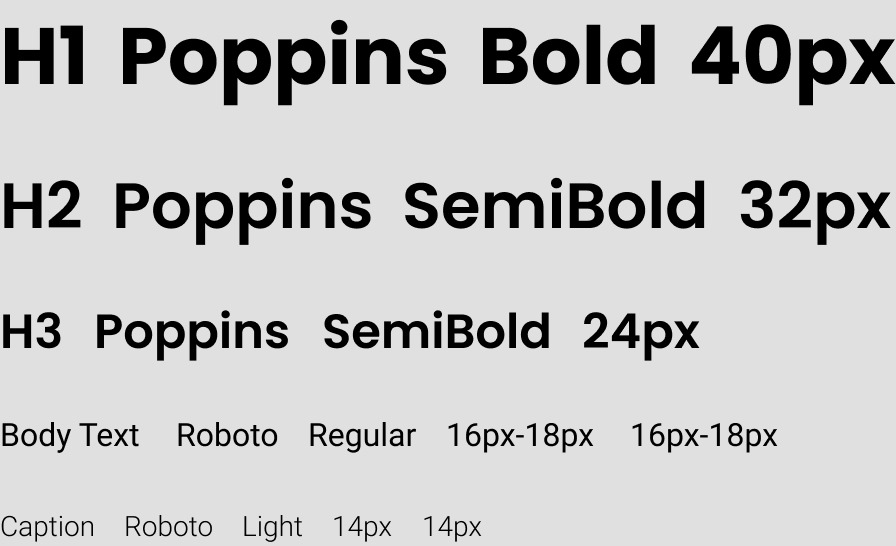

#### Spacing
Un sistema de espaciado bien definido mejora la comprensión visual, genera orden y reduce la fatiga cognitiva del usuario.
* Espaciado base: 8px. Todos los márgenes, paddings y gaps deben ser múltiplos de 8px para garantizar coherencia visual.

| Elemento                          | Espaciado Recomendado                  |
|:-----------------------------------|:---------------------------------------|
| Padding interno de botones        | 12px vertical, 24px horizontal         |
| Separación entre componentes      | 16px o 24px según relación jerárquica  |
| Margen entre secciones             | 48px mínimo                            |
| Margen entre título y contenido    | 24px                                   |
| Padding interior de tarjetas/cards | 16px                                   |

#### Comunicación y Tono

* El tono divertido pero profesional, casual y entusiasta se asemeja al enfoque de Duolingo y Headspace, donde un tono amigable refuerza la motivación sin caer en la condescendencia.
* Las mensajes de ejemplo (“¡Sigues floreciendo! 🌿”) son efectivos: usan emojis como refuerzo visual y un lenguaje positivo que promueve el engagement.
* Evitar un lenguaje autoritario (“Debes cumplir…”) se alinea con las directrices de usabilidad que recomiendan un tono de mentor/amigo, minimizando la resistencia del usuario y aumentando la percepción de apoyo.

### 4.1.2. Web Style Guidelines.

Las Web Style Guidelines de Focustime definen los estándares visuales e interaccionales para la interfaz de escritorio, asegurando coherencia, accesibilidad y una experiencia fluida en múltiples resoluciones. Se establece un sistema de cuadrículas, una jerarquía tipográfica clara basada en Poppins y Roboto, paleta de colores consistente con el branding, diseño de navegación intuitiva, componentes interactivos accesibles, y puntos de quiebre responsive alineados con mejores prácticas de la industria.

* Layout & Grid System : Adoptamos un sistema de 12 columnas para desktop.

* Typography & Color Usage : Se mantiene la tipografía de sistema: Poppins para títulos y Roboto para cuerpo de texto, respetando la jerarquía 40 px–32 px–24 px–16 px–14 px con line-height 1.5x. Los colores primarios (Verde Hope #6BBF59, Azul Calm #4A90E2) destacan botones y enlaces principales, mientras que los secundarios (Amarillo Bright, Rojo Gentle) refuerzan alertas y estados de error sin desentonar.

* Navigation : La barra de navegación permanece visible en la parte superior, con opciones principales agrupadas a la izquierda y acciones clave (login, registro) a la derecha para conveniencia del usuario.

* Components & UI Elements : Los botones principales usan el color Verde Hope, con padding de 12 px vertical y 24 px horizontal para facilitar la interacción.

## 4.2. Information Architecture.

### 4.2.1. Organization Systems.

Para agrupar y presentar el contenido, aplicamos tres esquemas principales de organización:

* Jerárquico (Visual Hierarchy): Empleamos jerarquía visual en la Landing Page y en las vistas de configuración de metas, donde los títulos (H1/H2) orientan al usuario a los bloques de información más críticos, siguiendo patrones de encabezado recomendados para IA.
* Secuencial (Step-by-Step): En flujos como registro, planificación de meta y creación de Pomodoros, utilizamos organización secuencial para guiar al usuario mediante pasos claros (p.ej., 1. Crear meta → 2. Dividir subtareas → 3. Iniciar Pomodoro), reduciendo la complejidad percibida.
* Matricial (Dashboards): En el dashboard de progreso, indicamos métricas en formato matricial (gráficos de dona, barras y tablas) que permiten comparar subtareas, rutinas y sesiones Pomodoro en paralelo, facilitando la visualización de datos multidimensionales.

Para la categorización de contenido, adoptamos:

* Cronológico en el Historial de Pomodoros y en la sección de Registro de Estado Emocional, mostrando sesiones y evaluaciones por fecha para seguimiento de tendencias.
* Por audiencia en la Landing Page, con secciones diferenciadas (“Para Estudiantes” vs “Para Profesionales”), ajustando el contenido a las necesidades de cada segmento objetivo.
* Por tópicos en la Biblioteca de Técnicas (antiprocrastinación, gestión del tiempo, hábitos), agrupando recursos en categorías semánticas para facilitar descubrimiento.

### 4.2.2. Labeling Systems.

Para evitar confusión y mantener la simplicidad:
* Etiquetas concisas (labels) ubicadas encima de los campos de formulario (“Título de meta”, “Fecha límite”), siguiendo la recomendación de colocar labels por encima para facilitar el escaneo vertical.
* Terminología coherente en toda la aplicación: usamos “Meta”, “Subtarea”, “Rutina”, “Pomodoro” y “Dashboard” de forma uniforme, evitando sinónimos que fragmenten la experiencia.
* Asociaciones claras: cada icono (reloj para Pomodoro, trofeo para recompensas) va acompañado de un label textual breve, mejorando la accesibilidad y comprensión.

### 4.2.3. SEO Tags and Meta Tags

Para mejorar la visibilidad en buscadores, definimos meta datos en la Landing Page y en la Web App:

| Página                  | `<title>`                                                      | `meta name="description"`                                                                                         | `meta name="keywords"`                                 | `meta name="author"` |
|:-------------------------|:---------------------------------------------------------------|:------------------------------------------------------------------------------------------------------------------|:--------------------------------------------------------|:---------------------|
| Landing Page             | TimeBloom: Productividad consciente para estudiantes y profesionales | “Potencia tu enfoque y hábitos con Focustime: planifica metas, usa Pomodoro, y alcanza tus objetivos con recompensas motivadoras.” | productividad, metas, Pomodoro, hábitos, enfoque, antiprocrastinación | BloomTech            |
| Dashboard Web App (interna) | Dashboard – TimeBloom: Tu progreso visual en un clic. | “Consulta tu progreso diario y semanal en metas, rutinas y sesiones Pomodoro para mantener tu productividad al máximo.” | dashboard, progreso, estadísticas, Pomodoro, rutinas, metas | BloomTech            |

### 4.2.4. Searching Systems.

Oportunidades de implementacion de búsqueda:
**Filtros contextuales en cada sección:**
* En Metas: filtrar por estado (Pendiente, En curso, Completada).
* En Rutinas: filtrar por periodo (Matutina, Vespertina, Nocturna).
* En Biblioteca: filtrar por tipo de recurso (Artículo, Guía).

### 4.2.5. Navigation Systems.

* Implementamos una barra lateral fija a la izquierda que permanece visible en todo momento, favoreciendo la exploración de un IA amplio y creciente. La navegación vertical izquierda es ideal para aplicaciones con múltiples secciones, ya que es fácil de escanear y ubicar.
* En la parte superior, se coloca el logo de Focustime con un tamaño de 48×48 px; al hacer clic, el usuario regresa al dashboard principal. Esto refuerza el branding y actúa como “Home”.
* Debajo del logo, listamos las funcionalidades principales.

## 4.3. Landing Page UI Design.
En esta sección presentamos la propuesta de interfaz de usuario (UI) para la **Landing Page** de TimeBloom. Aquí mostramos cómo hemos aplicado las decisiones de diseño y la arquitectura de información para guiar al usuario de forma clara y atractiva.

### Introducción

La Landing Page es la puerta de entrada de TimeBloom. Debe:

- **Comunicar el valor** de la aplicación de un vistazo.  
- **Guiar al usuario** hacia la llamada a la acción principal (“Continúa”).  
- **Reflejar la identidad** de marca (colores, tipografía y estilo visual).  
- **Adaptarse a móviles y desktop** manteniendo consistencia.

Para lograrlo, hemos definido:

1. **Jerarquía visual** clara, con un título heroico en la parte superior izquierda y un botón destacado.  
2. **Patrón F-Layout**, aprovechando la convención de lectura occidental (izquierda → derecha, arriba → abajo).  
3. **Espaciado generoso** para destacar cada bloque y evitar saturación.  
4. **Imágenes y fondos** que refuercen el tono profesional y motivador de la marca.  
---

### 4.3.1. Landing Page Wireframe.


- **Header fijo** con logo y navegación clara.  
- **Hero section** dividida en dos columnas:  
  - **Columna izquierda**: Titular, subtítulo y botón CTA.  
  - **Columna derecha**: Ilustración o mock-up de la app.  
- **Sección “Nuestros Productos”** inmediatamente visible al hacer scroll.  
---

### 4.3.2. Landing Page Mock-up.


- Colores de fondo (`bg-gradient-to-r from-blue-900 to-blue-800`) que transmiten serenidad y confianza.  
- Tipografía **Inter**, pesos bold para el título y regular para subtítulos.  
- Botón “Continúa” con clase Tailwind:
  ```html
  <a href="#products"
     class="inline-block mt-8 px-8 py-4 bg-green-500 hover:bg-green-600 text-white rounded-full text-lg font-semibold">
    Continúa
  </a>

## 4.4. Web Applications UX/UI Design.
En esta sección presentamos la propuesta de experiencia de usuario (UX) y la interfaz (UI) para las **Web Applications** de TimeBloom. Aquí describimos cómo traducimos los requerimientos funcionales y el mapa de interacción en pantallas y flujos que guían al usuario a cumplir sus tareas de forma clara, rápida y agradable.
### 4.4.1. Web Applications Wireframes.

Esta sección presenta los wireframes de nuestra Startup, diseñados aplicando principios de diseño centrado en el usuario, accesibilidad e inclusión.
Se prioriza una arquitectura de información clara y herramientas especializadas para garantizar una experiencia de usuario fluida y eficiente.

**LOGIN:**

**RESGISTRO:**

**PLANES:**

**PAGO:**

**USUARIO:**

**DASHBOARD:**

**METAS:**

**HABITOS:**

 **POMODORO:**

 **TECNICAS Y CONSEJOS:**

**CALENDARIO:**

**RECOMPENSAS:**


### 4.4.2. Web Applications Wireflow Diagrams.

Esta sección presenta los wireframes de nuestra Startup, diseñados aplicando principios de diseño centrado en el usuario, accesibilidad e inclusión.
Se prioriza una arquitectura de información clara y herramientas especializadas para garantizar una experiencia de usuario fluida y eficiente.


[FIGMA](https://www.figma.com/design/d0Sli9JvzTQ1D3KAfiZ5j3/Untitled?node-id=14-1166&t=TtypjMW7nooE7PlE-1)

### 4.4.3. Web Applications Mock-ups.

**LOGIN:**

**RESGISTRO:**

**PLANES:**

**PAGO:**

**USUARIO:**

**DASHBOARD:**

**METAS:**

**HABITOS:**

**POMODORO:**

**TECNICAS Y CONSEJOS:**

**CALENDARIO:**

**RECOMPENSAS:**


### 4.4.4. Web Applications User Flow Diagrams.

**User Flow Diagrams:**

[FIGMA](https://www.figma.com/design/d0Sli9JvzTQ1D3KAfiZ5j3/Untitled?node-id=14-1166&t=TtypjMW7nooE7PlE-1)

## 4.5. Web Applications Prototyping.

Esta sección presenta los prototipos de interfaz de usuario , los cuales incluyen simulaciones de interacción y navegación. Las decisiones de
interacción se fundamentan en criterios clave, como la facilidad de uso, la accesibilidad y la optimización para distintos dispositivos.

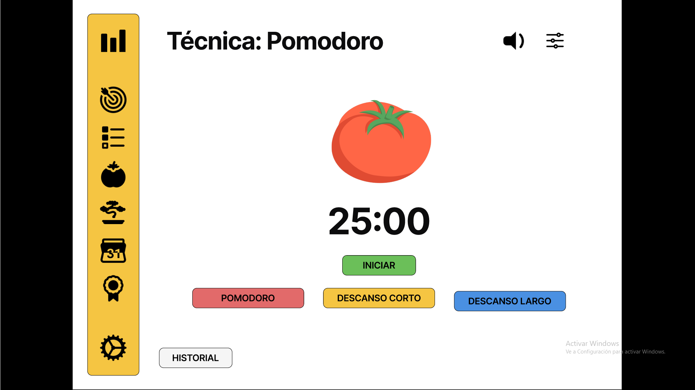

https://www.figma.com/proto/d0Sli9JvzTQ1D3KAfiZ5j3/Untitled?page-id=14%3A1166&node-id=79-2777&viewport=274%2C-714%2C0.17&t=KzyAi7YniqCIiwcz-1&scaling=contain&content-scaling=fixed&starting-point-node-id=79%3A2636&show-proto-sidebar=1

## 4.6. Domain Driven Software Arquitecture.

### 4.6.1. Software Architecture Context Diagram.
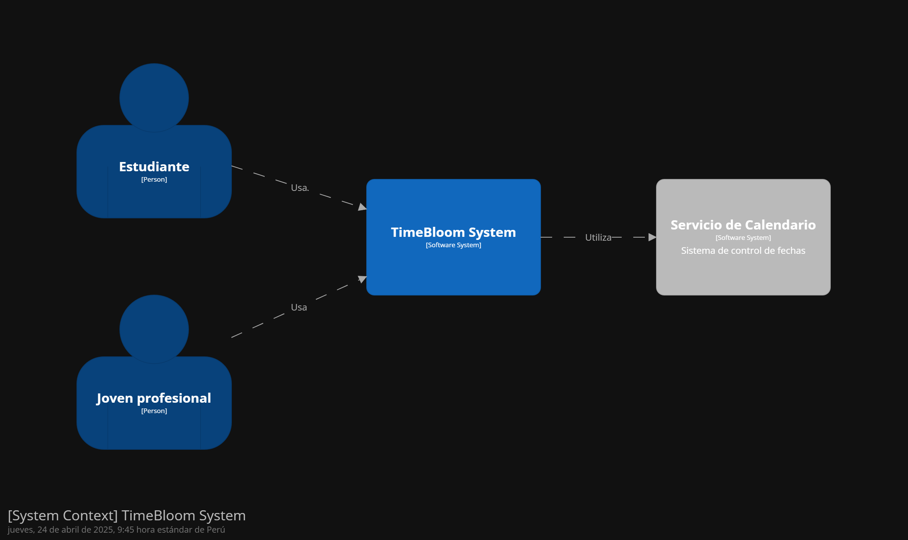
### 4.6.2. Software Architecture Container Diagrams.
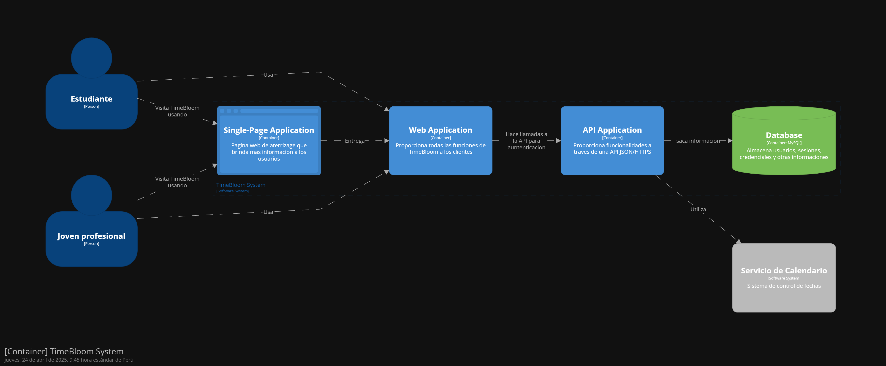
### 4.6.3. Software Architecture Components Diagrams.
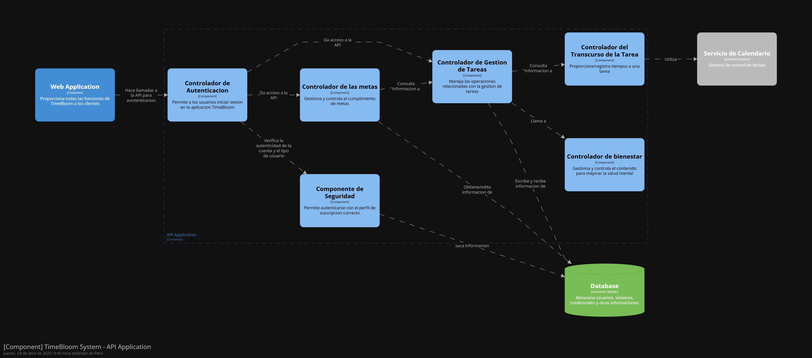
## 4.7. Software Object-Oriented Design. 
### 4.7.1. Class Diagrams. 

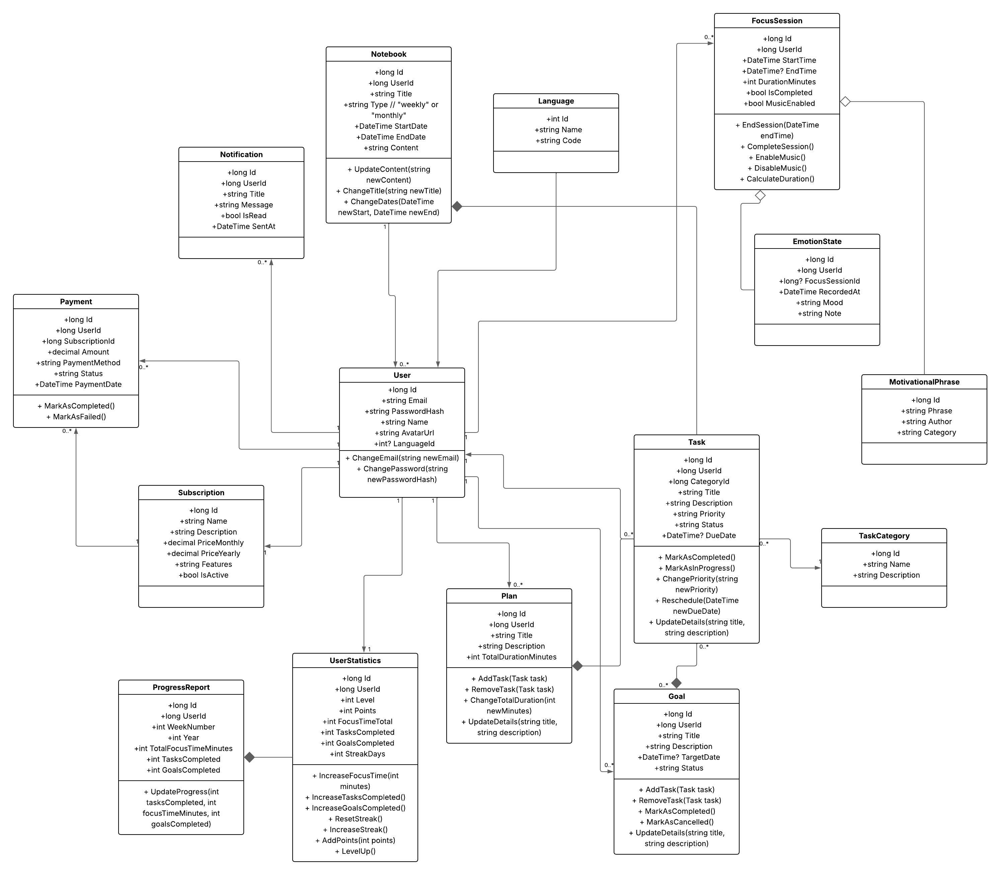

### 4.7.2. Class Dictionary. 
### Entidad: User

| # | Nombre de Atributos | Definición | Tipo de Dato | Unidad de Medida | Valores Restringidos |
|---|---------------------|------------|--------------|-----------------|----------------------|
| 1 | id | Identificador del usuario | long | 8 bytes | Mayor a cero |
| 2 | email | Correo electrónico del usuario | string | Cadena de caracteres | Formato de email válido |
| 3 | passwordHash | Contraseña encriptada | string | Cadena de caracteres | Caracteres alfanuméricos |
| 4 | name | Nombre del usuario | string | Cadena de caracteres | Letras y espacios |
| 5 | languageId | Identificador del idioma | int (nullable) | 4 bytes | Mayor a cero o null |

### Entidad: Language

| # | Nombre de Atributos | Definición | Tipo de Dato | Unidad de Medida | Valores Restringidos |
|---|---------------------|------------|--------------|-----------------|----------------------|
| 1 | id | Identificador del lenguaje | int | 4 bytes | Mayor a cero |
| 2 | name | Nombre del lenguaje | string | Cadena de caracteres | Letras y espacios |
| 3 | code | Código ISO del lenguaje | string | Cadena de caracteres | 2 o 3 letras (ISO 639) |

### Entidad: UserStatistics

| # | Nombre de Atributos | Definición | Tipo de Dato | Unidad de Medida | Valores Restringidos |
|---|---------------------|------------|--------------|-----------------|----------------------|
| 1 | id | Identificador de estadísticas | long | 8 bytes | Mayor a cero |
| 2 | userId | Relación al usuario | long | 8 bytes | Mayor a cero |
| 3 | level | Nivel de usuario | int | Número entero | Mayor a cero |
| 4 | points | Puntos acumulados | int | Número entero | Mayor o igual a cero |
| 5 | focusTimeTotal | Tiempo total de enfoque | int | Minutos | Mayor o igual a cero |
| 6 | tasksCompleted | Tareas completadas | int | Contador | Mayor o igual a cero |
| 7 | goalsCompleted | Metas completadas | int | Contador | Mayor o igual a cero |
| 8 | streakDays | Días consecutivos activos | int | Días | Mayor o igual a cero |

### Entidad: Task

| # | Nombre de Atributos | Definición | Tipo de Dato | Unidad de Medida | Valores Restringidos |
|---|---------------------|------------|--------------|-----------------|----------------------|
| 1 | id | Identificador de la tarea | long | 8 bytes | Mayor a cero |
| 2 | userId | Relación al usuario creador | long | 8 bytes | Mayor a cero |
| 3 | categoryId | Relación a la categoría | long | 8 bytes | Mayor a cero |
| 4 | title | Título de la tarea | string | Cadena de caracteres | Letras y números |
| 5 | description | Descripción de la tarea | string | Cadena de caracteres | Opcional |
| 6 | priority | Prioridad de la tarea | string | Texto | "low", "medium", "high" |
| 7 | status | Estado de la tarea | string | Texto | "pending", "in_progress", "completed" |
| 8 | dueDate | Fecha límite | datetime | Fecha y hora | Formato de fecha válido |

### Entidad: TaskCategory

| # | Nombre de Atributos | Definición | Tipo de Dato | Unidad de Medida | Valores Restringidos |
|---|---------------------|------------|--------------|-----------------|----------------------|
| 1 | id | Identificador de categoría | long | 8 bytes | Mayor a cero |
| 2 | name | Nombre de categoría | string | Cadena de caracteres | Letras y espacios |
| 3 | description | Descripción de categoría | string | Cadena de caracteres | Opcional |

### Entidad: Notebook

| # | Nombre de Atributos | Definición | Tipo de Dato | Unidad de Medida | Valores Restringidos |
|---|---------------------|------------|--------------|-----------------|----------------------|
| 1 | id | Identificador de agenda | long | 8 bytes | Mayor a cero |
| 2 | userId | Relación al usuario | long | 8 bytes | Mayor a cero |
| 3 | title | Título de la agenda | string | Cadena de caracteres | Letras y números |
| 4 | type | Tipo de agenda | string | Texto | "weekly", "monthly" |
| 5 | startDate | Fecha de inicio | date | Días | Formato de fecha válido |
| 6 | endDate | Fecha de fin | date | Días | Formato de fecha válido |
| 7 | content | Contenido de notas | string | Cadena de caracteres | Opcional |

### Entidad: Plan

| # | Nombre de Atributos | Definición | Tipo de Dato | Unidad de Medida | Valores Restringidos |
|---|---------------------|------------|--------------|-----------------|----------------------|
| 1 | id | Identificador del plan | long | 8 bytes | Mayor a cero |
| 2 | userId | Relación al usuario creador | long | 8 bytes | Mayor a cero |
| 3 | title | Nombre del plan | string | Cadena de caracteres | Letras y números |
| 4 | description | Descripción del plan | string | Cadena de caracteres | Opcional |
| 5 | totalDurationMinutes | Duración total estimada | int | Minutos | Mayor o igual a cero |

### Entidad: Goal

| # | Nombre de Atributos | Definición | Tipo de Dato | Unidad de Medida | Valores Restringidos |
|---|---------------------|------------|--------------|-----------------|----------------------|
| 1 | id | Identificador de la meta | long | 8 bytes | Mayor a cero |
| 2 | userId | Relación al usuario creador | long | 8 bytes | Mayor a cero |
| 3 | title | Nombre de la meta | string | Cadena de caracteres | Letras y números |
| 4 | description | Descripción de la meta | string | Cadena de caracteres | Opcional |
| 5 | targetDate | Fecha objetivo de cumplimiento | date | Días | Formato de fecha válido |
| 6 | status | Estado de la meta | string | Texto | "pending", "in_progress", "completed", "cancelled" |

### Entidad: FocusSession

| # | Nombre de Atributos | Definición | Tipo de Dato | Unidad de Medida | Valores Restringidos |
|---|---------------------|------------|--------------|-----------------|----------------------|
| 1 | id | Identificador de la sesión de enfoque | long | 8 bytes | Mayor a cero |
| 2 | userId | Relación al usuario | long | 8 bytes | Mayor a cero |
| 3 | startTime | Hora de inicio de la sesión | datetime | Fecha y hora | Formato válido |
| 4 | endTime | Hora de fin de la sesión | datetime (nullable) | Fecha y hora | Formato válido o null |
| 5 | durationMinutes | Duración de la sesión | int | Minutos | Mayor o igual a cero |
| 6 | isCompleted | Estado de completado | boolean | 1 bit | true o false |
| 7 | musicEnabled | Música de concentración activada | boolean | 1 bit | true o false |

### Entidad: EmotionState

| # | Nombre de Atributos | Definición | Tipo de Dato | Unidad de Medida | Valores Restringidos |
|---|---------------------|------------|--------------|-----------------|----------------------|
| 1 | id | Identificador del estado emocional | long | 8 bytes | Mayor a cero |
| 2 | userId | Relación al usuario | long | 8 bytes | Mayor a cero |
| 3 | focusSessionId | Relación a la sesión de enfoque | long (nullable) | 8 bytes | Mayor a cero o null |
| 4 | recordedAt | Fecha de registro del estado | datetime | Fecha y hora | Formato válido |
| 5 | mood | Estado emocional | string | Texto | "happy", "neutral", "stressed", "anxious", "motivated" |
| 6 | note | Comentarios adicionales | string | Cadena de caracteres | Opcional |

### Entidad: MotivationalPhrase

| # | Nombre de Atributos | Definición | Tipo de Dato | Unidad de Medida | Valores Restringidos |
|---|---------------------|------------|--------------|-----------------|----------------------|
| 1 | id | Identificador de la frase | long | 8 bytes | Mayor a cero |
| 2 | phrase | Texto de la frase motivacional | string | Cadena de caracteres | Texto libre |
| 3 | author | Autor de la frase | string | Cadena de caracteres | Opcional |
| 4 | category | Categoría de la frase | string | Texto | "general", "focus", "success", "wellness" |

### Entidad: ProgressReport

| # | Nombre de Atributos | Definición | Tipo de Dato | Unidad de Medida | Valores Restringidos |
|---|---------------------|------------|--------------|-----------------|----------------------|
| 1 | id | Identificador del reporte | long | 8 bytes | Mayor a cero |
| 2 | userId | Relación al usuario | long | 8 bytes | Mayor a cero |
| 3 | weekNumber | Número de la semana | int | Número entero | 1 a 52 |
| 4 | year | Año correspondiente | int | Número entero | Ejemplo: 2025 |
| 5 | totalFocusTimeMinutes | Tiempo total enfocado en minutos | int | Minutos | Mayor o igual a cero |
| 6 | tasksCompleted | Número de tareas completadas | int | Contador | Mayor o igual a cero |
| 7 | goalsCompleted | Número de metas cumplidas | int | Contador | Mayor o igual a cero |

### Entidad: Subscription

| # | Nombre de Atributos | Definición | Tipo de Dato | Unidad de Medida | Valores Restringidos |
|---|---------------------|------------|--------------|-----------------|----------------------|
| 1 | id | Identificador del plan de suscripción | long | 8 bytes | Mayor a cero |
| 2 | name | Nombre del plan | string | Cadena de caracteres | Letras y números |
| 3 | description | Descripción del plan | string | Cadena de caracteres | Opcional |
| 4 | priceMonthly | Precio mensual | decimal(10,2) | Moneda | Mayor o igual a cero |
| 5 | priceYearly | Precio anual | decimal(10,2) | Moneda | Mayor o igual a cero |
| 6 | features | Características del plan | string | Texto | Opcional |
| 7 | isActive | Estado de disponibilidad | boolean | 1 bit | true o false |

### Entidad: Payment

| # | Nombre de Atributos | Definición | Tipo de Dato | Unidad de Medida | Valores Restringidos |
|---|---------------------|------------|--------------|-----------------|----------------------|
| 1 | id | Identificador del pago | long | 8 bytes | Mayor a cero |
| 2 | userId | Relación al usuario | long | 8 bytes | Mayor a cero |
| 3 | subscriptionId | Relación a la suscripción | long | 8 bytes | Mayor a cero |
| 4 | amount | Monto pagado | decimal(10,2) | Moneda | Mayor o igual a cero |
| 5 | paymentMethod | Método de pago | string | Texto | "card", "paypal", "bank_transfer" |
| 6 | status | Estado del pago | string | Texto | "pending", "completed", "failed" |
| 7 | paymentDate | Fecha de pago | datetime | Fecha y hora | Formato de fecha válido |

### Entidad: Notification

| # | Nombre de Atributos | Definición | Tipo de Dato | Unidad de Medida | Valores Restringidos |
|---|---------------------|------------|--------------|-----------------|----------------------|
| 1 | id | Identificador de la notificación | long | 8 bytes | Mayor a cero |
| 2 | userId | Relación al usuario | long | 8 bytes | Mayor a cero |
| 3 | title | Título de la notificación | string | Texto | Texto libre |
| 4 | message | Contenido del mensaje | string | Texto | Texto libre |
| 5 | isRead | Estado de lectura | boolean | 1 bit | true o false |
| 6 | sentAt | Fecha de envío | datetime | Fecha y hora | Formato de fecha válido |


## 4.8. Database Design. 
### 4.8.1. Database Diagram. 

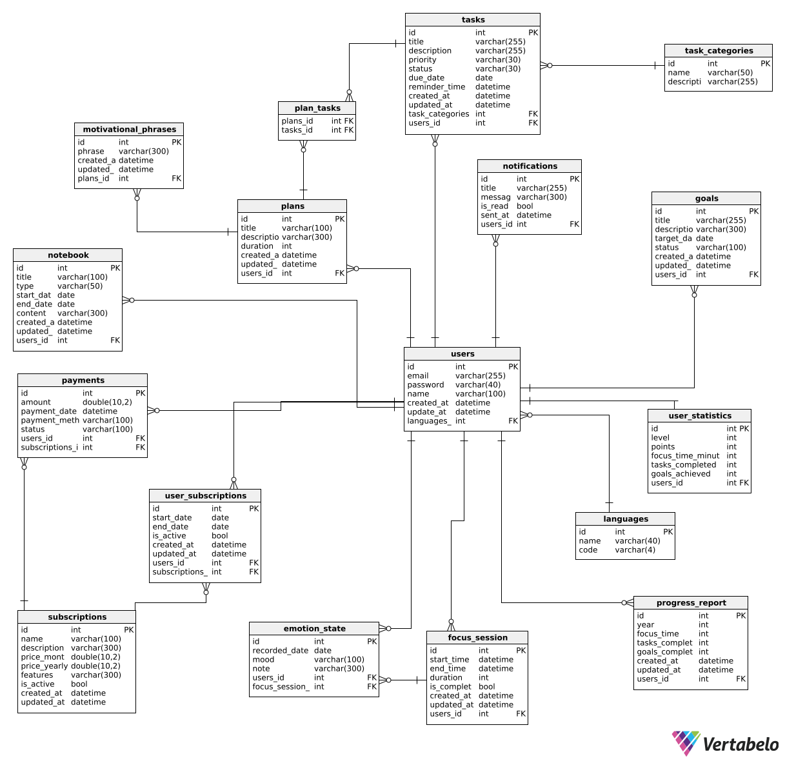

# V: Product Implementation, Validation & Deployment  
## 5.1. Software Configuration Management.
En este apartado se establecen los lineamientos y procedimientos adoptados durante el desarrollo y publicación del sitio web de TimeBloom, con el propósito de asegurar la coherencia y estabilidad del software desde sus primeras etapas hasta su implementación y posterior mantenimiento.
### 5.1.1. Software Development Environment Configuration.

*Project Management*

Para una gestión eficiente del proyecto, se hizo necesaria la implementación de un conjunto de herramientas destinadas a la asignación de tareas, la facilitación de reuniones y la colaboración entre los integrantes. Asimismo, se empleó un repositorio centralizado para consolidar los avances de manera coordinada. A continuación, se presentan las plataformas seleccionadas junto con su respectivo propósito dentro del marco del proyecto.

- Centro de organización de trabajo: Github
- Planificación de tareas: Trello
- Reuniones de equipo: Google Meet
- Coordinación grupal: WhatsApp

*Requirement Management*

Durante el desarrollo del proyecto se recurrió a diversas herramientas que facilitaron la definición, análisis y representación visual de los requerimientos técnicos y funcionales. Estas plataformas promovieron una planificación estructurada y una mayor claridad en el diseño conceptual del sistema:

| Herramienta | Descripción | Enlace |
|-------------|-------------|--------|
| Trello | Herramienta de organización de proyectos basada en tableros y tarjetas, empleada para distribuir tareas entre los miembros del equipo y hacer seguimiento al progreso de cada fase del desarrollo. | [trello.com](https://trello.com) |
| Uxpressia | Aplicación digital utilizada para el diseño de mapas estratégicos, como Impact Mapping, lo cual permitió vincular los objetivos del negocio con las funcionalidades del producto de forma clara y visual. | [uxpressia.com](https://uxpressia.com) |
| Structurizr | Plataforma de modelado arquitectónico que facilita la construcción de diagramas C4, permitiendo representar la estructura lógica del sistema y su interacción entre componentes de manera estandarizada. | [structurizr.com](https://structurizr.com) |
| Lucidchart | Entorno colaborativo de diagramación empleado para desarrollar modelos técnicos como diagramas de clases y estructuras de bases de datos, fundamentales en la definición de la arquitectura del sistema. | [lucidchart.com](https://lucidchart.com) |

------------------------------------------------------------------------------------------------------------------------------------------------

*Product UX/UI Design*

El diseño de la experiencia de usuario y de la interfaz visual se abordó mediante herramientas especializadas que posibilitaron la creación de prototipos gráficos y esquemas de navegación. Esto permitió validar la estructura de la aplicación antes de su implementación:

| Herramienta | Descripción | Enlace |
|-------------|-------------|--------|
| Figma | Plataforma de diseño colaborativo en línea que permitió a los miembros del equipo crear y editar en tiempo real wireframes y mockups, asegurando la coherencia visual y funcional de la landing page. | [figma.com](https://figma.com) |

--------------------------------------------------------------------------------------------------------------------------------------------------

*Software Development*

Para el desarrollo de la página web, se emplearon lenguajes de programación y etiquetado esenciales para crear la estructura, el diseño y las funcionalidades del sistema. A continuación, se describen las herramientas utilizadas:

| Herramienta | Descripción | Enlace |
|-------------|-------------|--------|
| HTML | Lenguaje de marcado fundamental para estructurar el contenido y la disposición de los elementos en la web. | [HTML](https://www.w3schools.com/html/default.asp) |
| CSS | Lenguaje de diseño que permite aplicar estilos visuales a los elementos estructurados en HTML, mejorando su presentación. | [CSS](https://www.w3schools.com/css/default.asp) |
| JavaScript | Lenguaje de programación orientado a objetos utilizado para agregar interactividad y funcionalidades dinámicas a la página web. | [JavaScript](https://www.w3schools.com/js/default.asp) |

----------------------------------------------------------------------------------------------------------------------------------------------------

*Software Documentation*

La gestión y documentación del proyecto se llevó a cabo utilizando herramientas que facilitaron la organización y el acceso a la información técnica, asegurando la transparencia y la trazabilidad del desarrollo:

| Herramienta | Descripción | Enlace |
|-------------|-------------|--------|
| GitHub | Plataforma de desarrollo colaborativo que también se utilizó para gestionar y alojar la documentación del proyecto. | [GitHub](http://github.com/) |
| Markdown | Formato de texto ligero utilizado para escribir y estructurar la documentación técnica del proyecto de forma clara y legible. | [markdown](https://markdown.es/) |

------------------------------------------------------------------------------------------------------------------------------------------------------

*Software Deployment*

Para el despliegue de la landing page, se optó por una plataforma de hosting que permite la publicación directa desde un repositorio de GitHub, garantizando una gestión eficiente del ciclo de vida de la aplicación:

| Herramienta | Descripción | Enlace |
|-------------|-------------|--------|
| GitHub Pages | Servicio de GitHub que permite desplegar la aplicación directamente desde el repositorio, facilitando la visualización pública de la página. | [GitHub Pages](https://pages.github.com/) |

------------------------------------------------------------------------------------------------------------------------------------------------------

### 5.1.2. Source Code Management.

Producto y Repositorio

| Producto | Repositorio | URL |
|-------------|-------------|--------|
| Landing Page | Timebloom-Landing Page | [LandingPage](https://github.com/Aplicaciones-Web-Grupo-2/Landing-page) |

*Estructura del Repositorio*

Hemos organizado el repositorio en ramas específicas para diferentes etapas del desarrollo, garantizando un flujo de trabajo ordenado y eficiente. La estructura de ramas es la siguiente:

- Develop branch (rama principal): Contiene la versión estable y lista para producción del software.

Además, para el desarrollo de nuevas funcionalidades, creamos ramas específicas siguiendo las convenciones de nomenclatura:

- Feature branches: Ramas dedicadas al desarrollo de nuevas características. La nomenclatura para estas ramas es feature/nueva-funcionalidad.

Implementamos GitFlow, un modelo de ramificación diseñado por Vincent Driessen, que incluye las siguientes ramas:

- Feature branches: Creadas a partir de develop para añadir nuevas características, siguiendo la nomenclatura feature/nueva-funcionalidad.
- Release branches: Preparadas para la liberación de nuevas versiones, permitiendo pruebas finales y corrección de errores antes del despliegue a producción.
- Hotfix branches: Utilizadas para corregir errores críticos en producción, siguiendo la nomenclatura hotfix/correccion-critica.

### Flujo de trabajo GitFlow

- Una rama de producción (develop).
- Rama de hotfix para corrección de errores críticos (hotfix/*).
- Rama de release para estabilización y pruebas previas al despliegue (release/*).
- Ramas para features (feature/*).
- Cambios en develop requieren aprobación.

### Mensajes de Commits

Adoptamos el estándar Conventional Commits para los mensajes de nuestros commits, lo que facilita la comprensión del historial de cambios y la automatización de versiones. Ejemplos de mensajes son:

- feat: Añadir nueva funcionalidad, por ejemplo, feat: implementar sistema de notificaciones.
- fix: Corregir errores, por ejemplo, fix: solucionar problema con la validación de datos.
- docs: Actualizar documentación, por ejemplo, docs: actualizar guía de instalación.
- style: Aplicar formato, por ejemplo, style: ajustar estilo de código según las pautas.
- refactor: Mejorar el código sin cambiar su funcionalidad, por ejemplo, refactor: optimizar el rendimiento del módulo de usuario.
- test: Añadir o modificar pruebas, por ejemplo, test: añadir pruebas para la funcionalidad de autenticación.

Documentación

La documentación del proyecto se encuentra en el archivo README.md dentro del repositorio. Este archivo proporciona detalles sobre la configuración, el uso del software y las guías para contribuir al proyecto.

----------------------------------------------------------------------------------------------------------------------------------------------------------------------------------------------------------------------

### 5.1.3. Source Code Style Guide & Conventions. 

HTML

Durante la construcción de la estructura del sitio, se adoptaron las siguientes buenas prácticas para asegurar accesibilidad y organización:

- Escribir todas las etiquetas en minúsculas.
- Asegurar el cierre correcto de todos los elementos.
- Mantener los atributos en minúscula.
- Incluir `alt`, `width` y `height` en imágenes para accesibilidad y control visual.
- Evitar espacios innecesarios dentro de las etiquetas.

Ejemplo de imagen:

```html

```
Etiquetas HTML utilizadas:

```html
<header>, <nav>, <div>, , <ul>, <li>, <a>, <p>, <button>, <h1>, <h2>, <h3>, <h4>
```
--------------------------------------------------------------------------------------------

CSS

Para mantener consistencia en el diseño y facilitar la lectura del código, se aplicaron las siguientes reglas:

- Usar nombres de clases e IDs que sean descriptivos y semánticos.
- Elegir nombres breves pero comprensibles.
```CSS
#gallery {}
.video {}
```
- Usar propiedades abreviadas siempre que sea posible para mantener el código compacto.
```CSS
padding: 0 1em 2em;
```
- No utilizar unidades en valores cero.
```CSS
margin: 0;
padding: 0;
```
- Ordenar las propiedades alfabéticamente para facilitar el escaneo visual.
```CSS
background: fuchsia;
border: 1px solid;
border-radius: 4px;
color: black;
text-align: center;
text-indent: 2em;
```
-------------------------------------------------------------------------------------
JavaScript

Para lograr un código más claro y mantenible, se establecieron las siguientes prácticas de codificación:
- Utilizar funciones con llaves bien estructuradas.
```JavaScript
function myFunc() {
  console.log('Hello!');
}
```
- Usar lowerCamelCase para declarar variables.
```JavaScript
let playerScore = 0;
```
- Preferir el uso de let y const sobre var.
```JavaScript
const myName = 'Chris';
let myAge = 40;
myAge++;
console.log(myAge);
```
- Nombrar las funciones también siguiendo la convención lowerCamelCase.
```JavaScript
function sayHello() {
  alert('Hello!');
}
```
### 5.1.4. Software Deployment Configuration. 

Landing Page

Consideraciones previas al despliegue:

1. Archivos en formato HTML, CSS y JS.
2. Publicación en un repositorio de GitHub.
3. Realización de pruebas de funcionamiento (internas y externas).

Requisitos:

- Repositorio en GitHub (público).
- Código fuente completo de la landing page.

Pasos para realizar el despliegue:

A continuación, se detallan los pasos para desplegar nuestro sitio web utilizando GitHub Pages.


  1. Despliegue con GitHub Pages: Primero, accedemos al repositorio en GitHub donde se encuentra el proyecto y luego nos dirigimos a la configuración del repositorio.
     

  2. Dentro del menú de ajustes, seleccionamos la opción "Pages".
     

---------------------------------------------------------------------------------------------------------------------------------------------------------------------------

Control de Versiones

Uso de Git: Es importante mantener un historial completo de los cambios para gestionar las diferentes versiones del código de manera eficiente.

En la sección de GitHub Pages, elegimos la rama principal (develop) en el menú desplegable de la opción "Branch" y luego hacemos clic en "Save" para guardar los cambios. Después de un breve periodo de espera, obtendremos el enlace a nuestro sitio web, ahora publicado en GitHub Pages.
## 5.2. Landing Page, Services & Applications Implementation. 
### 5.2.1. Sprint 1 
#### 5.2.1.1. Sprint Planning 1
El Sprint Planning 1 es una reunión esencial para iniciar el primer sprint de un proyecto, donde el equipo define los objetivos y la estrategia para cumplirlos. En este caso, nuestro objetivo principal es implementar la landing page de la aplicación, asegurando una presentación efectiva del producto.

| Sprint #                             | Sprint 1                                                                                               |
|--------------------------------|--------------------------------------------------------------------------------------------------------|
| **Date**       |     2025-04-22        |
| Time           | 10:00 PM                      |
| Location       | Virtual - Meet               |
| Prepared By    | Nelson Guerrero              |
| Attendees (to planning meeting)| Milenio Huaman, Fatima Asmad, Elvert Vasquez, Ayrton Inga, Sebastian Tello                |
| Sprint n - 1 Review Summary    | Este es el primer Sprint, por lo que este campo no aplica.                                            |
| Sprint n - 1 Retrospective Summary | Este es el primer Sprint, por lo que este campo no aplica.                                       |
| Sprint 1 Goal                  | Nuestra prioridad en este sprint es implementar la landing page de nuestra aplicación. Creemos que esto brindará una presentación satisfactoria de nuestro producto a los posibles usuarios. Esto se confirmará cuando las visitas a nuestra landing page superen un cierto índice. |
| Sprint 1 Velocity              | Nuestro equipo puede aceptar hasta 17 Story Points.                                                  |
| Sum of Story Points            | La suma de Story Points atendidos es de  .                                            |

#### 5.2.1.2. Aspect Leaders and Collaborators
Durante este sprint, nuestro objetivo fue definir nuestros puntos base para realizar una solucion acertada a lo que el usuario necesite. La investigacion, entrevistas y datos recolectados ayudaron a que se pueda generar una vision mas clara del objetivo en el grupo. Por ello aqui se presentan los roles que cada uno de los participantes tuvo a lo largo de este sprint.

| Team Member (Last Name, First Name)       | GitHub Username   | Aspect Name 1 (L/C) 
|------------------------------------------|-------------------|---------------------|
| Elvert Vasquez | ElvDev05  | L  | 
| Fatima Asmad Padilla   |  FatimaAP05    | C         |  
| Milenio Huaman   | Milenioupc    | C         | 
| Ayrton Inga       | DamianIH     | C         |  
| Sebastian Tello   | SRT0808 | C         | 
| Nelson Guerrero   | Nelsoondev | C         | 

#### 5.2.1.3. Sprint Backlog 1

Para el primer sprint, desarrollamos la estructura y las funcionalidades básicas de la landing page, así como el diseño visual y la barra de navegación.

| **Sprint #**   | Sprint 1   |             |             |             |             |             |             |
|----------------|-------------|-------------|-------------|-------------|-------------|-------------|-------------|
| **User Story** |             | **Work-Item/task** |             |             |             |             |             |
| **ID**         | **Título**  | **ID**             | **Título**   | **Descripción**        | **Estimación (hrs)** | **Assigned to**    | **Status** |
| US-11 | Explorar beneficios de la app | T01 | Mostrar beneficios de la app | Crear una sección en la landing page donde se muestren los beneficios clave de la app (enfoque, bienestar, productividad). | 8  | Nelson Guerrero  | Done |
| US-12 | Conocer testimonios de usuarios | T02 | Mostrar testimonios de usuarios | Desarrollar una sección que muestre testimonios positivos de usuarios para aumentar la confianza en la app. | 6 | Milenio Huaman | Done |
| US-13 | Acceder a preguntas frecuentes | T03 | Crear sección de preguntas frecuentes (FAQ) | Desarrollar una sección con preguntas frecuentes (FAQ) que brinden respuestas rápidas a los visitantes sobre el funcionamiento de la app. | 5 | Nelson Guerrero  | Done |
| US-14 | Contactar al equipo | T04 | Crear formulario de contacto | Crear un formulario en la landing page para que los visitantes puedan contactar al equipo de soporte para resolver dudas o inquietudes. | 7 | Milenio Huaman  | Done |
| US-15 | Ver planes y precios | T05 | Mostrar planes y precios disponibles | Crear una sección donde se muestren los planes disponibles de la app y sus beneficios, para que los usuarios puedan tomar decisiones informadas. | 6 | Nelson Guerrero  | Done |

#### 5.2.1.4. Development Evidence for Sprint Review
En esta sección presentamos el flujo de trabajo para la creación y actuallización de la landing page.

| Repository                           | Branch   | Commit ID | Commit Message                  | Commit Message Body          | Commited on  (Date) |
|-------------------------------------|---------|-----------|----------------------------------|------------------------------|---------------------|
| LandingPage | main | 3c743d2 | Initial commit |     | 26/04/2025 |
| LandingPage | main | 3c743d2…1204b17 | docs(readme):Create images |     | 26/04/2025 |
| LandingPage | main | 1204b17…57e7260 | docs(fix):subir landing page |     | 26/04/2025 |
| LandingPage | main | 57e7260…8e55abf | docs(imagenes): Subir imagen del landing page |     | 26/04/2025 |
| LandingPage | main | 8e55abf…c92ae4d | docs(imagenes): subir imagen de mockup |     | 26/04/2025 |
| LandingPage | main | c92ae4d…af86bf3 | Inicializa proyecto landinpage |     | 26/04/2025 |
| LandingPage | main | af86bf3…d6e40d8  | Delete(file) BloomTech/BloomTech directory |     | 26/04/2025 |
| LandingPage | main | d6e40d8…5f5b866 | fix(main): Merge remote changes into main |     | 26/04/2025 |
| LandingPage | main | 5f5b866…26a8c56 | fix(main): Redireccionamiento de imagenes |     | 26/04/2025 |

#### 5.2.1.5. Execution Evidence for Sprint Review
| **Epic / Story ID** | **Título**                    | **Criterios de Aceptación**                                                                                     |
|----------------------|------------------------------|----------------------------------------------------------------------------------------------------------------|
| US21                | Navegación por el landing page | Dado que el usuario está en la página principal, cuando haga clic en cualquier ítem del menú, entonces va redirigido a la sección correspondiente. |
| US22                | Ver información del startup   | Dado que voy a "Sobre Nosotros", cuando hago scroll, entonces veo informacion sobre la startup como misión y visión.                    |
| US33                | Conocer los servicios |Dado que voy a "Nuestros Servicios", cuando hago scroll, entonces veo informacion sobre los servicos que ofrece la aplicación. |

 En esta entrega, nuestro equipo ha desplegado con éxito la landing page.
 Enlace de la Landing Page: [https://aplicaciones-web-grupo-2.github.io/Landing-page/](https://aplicaciones-web-grupo-2.github.io/Landing-page/)

<p align="center">
  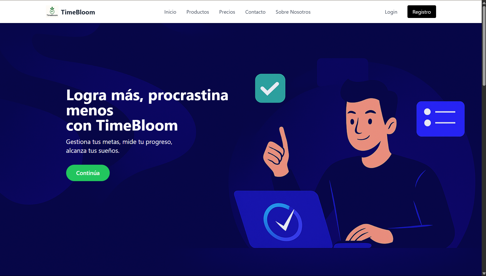
</p>

<p align="center">
  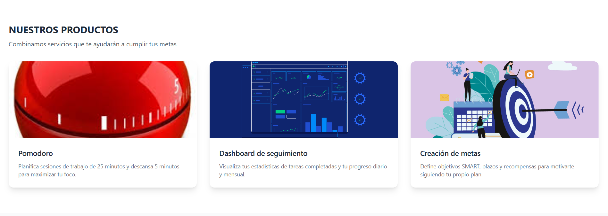
</p>

<p align="center">
  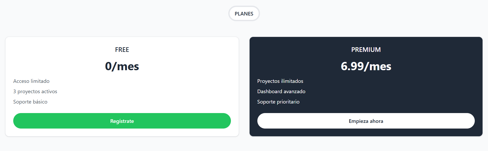
</p>

<p align="center">
  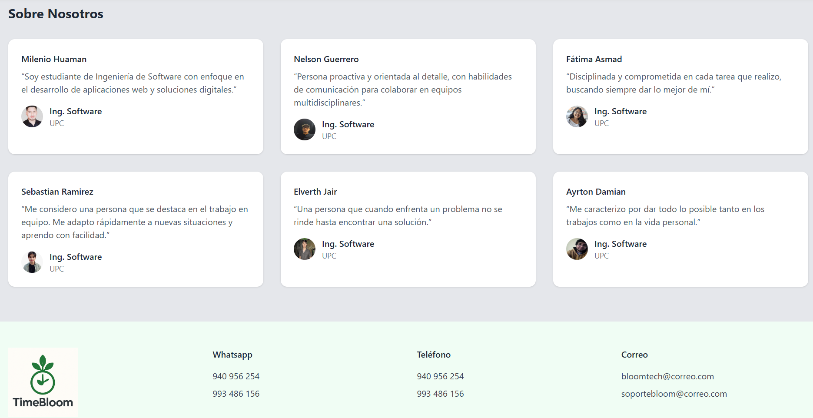
</p>

#### 5.2.1.6. Services Documentation Evidence for Sprint Review
Durante este Sprint, nos enfocamos exclusivamente en el desarrollo del frontend estático de la Landing Page del proyecto. En consecuencia, no se implementaron endpoints ni funcionalidades relacionadas con servicios web o APIs RESTful.

La creación de la documentación se programará para Sprints futuros, una vez que comience la implementación del backend del sistema.

#### 5.2.1.7. Software Deployment Evidence for Sprint Review

Se realizó el despliegue de la **landing page** del proyecto *TimeBloom*, marcando el primer paso hacia la publicación progresiva de los productos del sistema. Este trabajo tuvo como objetivo validar visualmente los avances en diseño e interacción con el cliente y el equipo docente.

##### Actividades Realizadas

- Configuración del repositorio **GitHub** y definición de la estructura inicial de carpetas.
- Implementación del flujo de trabajo **Git Flow**, manteniendo los cambios en la rama *develop*.
- Realización de un **merge** desde *develop* hacia la rama *main*, siguiendo las convenciones definidas en la sección *5.1.2*.
- Activación de **GitHub Pages** como servicio de despliegue estático, apuntando al contenido de la rama *main*.
- Publicación exitosa de la **landing page**, accesible mediante una URL pública.

##### Evidencias Visuales

* Configuración del repositorio GitHub y estructura inicial de carpetas.
  * Creamos un repositorio para la landing page dentro de la organizacion. La configuramos para que sea de tipo publico:
  <p align="center">
  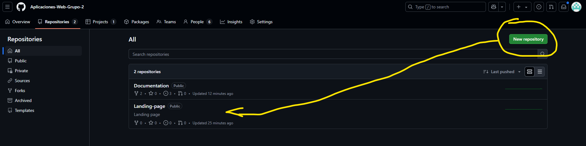
  </p>

  * Una vez dentro copiamos la direccion HTTPS del repositorio y la clonamos en nuestro entorno local con el comando git clone. Preparamos una estructura de carpetas similar a la siguiente en nuestra maquina:

* Implementación de flujo de trabajo con Git Flow, manteniendo los cambios en la rama develop.

  * Desde la consola, creamos un push inicial en la rama remota main usando el comando git push origin main con un mensaje commit descriptivo.
  initial-commit-landing

  * El siguiente paso es crear la rama local develop usando el comando git checkout -b develop, la creamos de manera remota con git push origin develop. Las ramas feature/* se crearan de la misma forma, pero hay que tener en cuenta que siempre se deben crear a partir de la rama develop, por lo que un paso previo es asegurarnos que estamos en la rama correcta con git checkout develop.

* Realización de un merge desde develop hacia la rama main, de acuerdo a las convenciones definidas en la sección 5.1.2.

  * Antes de realizar el merge, se revisaron los cambios mediante un pull request en GitHub, asegurando que no existieran conflictos y que el código cumpliera con los estándares definidos.

  * Se realizaron pruebas manuales usando la extension Live Server para verificar la funcionalidad de la landing page antes de fusionar los cambios.

* Activación de GitHub Pages como servicio de despliegue estático, apuntando al contenido de la rama main.

  * En la configuración del repositorio, se seleccionó la rama main como fuente para GitHub Pages. Esto se realizó desde la pestaña "Settings" > "Pages" en GitHub.

  * Se verificó que la URL generada por GitHub Pages estuviera activa y mostrara correctamente el contenido de la landing page.

  <p align="center">
  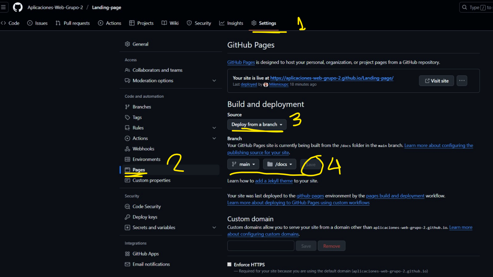
</p>

  * Publicacion exitosa de la Landing Page

  <p align="center">
  
</p>

<p align="center">
  
</p>

<p align="center">
  
</p>

<p align="center">
  
</p>

#### 5.2.1.8. Team Collaboration Insights during Sprint
Para este sprint, las tareas de diseño, implementación y documentación de la landing page se distribuyó entre los integrantes del equipo. La implementación y despliegue de la landing page fue llevado a cabo principalmente por Nelson Guerrero y Milenio Huaman.

<p align="center">
  
</p>

<p align="center">
  
</p>


### 5.2.2. Sprint 2 
#### 5.2.2.1. Sprint Planning 2
En el Sprint 2 nos centramos en escoger las funcionalidades más importantes de la aplicación para dar inicio al desarrollo del proyecto. Tuvimos reuniones en las cuales a cada integrante del equipo se le asignó un bounded context a trabajar. Seleccionamos las user stories según indica nuestro product backlog.

| Sprint #                             | Sprint 1                                                                                               |
|--------------------------------|--------------------------------------------------------------------------------------------------------|
| **Date**       |     2025-05-7      |
| Time           | 10:00 PM                      |
| Location       | Virtual - Meet               |
| Prepared By    | Elverth Vasquez Villalobos              |
| Attendees (to planning meeting)| Milenio Huaman, Fatima Asmad, Nelson Guerrero, Ayrton Inga, Sebastian Tello                |
| Sprint n - 2 Review Summary    | Discutimos las diferentes observaciones que nos hizo el profesor respecto a nuestro informe y landing page                                            |
| Sprint n - 2 Retrospective Summary | Creemos que la coordinación se podría mejorar , sobretodo en la gestión del tiempo para que cada integrante del grupo pueda dedicar el tiempo adecuado al desarrollo de sus funcionalidades      |
| Sprint 2 Goal                  | El objetivo de este Sprint es desarrollar las funcionalidades más importantes que hacen que nuestro proyecto ya pueda ser considerado un MVP.La creación de sesiones pomodoros para el usuario es una de las funcionalidades que se espera se pueda desarrollar en este sprint. Asi mismo, en este sprint corregimos las observaciones hechas por el profesor y organizamos al equipo para que cada uno se encargue de un bounded context. |
| Sprint 2 Velocity              | Nuestro equipo puede aceptar hasta 20 Story Points.                                                  |
| Sum of Story Points            | La suma de Story Points atendidos es de 16.                                            |

#### 5.2.2.2. Aspect Leaders and Collaborators
En este sprint nos centramos en el desarrollo de las funcionalidades de la aplicación en el lado del frontend. Para llegar a realizar todo el desarrollo hubo una organización previa en el equipo en el cual se aginaron roles y responsabilidades

| Team Member (Last Name, First Name)       | GitHub Username   | Aspect Name 1 (L/C) |Aspect Name 2 (L/C)
|------------------------------------------|-------------------|---------------------|---------------------|
| Elvert Vasquez | ElvDev05  | L  |  L  |
| Fatima Asmad Padilla   |  FatimaAP05    | C         |  C         | 
| Milenio Huaman   | Milenioupc    | C         | C         | 
| Ayrton Inga       | DamianIH     | C         | C         |  
| Sebastian Tello   | SRT0808 | C         | C         | 
| Nelson Guerrero   | Nelsoondev | C         | C         | 

#### 5.2.2.3. Sprint Backlog 2

Para el primer sprint, desarrollamos la estructura y las funcionalidades básicas de la landing page, así como el diseño visual y la barra de navegación.

| **Sprint #**   | Sprint 2  |             |             |             |             |             |             |
|----------------|-------------|-------------|-------------|-------------|-------------|-------------|-------------|
| **User Story** |             | **Work-Item/task** |             |             |             |             |             |
| **ID**         | **Título**  | **ID**             | **Título**   | **Descripción**        | **Estimación (hrs)** | **Assigned to**    | **Status** |
| US-01 | Iniciar Sesión | T09 | Maquetar vista de login            | Diseñar el formulario de inicio de sesión en frontend              | 4  |  Nelson | Done |
| US-01 | Iniciar Sesión | T10 | Implementar autenticación backend | Lógica de validación de credenciales y generación de sesión        | 5  | Nelson | Done |
| US-02 | Registro de Usuario | T11 | Maquetar vista de registro         | Formulario de registro con campos necesarios                        | 4  | Nelson | Done |
| US-02 | Registro de Usuario | T12 | Lógica de registro en backend      | Validaciones y guardado de usuario en base de datos                 | 5  | Nelson | Done |
| US-03 | Comenzar sesión de enfoque | T01 | Creación de tareas | El usuario puede crear las tareas que tiene pendiente en la semana | 4 | Elverth Vasquez  | Done |
| US-03 | Comenzar sesión de enfoque | T02 | Gestión de tareas | El usuario puede gestionar las tareas que tiene pendiente en la semana | 1 | Elverth Vasquez  | Done |
| US-03 | Comenzar sesión de enfoque | T03 | Visualizar tareas | El usuario puede visualizar en una tabla las tareas que ha creado. En la tabla se aprecia cada uno de los atributos de las tareas (nombre, estado, categoria,etc.) | 1| Elverth Vasquez  | Done |
| US-03 | Comenzar sesión de enfoque | T04 | Crear sesión pomodoro | El usuario puede crear una sesión pomodoro  | 4| Milenio  | Pending |
| US-03 | Comenzar sesión de enfoque | T05 | Asignar tareas a sesión pomodoro | El usuario puede asignar las tareas que desea realizar en su sesión pomodoro.  | 4| Milenio  | Pending |
| US-03 | Comenzar sesión de enfoque | T13 | Integrar ejemplo Pomodoro online | Integrar un ejemplo de Pomodoro como referencia temporal             | 2  | Milenio | Done |
| US-03 | Comenzar sesión de enfoque | T14 | Diseñar estructura técnica | Estructura preliminar de sesiones Pomodoro (modelo, flujo de datos) | 4  | Milenio | In Progress |
| US-04 | Recibir frases motivacionales | T06 | Visualizar frases | El usuario puede visualizar frases motivacionales  | 2| Ayrton Inga  | Done |
| US-04 | Recibir frases motivacionales | T07 | Generar frases | El usuario puede generar frases que recibirá de forma aleatoria  | 2| Ayrton Inga  | Done |
| US-04 | Recibir frases motivacionales | T08 | Recibir frase luego de sesión pomodoro | El usuario recibe una frase aleatoria luego de culminar su sesión pomodoro  | 2| Ayrton Inga  | Pending |
| US-17 | Obtener tareas del usuario | T15 | Crear endpoint GET /tareas       | Obtener tareas desde base de datos para usuario autenticado         | 3  | Elverth Vasquez  | Done |
| US-17 | Obtener tareas del usuario | T16 | Mostrar tareas en tablero        | Mostrar tareas en interfaz del usuario                              | 3  | Elverth Vasquez | Done |

#### 5.2.2.4. Development Evidence for Sprint Review
En esta sección presentamos el flujo de trabajo para la creación y desarrollo del Frontend.

| Repository                           | Branch   | Commit ID | Commit Message                  | Commit Message Body          | Commited on  (Date) |
|-------------------------------------|---------|-----------|----------------------------------|------------------------------|---------------------|
| TimeBloom---Frontend | main | 1be6782d57530f9efaa5d9661ed28d3f83a9bb43 | First commit |     | 12/05/2025 |
| TimeBloom---Frontend | develop | 70e116c05d21e6e5a83df5d5a17217a494687e7e | feat:add table to management tasks |     | 14/05/2025 |
| TimeBloom---Frontend | develop | 937c30001e935ac8e34df3d05e687ddb26f49965 | fix: enviroments and method created in task management component |     | 14/05/2025 |
| TimeBloom---Frontend | develop | 3cd944b6ade47346c4bcc40f7da8a3cc4cbff244 | fix: update,create and delete methods fixed |     | 15/05/2025 |
| TimeBloom---Frontend | develop | 135458c13b9dc6e0e26a8c467ded00301a23db97 | fix: columns Status and Category fixed in task management |     | 15/05/2025 |
| TimeBloom---Frontend | develop | 1b0a1df1e64104efc026f5b16a85d5adba9daa43 | feat: add drawer |     | 15/05/2025 |
| TimeBloom---Frontend | develop | bc335dcb8400fe03f00f0aad98e3ae11486a43e5 | feat: add advices page |     | 15/05/2025 |
| TimeBloom---Frontend | develop | 45618f2e61371ac15cecf90ed52d524c25130bcd | feat: add goal-management component |     | 16/05/2025 |
| TimeBloom---Frontend | develop | 4caae1b0a6d161c2f6ad07a504494e209f833543 | feat: add style to list-options |     | 16/05/2025 |
| TimeBloom---Frontend | develop | 61070879fb9d7954386e0b2ec8e3941b790df005 | Merge branch 'develop' of https://github.com/Aplicaciones-Web-Grupo-2/TimeBloom---Frontend into develop |     | 16/05/2025 |


#### 5.2.2.5. Execution Evidence for Sprint Review

En esta entrega se hizo una actualizacion significativa en la landig page haciendo que las referencias cambien para que apuente a la app.

**Evidencias de ejecucióm**

 

Ademas se desarrollo funcionalidades significativas del Frontend.

**Evidencias de ejecucióm**

    
 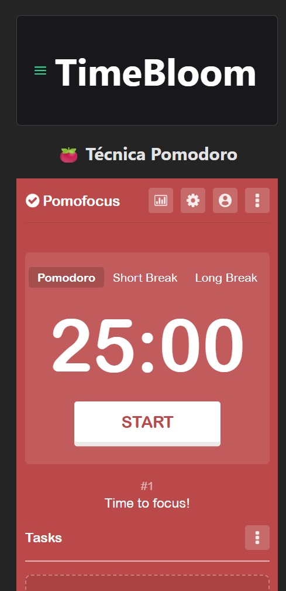
 
#### 5.2.2.6. Services Documentation Evidence for Sprint Review
En este Sprint utilizamos json server para crear una fake api que nos permita simular datos y construir nuestro frontend.

##### Fake API


#### 5.2.2.7. Software Deployment Evidence for Sprint Review

Se realizó el despliegue de la version actualizada de la **landing page** del proyecto *TimeBloom*, marcando el primer paso hacia la publicación progresiva de los productos del sistema. Este trabajo tuvo como objetivo validar visualmente los avances en diseño e interacción con el cliente y el equipo docente.

##### Actividades Realizadas

- Configuración del repositorio **GitHub** y definición de la estructura inicial de carpetas.
- Implementación del flujo de trabajo **Git Flow**, manteniendo los cambios en la rama *develop*.
- Realización de un **merge** desde *develop* hacia la rama *main*, siguiendo las convenciones definidas en la sección *5.1.2*.
- Activación de **GitHub Pages** como servicio de despliegue estático, apuntando al contenido de la rama *main*.
- Publicación exitosa de la **landing page**, accesible mediante una URL pública.

##### Evidencias Visuales

* Configuración del repositorio GitHub y estructura inicial de carpetas.
  * Creamos un repositorio para la landing page dentro de la organizacion. La configuramos para que sea de tipo publico:
  <p align="center">
  
  </p>

  * Una vez dentro copiamos la direccion HTTPS del repositorio y la clonamos en nuestro entorno local con el comando git clone. Preparamos una estructura de carpetas similar a la siguiente en nuestra maquina:

* Implementación de flujo de trabajo con Git Flow, manteniendo los cambios en la rama develop.

  * Desde la consola, creamos un push inicial en la rama remota main usando el comando git push origin main con un mensaje commit descriptivo.
  initial-commit-landing

  * El siguiente paso es crear la rama local develop usando el comando git checkout -b develop, la creamos de manera remota con git push origin develop. Las ramas feature/* se crearan de la misma forma, pero hay que tener en cuenta que siempre se deben crear a partir de la rama develop, por lo que un paso previo es asegurarnos que estamos en la rama correcta con git checkout develop.

* Realización de un merge desde develop hacia la rama main, de acuerdo a las convenciones definidas en la sección 5.1.2.

  * Antes de realizar el merge, se revisaron los cambios mediante un pull request en GitHub, asegurando que no existieran conflictos y que el código cumpliera con los estándares definidos.

  * Se realizaron pruebas manuales usando la extension Live Server para verificar la funcionalidad de la landing page antes de fusionar los cambios.

* Activación de GitHub Pages como servicio de despliegue estático, apuntando al contenido de la rama main.

  * En la configuración del repositorio, se seleccionó la rama main como fuente para GitHub Pages. Esto se realizó desde la pestaña "Settings" > "Pages" en GitHub.

  * Se verificó que la URL generada por GitHub Pages estuviera activa y mostrara correctamente el contenido de la landing page.

  <p align="center">
  
</p>

  * Publicacion exitosa de la Landing Page

  <p align="center">
  
</p>

<p align="center">
  
</p>

<p align="center">
  
</p>

<p align="center">
  
</p>

**FrontEnd** 

<p align="center">
  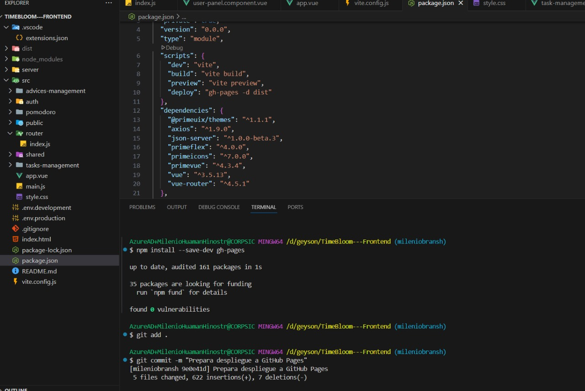
</p>

<p align="center">
  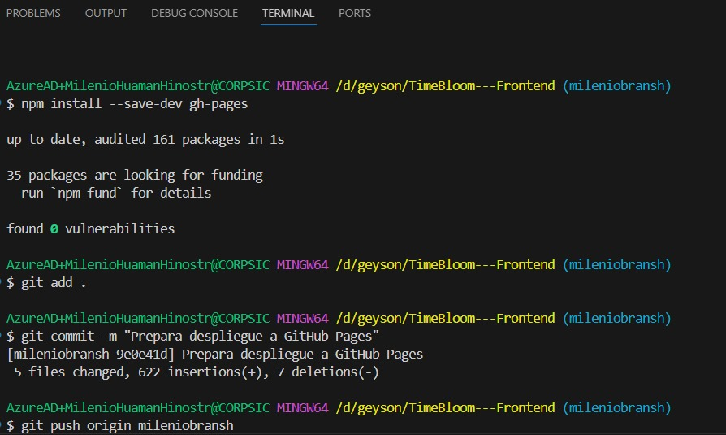
</p>

<p align="center">
  
</p>

<p align="center">
  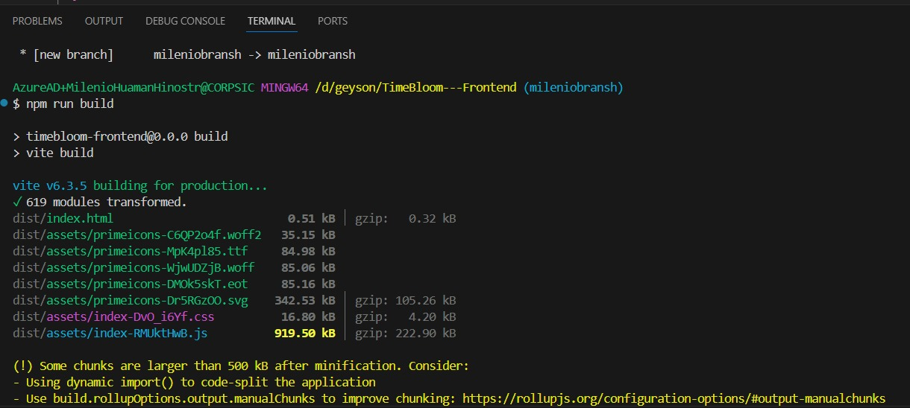
</p>

<p align="center">
  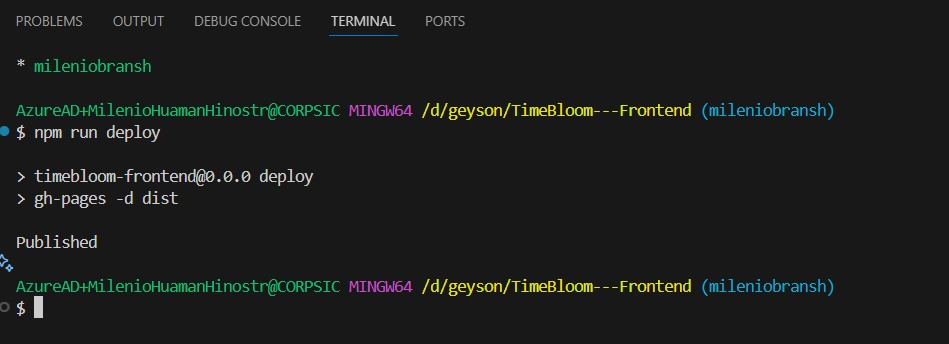
</p>

El Frontend desplegada:

<p align="center">
  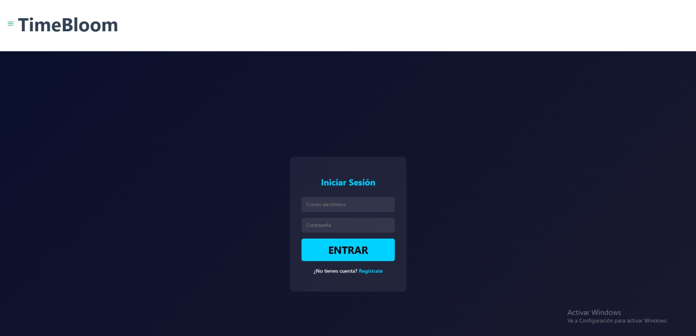
</p>

<p align="center">
  
</p>

#### 5.2.2.8. Team Collaboration Insights during Sprint
En este sprint el desarollo de la aplicación web se dividió en los diferentes bounded context que comprende el proyecto . Cada integrante del equipo desarollo un bounded context y se encargó de su funcionamiento óptimo.

<p align="center">
  
</p>

<p align="center">
  
</p>

### 5.2.3. Sprint 3 
#### 5.2.3.1. Sprint Planning 3

En el Sprint 3 se continuo con el desarrollo de mas funcionalidades, asi como la creacion del backend. Tuvimos reuniones en las cuales a cada integrante del equipo se le asignó ciertas partes del proyecto a mejorar. Seleccionamos las user stories según indica nuestro product backlog.

| Sprint #                             | Sprint 3                                                                                               |
|--------------------------------|--------------------------------------------------------------------------------------------------------|
| **Date**       |     2025-06-13      |
| Time           | 11:00 PM                      |
| Location       | Virtual - Meet               |
| Prepared By    | Elverth Vasquez Villalobos              |
| Attendees (to planning meeting)| Milenio Huaman, Fatima Asmad, Nelson Guerrero, Ayrton Inga, Sebastian Tello                |
| Sprint n - 3 Review Summary    | Discutimos las diferentes observaciones que nos hizo el profesor respecto a nuestro despliegue de frontend e informe.                                            |
| Sprint n - 3 Retrospective Summary | Creemos que que se pudo realizar con exito las mejoras que teniamos planeados para este projecto, asi como una mejor division de tareas realizadas.      |
| Sprint 3 Goal                  | En este sprint se espera la implementación de la primera versión del backend de nuestro proyecto. |
| Sprint 3 Velocity              | Nuestro equipo puede aceptar hasta 30 Story Points.                                                  |
| Sum of Story Points            | La suma de Story Points atendidos es de 27.                 

#### 5.2.3.2. Aspect Leaders and Collaborators

En este sprint nos centramos en el desarrollo inicial del backend, asi como la mejora de funcionalidades en el frontend. Para llegar a realizar todo el desarrollo hubo una organización previa en el equipo en el cual se aginaron roles y responsabilidades

| Team Member (Last Name, First Name)       | GitHub Username   | Aspect Name 1 (L/C) |Aspect Name 2 (L/C)
|------------------------------------------|-------------------|---------------------|---------------------|
| Elvert Vasquez | ElvDev05  | L  |  L  |
| Fatima Asmad Padilla   |  FatimaAP05    | C         |  C         | 
| Milenio Huaman   | Milenioupc    | C         | C         | 
| Ayrton Inga       | DamianIH     | C         | C         |  
| Sebastian Tello   | SRT0808 | C         | C         | 
| Nelson Guerrero   | Nelsoondev | C         | C         | 

#### 5.2.3.3. Sprint Backlog 3

| **Sprint 3**   |             |             |             |             |             |             |             |
|----------------|-------------|-------------|-------------|-------------|-------------|-------------|-------------|
| **User Story** |             | **Work-Item/task** |             |             |             |             |             |
| **ID**         | **Título**  | **ID**             | **Título**   | **Descripción**        | **Estimación (hrs)** | **Assigned to**    | **Status** |
| US-03 | Comenzar sesión de enfoque | T-031 | Diseñar UI para Pomodoro Timer              | Maquetar interfaz con controles de inicio, pausa y reinicio. | 4 | Frontend Dev | En progreso |
|       |                            | T-032 | Implementar lógica de temporizador         | Manejar cuenta regresiva y ciclos Pomodoro (25/5). | 5 | Frontend Dev | En progreso |
|       |                            | T-033 | Conectar con backend (crear sesión)        | Llamar a endpoint POST (US-16). | 2 | Frontend Dev | Pendiente |
| US-04 | Recibir frases motivacionales | T-041 | Crear componente de frase motivacional     | Mostrar frase aleatoria al iniciar o terminar tarea. | 2 | Frontend Dev | Pendiente |
|       |                               | T-042 | Implementar servicio de frases             | Usar lista local o servicio externo temporal. | 2 | Frontend Dev | Pendiente |
| US-08 | Definir metas personales | T-081 | Crear formulario de creación de metas       | Inputs para nombre, categoría, duración estimada. | 3 | Frontend Dev | En progreso |
|       |                          | T-082 | Lógica de validación y envío               | Validaciones básicas y POST al backend. | 2 | Frontend Dev | Pendiente |
|       |                          | T-083 | Endpoint POST para crear meta              | Implementar en backend con persistencia. | 3 | Backend Dev | Completado |
|       |                          | T-084 | Endpoint PUT para actualizar metas         | Permitir editar metas existentes. | 3 | Backend Dev | Completado |
| US-17 | Obtener tareas del usuario | T-171 | Endpoint GET para tareas del usuario       | Filtrado por usuario, tareas activas, etc. | 3 | Backend Dev | Completado |
|       |                           | T-172 | Conectar frontend al endpoint              | Visualizar tareas en el tablero. | 3 | Frontend Dev | En progreso |
|       |                           | T-173 | Componente visual para tareas             | Maquetación de tarjeta de tarea, estado, etc. | 4 | Frontend Dev | En progreso |
| US-21 | Misión del día | T-211 | Generar reto diario (mock)                  | Mostrar mensaje personalizado diario. | 2 | Frontend Dev | Pendiente |
|       |                | T-212 | Componente de visualización                | Diseño y maquetación de sección “Misión del Día”. | 3 | Frontend Dev | Pendiente |
| US-05 | Ver progreso semanal | T-051 | Implementar visual de progreso semanal     | Gráfica o resumen semanal de logros. | 4 | Frontend Dev | Pendiente |
|       |                      | T-052 | Endpoint GET para resumen de progreso      | Lógica para generar resumen (mock o real). | 3 | Backend Dev | Pendiente |
| US-16 | Crear sesión de enfoque | T-161 | Endpoint POST para crear sesión Pomodoro   | Registrar hora de inicio y duración. | 3 | Backend Dev | Completado |

#### 5.2.3.4. Development Evidence for Sprint Review

En esta sección presentamos el flujo de trabajo para la creación y primer desarrollo del backend.

| Repository                           | Branch   | Commit ID | Commit Message                  | Commit Message Body          | Commited on  (Date) |
|-------------------------------------|---------|-----------|----------------------------------|------------------------------|---------------------|
| TimeBloom-platform | master | fb765a52c856e58d958646ff4d4a7e459b2d13f1 | Agregar .gitattributes y .gitignore. |     | 21/06/2025 |
| TimeBloom-platform | master | 1791535756b3c95751e25d96ac1d55ef9f0f8eb8 | Agregar archivos de proyecto. |     | 21/06/2025 |
| TimeBloom-platform | feat/Goals | c2be83b3e3cf1e1fc30f9c63683b10acff0cbdd0 | Implement goal and goal category management services, repositories, and REST controllers |     | 22/06/2025 |
| TimeBloom-platform | master | ff7a5cc103e198e2f84d4b8d4438d5400dbf6a61 | Merge pull request #1 from Aplicaciones-Web-Grupo-2/feat/Goals |     | 22/06/2025 |

#### 5.2.3.5. Execution Evidence for Sprint Review

En esta entrega se avanzó significativamente en el desarrollo de funcionalidades clave tanto del frontend como del backend. En la interfaz de usuario se implementaron las secciones de tareas, Pomodoro, frases motivacionales, misión del día y metas personales, mejorando la experiencia del usuario y sentando las bases del flujo principal de uso. 

**Evidencias de ejecucióm**

 

 

 

 

  
  
A nivel de backend, se desarrollaron y probaron los endpoints relacionados a la gestión de metas y tareas, lo que permitió establecer la conexión entre la lógica del sistema y la interfaz visual. Cada integrante del equipo asumió la implementación de componentes específicos, consolidando la integración de módulos y reflejando el avance coordinado del proyecto.

**Evidencias de ejecucióm**

 

#### 5.2.2.6. Services Documentation Evidence for Sprint Review

Durante el Sprint 3 se avanzó con la implementación de los servicios backend correspondientes a los módulos de **Goals** (metas) y **Tasks** (tareas), elementos fundamentales dentro del flujo principal de la aplicación *TimeBloom*. Para garantizar la trazabilidad y comprensión de los servicios expuestos, se utilizó **Swagger UI**, lo que permitió documentar, visualizar y probar los endpoints directamente desde el navegador, facilitando así el proceso de revisión y validación por parte del equipo.

A continuación, se detalla la evidencia de los servicios desarrollados:

### Endpoints del módulo `Goal`

| Método | Endpoint                        | Descripción                                      |
|--------|----------------------------------|--------------------------------------------------|
| GET    | `/api/v1/goals/user/{userId}`   | Obtiene todas las metas asociadas a un usuario específico. |
| GET    | `/api/v1/goals/{id}`            | Retorna los detalles de una meta específica por su ID. |
| POST   | `/api/v1/goals`                 | Crea una nueva meta personal, vinculada al usuario. |

### Endpoints del módulo `GoalCategory`

| Método | Endpoint                              | Descripción                                      |
|--------|----------------------------------------|--------------------------------------------------|
| GET    | `/api/v1/goalcategories`              | Lista todas las categorías de metas disponibles. |
| POST   | `/api/v1/goalcategories`              | Permite registrar una nueva categoría de meta. |
| GET    | `/api/v1/goalcategories/{id}`         | Devuelve la información de una categoría específica. |

### Endpoints del módulo `Task`

| Método | Endpoint                        | Descripción                                      |
|--------|----------------------------------|--------------------------------------------------|
| POST   | `/api/v1/task`                  | Registra una nueva tarea asociada al usuario. |
| GET    | `/api/v1/task/{taskId}`         | Retorna los datos de una tarea específica por su ID. |

### Endpoints del módulo `TaskCategory`

| Método | Endpoint                                  | Descripción                                      |
|--------|--------------------------------------------|--------------------------------------------------|
| POST   | `/api/v1/task-category`                   | Permite crear una nueva categoría de tarea. |
| GET    | `/api/v1/task-category/{taskCategoryId}`  | Obtiene información de una categoría específica de tarea. |

### Swagger UI

Todos estos endpoints fueron documentados y expuestos en **Swagger**, permitiendo:
- Probar las operaciones CRUD con datos reales.
- Visualizar los modelos de entrada y salida de forma clara.
- Validar el correcto funcionamiento de las rutas antes de conectarlas con el frontend.

Este enfoque permitió al equipo técnico y al Product Owner verificar rápidamente el progreso y la funcionalidad desarrollada, asegurando transparencia y calidad técnica en el backend de *TimeBloom*.

 
 
#### 5.2.3.7. Software Deployment Evidence for Sprint Review

Se realizó el despliegue de la version actualizada de la **landing page** del proyecto *TimeBloom*, marcando el primer paso hacia la publicación progresiva de los productos del sistema. Este trabajo tuvo como objetivo validar visualmente los avances en diseño e interacción con el cliente y el equipo docente.

##### Actividades Realizadas

- Configuración del repositorio **GitHub** y definición de la estructura inicial de carpetas.
- Implementación del flujo de trabajo **Git Flow**, manteniendo los cambios en la rama *develop*.
- Realización de un **merge** desde *develop* hacia la rama *main*, siguiendo las convenciones definidas en la sección *5.1.2*.
- Activación de **GitHub Pages** como servicio de despliegue estático, apuntando al contenido de la rama *main*.
- Publicación exitosa de la **landing page**, accesible mediante una URL pública.

##### Evidencias Visuales

* Configuración del repositorio GitHub y estructura inicial de carpetas.
  * Creamos un repositorio para la landing page dentro de la organizacion. La configuramos para que sea de tipo publico:
  <p align="center">
  
  </p>

  * Una vez dentro copiamos la direccion HTTPS del repositorio y la clonamos en nuestro entorno local con el comando git clone. Preparamos una estructura de carpetas similar a la siguiente en nuestra maquina:

* Implementación de flujo de trabajo con Git Flow, manteniendo los cambios en la rama develop.

  * Desde la consola, creamos un push inicial en la rama remota main usando el comando git push origin main con un mensaje commit descriptivo.
  initial-commit-landing

  * El siguiente paso es crear la rama local develop usando el comando git checkout -b develop, la creamos de manera remota con git push origin develop. Las ramas feature/* se crearan de la misma forma, pero hay que tener en cuenta que siempre se deben crear a partir de la rama develop, por lo que un paso previo es asegurarnos que estamos en la rama correcta con git checkout develop.

* Realización de un merge desde develop hacia la rama main, de acuerdo a las convenciones definidas en la sección 5.1.2.

  * Antes de realizar el merge, se revisaron los cambios mediante un pull request en GitHub, asegurando que no existieran conflictos y que el código cumpliera con los estándares definidos.

  * Se realizaron pruebas manuales usando la extension Live Server para verificar la funcionalidad de la landing page antes de fusionar los cambios.

* Activación de GitHub Pages como servicio de despliegue estático, apuntando al contenido de la rama main.

  * En la configuración del repositorio, se seleccionó la rama main como fuente para GitHub Pages. Esto se realizó desde la pestaña "Settings" > "Pages" en GitHub.

  * Se verificó que la URL generada por GitHub Pages estuviera activa y mostrara correctamente el contenido de la landing page.

  <p align="center">
  
</p>

  * Publicacion exitosa de la Landing Page

  <p align="center">
  
</p>

<p align="center">
  
</p>

<p align="center">
  
</p>

<p align="center">
  
</p>

**FrontEnd** 

<p align="center">
  
</p>

<p align="center">
  
</p>

<p align="center">
  
</p>

<p align="center">
  
</p>

<p align="center">
  
</p>

El Frontend desplegada:

<p align="center">
  
</p>

<p align="center">
  
</p>

FrontEnd Para el FrontEnd, se hizo el mismo proceso y estas son las evidenciqas: 

 

 

 

 

  

#### 5.2.3.8. Team Collaboration Insights during Sprint

## 5.3. Validations Interviews.

### 5.3.1. Diseño de entrevistas

- ¿Qué aspectos de mejora puedes encontrar en la aplicación?
- ¿Hubo un paso de la navegación no muy intuitivo?
- ¿Qué otra funcionalidad sería conveniente agregar?
- ¿Cree que nuestra aplicación podrá ayudar en la mejora de eficacia de tareas?

### 5.3.2. Registro de entrevistas

A continuación se presentan los detalles clave de las entrevistas realizadas a los usuarios:

| **Entrevista 1** ||
|:-:|:-:|
| Nombre | Andrea |
|Edad| 20 |
|Departamento| Lima |
|Distrito| Lima |
|Minuto de inicio|00:00:01|
|Captura de la entrevista|  |
|Link de la entrevista| https://www.youtube.com/watch?v=6fhc8HsbXuk |

### 5.3.3. Evaluaciones según heurísticas

#### Escala de Severidad

| Nivel | Descripción |
|-------|-------------|
| 1     | Problema superficial: Es poco común o fácil de sortear por el usuario. No requiere atención inmediata, salvo que haya tiempo disponible. |
| 2     | Problema menor: Puede presentarse con mayor frecuencia o resultar algo más complicado para el usuario. Es recomendable resolverlo, aunque con baja prioridad, en futuras versiones. |
| 3     | Problema mayor: Sucede con regularidad o el usuario no puede resolverlo por sí mismo. Debe ser atendido con prioridad alta.. |
| 4     | Problema muy grave: errores que impiden que el usuario continúe utilizando la herramienta. Debe repararse antes del lanzamiento.. |

#### Tabla Resumen

| # | Problema                                                                 | Escala de severidad | Heurística/Principio violado       | Tarea evaluada                                  |
|---|---------------------------------------------------------------------------|----------------------|-------------------------------------|-------------------------------------------------|
| 1 |  Datos demasiado grandes y poco ordenados                  | 2                    | Eficiencia y satisfacción del usuario | Navegación de la página        |
| 2 | Diseño de la página       | 2                    | Diseño estético y cohesivo           | Navegación dentro de la página    |
| 3 | Cuadros de diálogo muy simples      | 1                    | Diseño estético y cohesivo           | Edición de la información      |

#### Recomendaciones

- **Problema 1: Datos demasiado grandes y poco ordenados**  
  - **Tarea Evaluada:** Navegación de la página
  - **Recomendación:** Modificar el tamaño de la información.

- **Problema 2: Diseño de la página**  
  - **Tarea Evaluada:** Navegación dentro de la página 
  - **Recomendación:** Mejorar el diseño de la página agregando fondo.

- **Problema 3: Cuadros de diálogo muy simples**  
  - **Tarea Evaluada:** Edición de la información  
  - **Recomendación:** Agregar íconos, etiquetas o elementos visuales que complementen y refuercen el propósito de cada acción del usuario.

## 5.4. Video about the product.

## Conclusiones
### Conclusiones y recomendaciones

* **Conclusiónes:**
1. **Problema real y vigente:**
   La desconexión y falta de comunicación sobre la productividad y bienestar emocional entre estudiantes y jóvenes profesionales afecta su rendimiento y salud.
2. **Solución alineada a las necesidades del usuario:**
   TimeBloom ofrece herramientas personalizadas para organizar tareas y fomentar el bienestar emocional, mejorando la eficiencia de estudiantes y jóvenes profesionales.
3. **Alta viabilidad tecnológica:**
   El acceso a smartphones y conectividad en Lima garantiza que la aplicación sea fácilmente adoptada por los usuarios.
4. **Impacto potencial alto:**
   TimeBloom puede mejorar la productividad y reducir el estrés, favoreciendo el bienestar académico y profesional de los usuarios.

* **Recomendaciónes:**
1. **Incluir un módulo de accesibilidad y soporte técnico:**
   Agregar opciones como lectura fácil, notificaciones por WhatsApp y soporte técnico para garantizar accesibilidad.
2. **Insentivar el uso de la aplicación para el personal:**
   Implementar logros o recompensas para motivar el uso constante de la aplicación.
3. **Expandirlo de manera progresiva:**
   Comenzar en universidades y empresas tecnológicas y expandir gradualmente a zonas con menor conectividad.

## Bibliografía

Procrastinación académica en los estudiantes de internado de la carrera profesional de Psicología en. Edu.Pe. Retrieved April 14, 2025, from [https://repositorio.continental.edu.pe/bitstream/20.500.12394/15288/1/IV_FHU_501_TE_Osorio_Rice_2024.pdf?utm_source=chatgpt.com](https://repositorio.continental.edu.pe/bitstream/20.500.12394/15288/1/IV_FHU_501_TE_Osorio_Rice_2024.pdf?utm_source=chatgpt.com)

Researchgate.net. Retrieved April 14, 2025, from [https://www.researchgate.net/publication/344057996_Procrastinacion_academica_y_ansiedad_en_estudiantes_universitarios_de_Madre_de_Dios_Peru](https://www.researchgate.net/publication/344057996_Procrastinacion_academica_y_ansiedad_en_estudiantes_universitarios_de_Madre_de_Dios_Peru)

Redalyc.org. Retrieved April 14, 2025, from [https://www.redalyc.org/journal/4595/459578426014/html/?utm_source=chatgpt.com](https://www.redalyc.org/journal/4595/459578426014/html/?utm_source=chatgpt.com)

Edu.Pe. Retrieved April 14, 2025, from [https://repositorio.usil.edu.pe/items/bca058c0-22d7-4870-ac03-b165bdeaa6a4](https://repositorio.usil.edu.pe/items/bca058c0-22d7-4870-ac03-b165bdeaa6a4)

Amelica.org. Retrieved April 14, 2025, from [https://portal.amelica.org/ameli/journal/359/3593711012/html/?utm_source=chatgpt.com](https://portal.amelica.org/ameli/journal/359/3593711012/html/?utm_source=chatgpt.com)

## Anexos
- Deployment Landing AgeCare: [Landing Deployment](https://aplicaciones-web-grupo-2.github.io/Landing-page/)
- Deployment Frontend AgeCare: [Frontend Deployment](https://aplicaciones-web-grupo-2.github.io/TimeBloom---Frontend/#/home)
