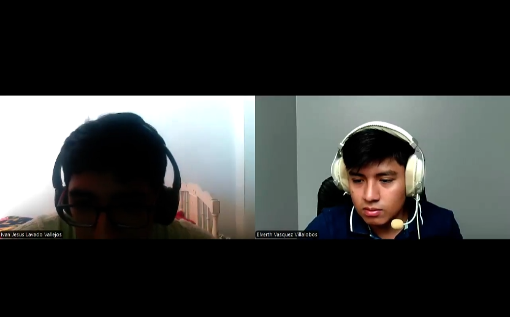

# Universidad Peruana de Ciencias Aplicadas

## Ingeniería de Sistemas y Computación | Ingeniería de Software

### APLICACIONES WEB

#### TF REPORT

**Nombre del Startup**

**Docente:** COLOCAR NOMBRE

**Grupo 2**

**Team Members:**
- Vásquez Villalobos, Elverth Jair **U202213070**
- Huaman Hinostroza, Milenio **U20211C245**
- Asmad Padilla, Fatima **U20221B490**
- Inga Hernandez, Ayrton **U201924756**
- Ramirez Tello, Sebastian **U202316122**

# CONTENIDO

# Tabla de Contenidos

1. [Capítulo I: Introducción](#capítulo-i-introducción) 
   1.1. [Startup Profile](#startup-profile) 
      1.1.1. [Descripción de la Startup](#descripción-de-la-startup) 
      1.1.2. [Perfiles de integrantes del equipo](#perfiles-de-integrantes-del-equipo) 
   1.2. [Solution Profile](#solution-profile) 
      1.2.1. [Antecedentes y problemática](#antecedentes-y-problemática) 
      1.2.2. [Lean UX Process](#lean-ux-process) 
         1.2.2.1. [Lean UX Problem Statements](#principio-1) 
         1.2.2.2. [Lean UX Assumptions](#principio-2) 
         1.2.2.3. [Lean UX Hypothesis Statements](#principio-3) 
         1.2.2.4. [Lean UX Canvas](#principio-4) 
   1.3. [Segmentos objetivo](#lean-ux-problem-statements-assumptions-hypothesis-statements-canvas-segmentos-objetivo) 
2. [Capítulo II: Requirements Elicitation & Analysis](#capítulo-ii-requirements-elicitation-analysis) 
   2.1. [Competidores](#competidores) 
      2.1.1. [Análisis competitivo](#análisis-competitivo) 
      2.1.2. [Estrategias y tácticas frente a competidores](#estrategias-y-tácticas-frente-a-competidores) 
   2.2. [Entrevistas](#entrevistas) 
      2.2.1. [Diseño de entrevistas](#diseño-de-entrevistas) 
      2.2.2. [Registro de entrevistas](#registro-de-entrevistas) 
      2.2.3. [Análisis de entrevistas](#análisis-de-entrevistas) 
   2.3. [Needfinding](#needfinding) 
      2.3.1. [User Personas](#user-personas) 
      2.3.2. [User Task Matrix](#user-task-matrix) 
      2.3.3. [User Journey Mapping](#user-journey-mapping) 
      2.3.4. [Empathy Mapping](#empathy-mapping) 
      2.3.5. [As-is Scenario Mapping](#as-is-scenario-mapping) 
   2.4. [Ubiquitous Language](#ubiquitous-language) 
3. [Capítulo III: Requirements Specification](#capítulo-iii-requirements-specification) 
   3.1. [To-Be Scenario Mapping](#to-be-scenario-mapping) 
   3.2. [User Stories](#user-stories) 
   3.3. [Impact Mapping](#impact-mapping) 
   3.4. [Product Backlog](#product-backlog) 
4. [Capítulo IV: Product Design](#capítulo-iv-product-design) 
   4.1. [Style Guidelines](#style-guidelines) 
      4.1.1. [General Style Guidelines](#general-style-guidelines) 
      4.1.2. [Web Style Guidelines](#web-style-guidelines) 
   4.2. [Information Architecture](#information-architecture) 
      4.2.1. [Organization Systems](#organization-systems) 
      4.2.2. [Labeling Systems](#labeling-systems) 
      4.2.3. [SEO Tags and Meta Tags](#seo-tags-and-meta-tags) 
      4.2.4. [Searching Systems](#searching-systems) 
      4.2.5. [Navigation Systems](#navigation-systems) 
   4.3. [Landing Page UI Design](#landing-page-ui-design) 
      4.3.1. [Landing Page Wireframe](#landing-page-wireframe) 
      4.3.2. [Landing Page Mock-up](#landing-page-mock-up) 
   4.4. [Web Applications UX/UI Design](#web-applications-uxui-design) 
      4.4.1. [Web Applications Wireframes](#web-applications-wireframes) 
      4.4.2. [Web Applications Wireflow Diagrams](#web-applications-wireflow-diagrams) 
      4.4.2. [Web Applications Mock-ups](#web-applications-mock-ups) 
      4.4.3. [Web Applications User Flow Diagrams](#web-applications-user-flow-diagrams) 
   4.5. [Web Applications Prototyping](#web-applications-prototyping) 
   4.6. [Domain-Driven Software Architecture](#domain-driven-software-architecture) 
      4.6.1. [Software Architecture Context Diagram](#software-architecture-context-diagram) 
      4.6.2. [Software Architecture Container Diagrams](#software-architecture-container-diagrams) 
      4.6.3. [Software Architecture Components Diagrams](#software-architecture-components-diagrams) 
   4.7. [Software Object-Oriented Design](#software-object-oriented-design) 
      4.7.1. [Class Diagrams](#class-diagrams) 
      4.7.2. [Class Dictionary](#class-dictionary) 
   4.8. [Database Design](#database-design) 
      4.8.1. [Database Diagram](#database-diagram) 
5. [Capítulo V: Product Implementation, Validation & Deployment](#capítulo-v-product-implementation-validation-deployment) 
   5.1. [Software Configuration Management](#software-configuration-management) 
      5.1.1. [Software Development Environment Configuration](#software-development-environment-configuration) 
      5.1.2. [Source Code Management](#source-code-management) 
      5.1.3. [Source Code Style Guide & Conventions](#source-code-style-guide-conventions) 
      5.1.4. [Software Deployment Configuration](#software-deployment-configuration) 
   5.2. [Landing Page, Services & Applications Implementation](#landing-page-services-applications-implementation) 
      5.2.1. [Sprint 1](#sprint-1) 
         5.2.1.1. [Sprint Planning 1 2 3](#sprint-planning-1) 
         5.2.1.2. [Sprint Backlog 1 2 3](#sprint-backlog-1) 
         5.2.1.3. [Development Evidence for Sprint Review](#development-evidence-for-sprint-review) 
         5.2.1.4. [Testing Suite Evidence for Sprint Review](#testing-suite-evidence-for-sprint-review) 
         5.2.1.5. [Execution Evidence for Sprint Review](#execution-evidence-for-sprint-review) 
         5.2.1.6. [Services Documentation Evidence for Sprint Review](#services-documentation-evidence-for-sprint-review) 
         5.2.1.7. [Software Deployment Evidence for Sprint Review](#software-deployment-evidence-for-sprint-review) 
         5.2.1.8. [Team Collaboration Insights during Sprint](#team-collaboration-insights-during-sprint) 
          5.3. [Validation Interviews](#team-collaboration-insights-during-sprint) 
         5.3.1. [Diseño de Entrevistas](#team-collaboration-insights-during-sprint) 
         5.3.2. [Registro de Entrevistas](#team-collaboration-insights-during-sprint) 
         5.3.3. [Evaluaciones según heurísticas](#team-collaboration-insights-during-sprint) 
         5.4. [Video About-the-Product.](#team-collaboration-insights-during-sprint)

# Capítulo I: Introducción
## 1.1. Startup Profile
### 1.1.1. Descripción de la Startup
### 1.1.2. Perfiles de integrantes del equipo

---

#### **Fatima Andrea Asmad Padilla – Ingeniería de Software – U20221B490**  

Mi perfil se caracteriza por la responsabilidad, disciplina y compromiso en cada tarea que realizo, buscando siempre dar lo mejor de mí en cualquier proyecto o actividad asignada. Actualmente curso el sexto ciclo de la carrera de Ingeniería de Software, lo cual me ha permitido adquirir una base sólida en distintas áreas del desarrollo tecnológico.

---

#### **Ayrton Damian Inga Hernandez – Ingeniería de Software – U201924756  **  

Soy estudiante de Ingenieria de Software en la UPC. Me caracterizo por dar todo lo posible tanto en los trabajos como en la vida personal, cuento con conocimientos impartidos anteriormente que me ayudarán a desarrollar este nuevo projecto de forma correcta y a llevar un buen trabajo en equipo.

---

#### **Elverth Jair Vasquez Villalobos – Ingeniería de Software – U202213070**  

Mi perfil se basa en ser una persona que cuando enfrenta un problema no se rinde hasta encontrar una solución. Considero que tengo una buena capacidad de análisis al momento de realizar algoritmos necesarios para el funcionamiento de algunos requerimientos en el software. Así mismo, me gusta siempre estar en comunicación con mi equipo de trabajo de una manera asertiva. Me apasiona el mundo de la tecnología y el emprendimiento, por ello trato de aportar al desarrollo del startup con mis habilidades en programación e investigación.

---

#### **XXXXX – Ingeniería de Software – XXXXX**  

XXXXXX

---

#### **XXXXX – Ingeniería de Software – XXXXX**  

XXXXXX

---

#### **XXXXX – Ingeniería de Software – XXXXX**  

XXXXXX

---
## 1.2. Solution Profile
## 1.2.1 Antecedentes y problemática
### 1.2.2 Lean UX Process.
#### 1.2.2.1. Lean UX Problem Statements
#### 1.2.2.2. Lean UX Assumptions
#### 1.2.2.3. Lean UX Hypothesis Statements
#### 1.2.2.4. Lean UX Canvas
## 1.3. Segmentos objetivo.
# Capítulo II: Requirements Elicitation & Analysis
## 2.1 Competidores
### 2.1.1. Análisis competitivo.

<table>
   <tr>
      <td align="center" colspan="6">Competitive Analysis Landscape</td>
   </tr>
   <tr>
      <td colspan="2" rowspan="2">¿Porqué llevar a cabo este análisis?</td><td colspan="4">Este análisis nos permitirá conocer nuestra posición frente a nuestros competidores. Además, podremos identificar nuestras fortalezas y debilidades.</td>
   </tr>
   <tr>
      <td colspan="4">¿Cómo podríamos resolver el problema de procrastinación en los jóvenes estudiantes y emprendedores de manera que no se desmotiven durante el intento?</td>
   </tr>
   <tr align="center">
      <td colspan="2"></td><td>FOCUST</td><td>TODOIST</td><td>TRELLO</td><td>FOREST</td>
   </tr>
   <tr>
      <td rowspan="2">Perfil</td><td>Overview</td><td>Es una aplicación de gestión de tareas con recursos de bienestar emocional para ayudar en la productividad y el cansancio mental.</td><td>Es una aplicación de gestión de tareas y listas por hacer, que ayuda a organizar la vida personal y profesional de un usuario.</td><td>Es una herramienta colaborativa que ayuda a individuos o equipos a organizar tareas para una mayor productividad.</td><td>Es una app de productividad que te ayuda a mantenerte enfocado alejándote del celular.</td>
   </tr>
   <tr>
      <td>Ventaja competitiva ¿Qué valor ofrece a los clientes?</td><td>Planificación de tareas y técnicas de estudio, fomento de la motivación productiva y evaluación de mejora.</td><td>Agrupa tareas dependiendo de áreas de la vida y división de tareas principales en subtareas.</td><td>Organización de tareas flexible tanto para uso personal o profesional.</td><td>Uso de técnicas para mejorar la concentración evitar usar el celular.</td>
   </tr>
   <tr>
      <td rowspan="2">Perfil de Marketing</td><td>Mercado objetivo</td><td>Estudiantes universitarios y jóvenes profesionales.</td><td>Profesionales independientes, estudiantes y pequeños equipos.</td><td>Freelancers, planificadores de eventos y para uso personal.</td><td>Estudiantes y FreeLancers que quieran enfocarse sin distracciones.</td>
   </tr>
   <tr>
      <td>Estrategias de marketing</td><td>Enfoque en que el producto se venda solo por su funcionalidad y anuncios por Google.</td><td>Enfoque en que el producto se venda solo por su experiencia y simplicidad, historias de usuarios y anuncios.</td><td>Enfoque en que el producto se venda solo, blog con artículos sobre productividad e integraciones con herramientas populares.</td><td>Asociación con ONGs y promueve su enfoque como acción con impacto ambiental.</td>
   </tr>
   <tr>
      <td rowspan="3">Perfil de Producto</td><td>Productos & Servicios</td><td>Ofrece una plataforma que integre herramientas de enfoque y motivacionales para la continua salud mental.</td><td>Ofrece una plataforma de ayuda para aumentar la productividad por medio de tareas.</td><td>Ofrece un aumento de productividad por medio de tarjetas y colaboración en tiempo real.</td><td>Ofrece el establecimiento de un temporizador para mantenerte fuera del celular.</td>
   </tr>
   <tr>
      <td>Precios & Costos</td><td>Versión gratuita con funciones principales y suscripción de bajo costo para mayores herramientas.</td><td>Gratuito hasta 5 proyectos y suscripción de bajo costo por usuario.</td><td>Ofrece versión gratuita y suscripciones de bajo costo por usuario.</td><td>Versión gratis con funciones limitadas y versión de paga única de bajo costo.</td>
   </tr>
   <tr>
      <td>Canales de distribución (Web y/o Móvil)</td><td>- Plataforma web y móvil</td><td>- Plataforma web y móvil</td><td>- Plataforma web y móvil</td><td>- Plataforma web y móvil</td>
   </tr>
   <tr>
      <td rowspan="4">Análisis SWOT</td><td>Fortalezas</td><td>Enfoque en la salud mental para mejorar la motivación del usuario, multiplataforma y simplicidad de interfaz.</td><td>Simplicidad de interfaz, multiplataforma y posicionado mundialmente.</td><td>Facilidad de aprendizaje, atractivo visual y altamente personalizable.</td><td>Enfoque ambiental, recompensas visuales y diseño atractivo.</td>
   </tr>
   <tr>
      <td>Debilidades</td><td>Desarrollo aun en la fase inicial y poca experiencia dentro del mercado laboral.</td><td>Falta de herramientas para gestión de proyectos complejos y funciones importantes bloqueadas en la versión de prueba.</td><td>Funciones avanzadas bloqueadas por pago y propenso a ser caótico por una mala organización.</td><td>Funciones limitadas más allá del enfoque individual, no es adaptable al trabajo en equipo.</td>
   </tr>
   <tr>
      <td>Oportunidades</td><td>Potencial para expandir funciones, integración de extensiones y tendencia creciente de la salud mental.</td><td>Enfocado en el público que prefiere una interfaz menos visual.</td><td>Enfocado en la colaboración de equipos y el uso de extensiones para aumentar la funcionalidad.</td><td>Integracion con herramientas de productividad y expansión a empresas o escuelas</td>
   </tr>
   <tr>
      <td>Amenazas</td><td>Competencia con apps ya establecidas con otros tipos de funcionalidades, limitado desarrollo por el periodo de tiempo establecido.</td><td>Personalización limitada y falta de uso de calendarios.</td><td>EUsuarios avanzados migran a plataformas más complejas y fuerte competencia entre plataformas colaborativas.</td><td>Desmotivación por mecánica repetitiva y apps gratuitas pueden ofrecer alternativas similares.</td>
   </tr>
</table>
 

### 2.1.2. Estrategias y tácticas frente a competidores.

##### Gestión del Tiempo y Técnicas de Estudio (Pomodoro)

- Estrategia: Ofrecer un módulo de gestión del tiempo que integre la técnica Pomodoro, diseñado específicamente para estudiantes y freelancers, orientado a combatir la procrastinación.

- Táctica: 
  - Temporizador Pomodoro: Un temporizador integrado que permite sesiones de enfoque, con alarmas y notificaciones de pausas cortas y descansos largos.
  - Personalización de Sesiones: Posibilidad de ajustar la duración de los intervalos de trabajo y descanso según la preferencia o el tipo de tarea.

Mientras aplicaciones como FocusMate utilizan el método Pomodoro en un formato de coworking virtual, nuestra solución se enfoca en adaptar la técnica de manera individual, permitiendo una mayor personalización del usuario sin necesidad de interacción externa.

##### Creación de Metas y Hábitos

- Estrategia: Facilitar el establecimiento y seguimiento de metas y hábitos, creando una estructura que motive a los usuarios a comprometerse con sus objetivos académicos o profesionales.

- Táctica:
  - Definición de Objetivos: Herramientas para que el usuario defina metas a corto y mediano plazo, con recordatorios y seguimiento de su progreso.
  - Plan de Hábitos: Integrar un sistema para registrar hábitos diarios (por ejemplo, lectura, ejercicio o estudio) y ver estadísticas sobre la consistencia en su ejecución.

A diferencia de las aplicaciones orientadas a listas de tareas genéricas (como Todoist o Trello), nuestro enfoque consiste en una planificación que fomente la mejora personal continua, priorizando la creación de hábitos que respalden la productividad y el bienestar.

##### Seguimiento del Progreso

- Estrategia: Proporcionar a los usuarios una visión clara y dinámica de su progreso para mantener la motivación y poder realizar ajustes en su estrategia de trabajo.

- Táctica:
  - Dashboard de Progreso: Un panel central que muestre estadísticas de sesiones Pomodoro completadas, metas alcanzadas y evolución en la formación de hábitos.
  - Análisis y Retroalimentación: Gráficos y reportes semanales que permitan identificar patrones, logros y áreas de mejora.

Al consolidar los datos en un formato visual y de fácil comprensión, se facilita la autogestión y la toma de decisiones, generando un valor diferencial frente a aplicaciones que solo registran tareas sin ofrecer análisis profundos.

##### Sistema de Recompensas Motivacionales

- Estrategia: Incentivar el cumplimiento de metas y la constancia a través de un sistema de recompensas que potencie la motivación intrínseca del usuario.

- Táctica:
  - Recompensas Virtuales: Otorgar medallas, puntos o logros digitales por completar sesiones de trabajo, alcanzar metas o mantener hábitos.
  - Gamificación Ligera: Integrar dinámicas simples de gamificación que reconozcan el esfuerzo y fomenten la competencia sana, sin sobrecargar el sistema.

Al combinar técnicas de gamificación con seguimiento concreto del progreso, la aplicación logra mantener a los usuarios comprometidos, diferenciándose de herramientas enfocadas únicamente en la organización de tareas.

## 2.2. Entrevistas.
### 2.2.1. Diseño de entrevistas.

## Preguntas para el segmento Estudiates Universitarios

### Objetivo: Entender la manera en que los estudiantes universitarios organizan su tiempo, conocer las razones por las cuales muchos de ellos sienten motivación/desmotivación para realizar sus actividades y que es lo que esperan de una herramienta que ayuda a combatir la procastinación

- ¿Cómo sueles organizar tus tareas académicas? ¿ Usas alguna app o método en específico ?
- ¿Qué tan seguido sueles dejar tus tareas para último momento? ¿A que crees que se deba eso?
- ¿Qué herramientas digitales usas para organizar tus actividades?
- ¿Cómo te sueles sentir cuando sabes que tienes muchas tareas pendientes?
- ¿Qué te motiva a empezar una tarea que inicialmente no querías hacer?
- ¿Sientes que las herramientas y métodos que usas actualmente influyen emocionalmente en ti o simplemente te ayudan a organizarte?
- ¿Tienes alguna técnica que te ayude a concentrarte cuando tienes que estudiar o trabajar?
- ¿Cómo te sentirías si vieras tu progreso reflejado en estadísticas o dashboards?
- ¿Qué opinas de las apps que usan recompensas simbólicas como medallas, frases motivadoras o niveles?
- ¿Te sentirías más motivado si la app reconociera tus logros aunque sean pequeños?
- ¿Qué características debería tener una app para que realmente la uses todos los días?
- ¿Qué te haría abandonar una app después de pocos días de usarla?
- ¿Cómo te gustaría que se vea o sienta la app ideal para ayudarte a ser más productivo y sentirte mejor emocionalmente?
- ¿Estarías dispuesto a pagar por una app que te ayude a mejorar tu productividad?

## Preguntas para el segmento Jóvenes Profesionales 

- ¿Cómo organizas tus actividades laborales y personales durante el día?
- ¿Qué dificultades enfrentas para mantenerte enfocado o cumplir tus tareas?
- ¿Qué aplicaciones o métodos usas actualmente para gestionar tu productividad?
- ¿En qué momentos sientes que más procrastinas o te desconcentras?
- ¿Qué tipo de tareas tiendes a postergar más y por qué?
- ¿Qué estrategias has intentado para evitar la procrastinación?
- ¿De qué maera manejas el estrés cuando tienes muchas responsabilidades?
- ¿Usas algún tipo de recurso como meditar o pausas activas para controlar la ansiedad ? ¿ Consideras que si te están funcionando?
- ¿Cual es tu motivación para realizar tu rutina diaria y tus actividades laborales?
- ¿Que buscas cuando te animas a descargar una app sobre productividad?
- ¿Que te hace seguir utilizando una app después de los primeros días?
- ¿Te resulta interesante la idea de recibir estadísticas o retroalimentación sobre tu progreso?
- ¿Qué opinas de tener un sistema de recompensas dentro de una app que premie tus logros diarios?
- ¿Estarías dispuesto a pagar por una app que te ayude a mejorar tu productividad?

## Preguntas generales

- ¿Qué navegador es el que usa con mayor frecuencia?
- ¿Qué dispositivo utiliza con frecuencia para realizar tus actividades (móvil, laptop o pc) ? 
- ¿Qué sistema operativo usa el dispositivo que más frecuentas?
- ¿A qué te dedicas?
- ¿Donde vives actualmente?
- ¿Cual es tu edad?
- ¿Qué aplicaciones o marcas reconoces que trabajen para ayudar a las personas a mejorar su productividad?

### 2.2.2. Registro de entrevistas.
En esta sección se documenta la recolección de información a través de entrevistas realizadas a representantes de los segmentos objetivo. Para esta investigación, se consideraron dos grupos clave: Estudiantes universitarios (18 a 25 años) y Jóvenes profesionales (22 a 30 años). El propósito es comprender sus necesidades, desafíos y expectativas para el desarrollo de la aplicación, enfocada en mejorar la productividad de nuestros usuarios.

&nbsp;

| **Entrevista 1** |
|------------------|
| <strong>Nombre:</strong> XXXXX |
| <strong>Edad:</strong> XX |
| <strong>Procedencia:</strong> XX |
| <strong>Segmento:</strong> Estudiantes universitarios (18 a 25 años) |
| <strong>Resumen:</strong> XXXXXX |
| <strong>Enlace de video:</strong> XXXX |
| <strong>Foto del entrevistado:</strong>  |

&nbsp;

| **Entrevista 2** |
|------------------|
| <strong>Nombre:</strong> XXXXX |
| <strong>Edad:</strong> XX |
| <strong>Procedencia:</strong> XX |
| <strong>Segmento:</strong> Estudiantes universitarios (18 a 25 años) |
| <strong>Resumen:</strong> XXXXXX |
| <strong>Enlace de video:</strong> XXXX |
| <strong>Foto del entrevistado:</strong>  |

&nbsp;

| **Entrevista 3** |
|------------------|
| <strong>Nombre:</strong> XXXXX |
| <strong>Edad:</strong> XX |
| <strong>Procedencia:</strong> XX |
| <strong>Segmento:</strong> Estudiantes universitarios (18 a 25 años) |
| <strong>Resumen:</strong> XXXXXX |
| <strong>Enlace de video:</strong> XXXX |
| <strong>Foto del entrevistado:</strong>  |

&nbsp;

| **Entrevista 4** |
|------------------|
| <strong>Nombre:</strong> Iván Jesús Lavado Vallejos |
| <strong>Edad:</strong> 20 |
| <strong>Procedencia:</strong> Chiclayo, Lambayeque |
| <strong>Segmento:</strong> Jóvenes profesionales (22 a 30 años) |
| <strong>Resumen:</strong> Iván Lavado Vallejos es un joven de 20 años que estudia Ingeniería Civil y realiza prácticas en el consorcio JJ en Chiclayo, organiza sus actividades con agendas digitales en su laptop y celular. Aunque él reconoce que la procrastinación, especialmente en las mañanas, y las distracciones como el celular dificultan su enfoque, intenta combatirlas apagando el dispositivo durante tareas importantes. Usa métodos como escuchar música y meditar para manejar el estrés. Su motivación diaria es convertirse en un profesional exitoso. Está interesado en aplicaciones de productividad que ofrezcan estadísticas, retroalimentación y recompensas, y estaría dispuesto a pagar si estas funciones lo ayudan a mejorar. Usa principalmente laptop y celular con Windows e iOS. Iván no conoce muchas marcas de apps de productividad pero está dispuesto a explorar soluciones tecnológicas que lo ayuden a ser más eficiente. |
| <strong>Enlace de video:</strong> XXXX |
| <strong>Foto del entrevistado:</strong>  |

&nbsp;

| **Entrevista 5** |
|------------------|
| <strong>Nombre:</strong> Antonella Silva Hernandez |
| <strong>Edad:</strong> 27 |
| <strong>Procedencia:</strong> Lima, Lima Metropolitana, SJL |
| <strong>Segmento:</strong> Jóvenes profesionales (22 a 30 años) |
| <strong>Resumen:</strong> La entrevistada, Antonella Silva, destaca su dificultad para mantener actividades en su vida privada debido a su rol como administradora y la alta carga de tareas que conlleva ese tipo de trabajo impidiendole realizar sus ejercicios para reducir estres. Nos comenta que la forma en la que trata de gestionar su productividad para tener mas tiempo privado es por medio de la creacion de horarios ya sea por excel o en una hoja fisica, pero continua buscando mas formas de lidiar con la falta de tiempo. Ademas nos menciona que, con respecto al uso de aplicaciones, es necesario que tenga una version movil y estaria dispuesta a pagar con tal de encontrar una aplicacion que sea dinamica y que principalmente le ayude en verdad a mejorar su productividad.|
| <strong>Enlace de video:</strong> XXXX |
| <strong>Foto del entrevistado:</strong>  |

&nbsp;

| **Entrevista 6** |
|------------------|
| <strong>Nombre:</strong> Mario Pinedo del Río |
| <strong>Edad:</strong> 22 |
| <strong>Procedencia:</strong> Lima, Lima Metropolitana, San Miguel |
| <strong>Segmento:</strong> Jóvenes profesionales (22 a 30 años) |
| <strong>Resumen:</strong> El entrevistado, Mario Pinedo, es un desarrollador web que trabaja de forma híbrida. Suele procrastinar tareas repetitivas o que requieren mucha concentración, especialmente cuando se siente abrumado o distraído. Ha usado herramientas como Pomodoro y Todoist, pero le cuesta ser constante por lo tedioso de configurarlas. Le interesaría una app sencilla que combine tareas, bienestar emocional y recompensas simbólicas como logros o niveles. También valora mensajes motivacionales, retroalimentación rápida y funciones que lo ayuden a dar el primer paso al comenzar sus tareas. |
| <strong>Enlace de video:</strong> [Dar clic aquí](https://youtu.be/rHTrGCGv6i0) |
| <strong>Foto del entrevistado:</strong>  |

### 2.2.3. Análisis de entrevistas.
## 2.3. Needfinding.
#### 2.3.1. User Personas.

Para comprender mejor a nuestros usuarios objetivo, hemos desarrollado perfiles detallados que representan sus características, necesidades, motivaciones y frustraciones. Estos User Personas nos permiten diseñar soluciones más alineadas con sus expectativas y comportamientos reales. A continuación, presentamos a los perfiles que guiarán las decisiones de diseño y desarrollo del proyecto.

##### Segmento principal: Estudiantes universitarios (18 a 25 años)

##### Segmento secundario: Jóvenes profesionales (22 a 30 años)

### 2.3.2. User Task Matrix.
## 2.3.3. User Journey Mapping.
### 2.3.4. Empathy Mapping.
### 2.3.5. As-is Scenario Mapping.

Para comprender mejor las necesidades, frustraciones y comportamientos de nuestros usuarios objetivo, hemos desarrollado un As-Is Scenario Mapping. Esta herramienta nos permite visualizar cómo interactúan actualmente con soluciones existentes (o la ausencia de ellas), identificando los puntos de dolor y oportunidades de mejora.

Este análisis ha sido realizado y visualizado mediante la herramienta Lucidchart. Se puede acceder al diagrama completo en el siguiente enlace [https://lucid.app/lucidspark/92b841d0-08ce-4fd3-b87d-7a17b662cafc/edit?viewport_loc=7154%2C-1841%2C2390%2C2345%2C0_0&invitationId=inv_fc4d10a1-d450-4682-93eb-fb2c0d8a6412](https://lucid.app/lucidspark/92b841d0-08ce-4fd3-b87d-7a17b662cafc/edit?viewport_loc=7154%2C-1841%2C2390%2C2345%2C0_0&invitationId=inv_fc4d10a1-d450-4682-93eb-fb2c0d8a6412)

Figura :

User Persona 1: Estudiantes Universitarios - Gestión del Tiempo

Nota: Este mapeo describe las experiencias actuales de los Estudiantes Universitarios en su busqueda de gestionar su tiempo.

Figura :

User Persona 2: Jóvenes Profesionales - Manejo de Distracciones

Nota: Este mapeo describe las experiencias actuales de los Jóvenes Profesionales en su manejo de distracciones.

## 2.4. Ubiquitous Language.

El Lenguaje Ubicuo establece un vocabulario común entre desarrolladores, diseñadores de experiencia de usuario y usuarios finales, asegurando una comunicación clara y coherente durante todo el desarrollo de la plataforma. Este glosario define los términos clave del dominio y se utiliza de forma consistente en la aplicación, la documentación y la interacción con los stakeholders.

| Term | Definition |
|------|-----------------|
| User | Persona que lo utiliza para mejorar su productividad y bienestar emocional. Puede ser estudiante universitario o joven profesional. |
| Focus Session | Periodo de trabajo o estudio en el que el usuario se concentra en una tarea específica usando . |
| Emotional State | Autoevaluación que el usuario realiza sobre su estado de ánimo antes y después de una Sesión de Enfoque. |
| Task | Actividad o compromiso que el usuario registra en   para trabajar durante una sesión. |
| Focus Streak | Serie consecutiva de días en que el usuario completa al menos una Sesión de Enfoque. |
| Microbreak | Pequeña pausa recomendada por la app para promover el bienestar entre sesiones largas. | 
| Focus Space | Ambiente virtual donde el usuario personaliza su experiencia de trabajo (música, mensajes motivacionales, etc.). |
| Daily Plan | Lista de tareas y sesiones planificadas para un día específico. |
| Wellness Reminder | Notificación que invita al usuario a evaluar su bienestar emocional o a tomar un descanso. |
| Productivity Report | Resumen visual de las sesiones completadas, tareas realizadas y estados emocionales registrados. |
| Energy Level | Valor que representa cómo se siente el usuario respecto a su capacidad para trabajar (alto, medio, bajo). |
| Focus Technique | Estrategia sugerida para mejorar la concentración (ejemplo: Técnica Pomodoro, trabajo profundo). |
| Personal Goal | Objetivo a largo plazo que el usuario define y divide en tareas más pequeñas dentro de la app. |
| Emotional Feedback | Reflexión corta que el usuario escribe al finalizar una sesión para registrar cómo se sintió. |
| Gamification | Elementos de juego (logros, medallas, niveles) incorporados para motivar el uso continuo de la app. |
| Focus Buddy | Funcionalidad que conecta a usuarios que desean compartir sesiones virtuales de trabajo de forma anónima o entre amigos. |
| Quality Time | Métrica que combina la duración de sesiones efectivas con el bienestar emocional reportado. |
| Offline Mode | Permite al usuario usar sin conexión a internet, sincronizando los datos luego automáticamente. |
| Productivity Calendar | Vista semanal o mensual de las sesiones realizadas, tareas completadas y estados emocionales. |
| Environment Personalization | Opciones para configurar temas visuales, sonidos y mensajes dentro del Espacio de Enfoque. |
| Focus Challenges | Retos opcionales que los usuarios pueden aceptar para mejorar su hábito de concentración. |
| Smart Notification | Alertas adaptativas basadas en el historial de uso y el estado emocional del usuario. |
| Wellness Dashboard | Sección de la app donde se visualizan tendencias emocionales y consejos personalizados. |
|   Community | Espacio donde los usuarios pueden compartir experiencias, consejos y logros. |
| Guided Session | Sesión de Enfoque acompañada por instrucciones o meditaciones breves para iniciar o cerrar la actividad. |
| User Profile | Información personal, metas, historial de productividad y configuración de preferencias. |
| Progress Evaluation | Análisis automático de los avances del usuario en relación con sus metas personales. |
| Obstacles Log | Función donde el usuario identifica barreras o distracciones que afectaron su sesión. |
| Mindful State | Estado de conciencia plena que promueve antes y después de las sesiones. |
| Emotional Recovery | Proceso guiado para que el usuario gestione emociones negativas detectadas tras sesiones difíciles. |

# Capítulo III: Requirements Specification
## 3.1. To-Be Scenario Mapping.
## 3.2. User Stories.

Las siguientes historias de usuario (HU) se desarrollaron a partir de entrevistas realizadas a los segmentos de clientes, enfocándose en sus necesidades para mejorar la gestión del tiempo, reducir la procrastinación y fortalecer el bienestar emocional. Cada historia refleja los desafíos identificados y las soluciones o funcionalidades que la app debe ofrecer para ayudar a estudiantes universitarios y jóvenes profesionales a mantenerse enfocados, motivados y organizados en su vida diaria.

| HU-ID | HU-01 |
|-------|-------|
| **Epic ID** | 1 |
| **Título** | Organización y gestión de tareas personales y laborales |
| **Descripción** | Como joven profesional, quiero organizar mis tareas en una sola aplicación fácil de usar, para tener un mejor control de mis actividades y evitar postergar responsabilidades. |
| **Criterios de aceptación** | - La aplicación debe permitir registrar tareas con fechas y categorías.  - Debe incluir recordatorios configurables para cada tarea.  - El diseño debe ser intuitivo y amigable para nuevos usuarios. |

| HU-ID | HU-02 |
|-------|-------|
| **Epic ID** | 2 |
| **Título** | Bienestar emocional a través de frases motivacionales |
| **Descripción** | Como usuario que se frustra fácilmente, quiero recibir frases motivacionales mientras uso la app, para sentirme más animado y mantenerme constante en mis tareas. |
| **Criterios de aceptación** | - La app debe mostrar frases motivadoras al completar tareas o iniciar el día.  - Las frases deben ser personalizadas según el estado de ánimo del usuario.  - Debe haber una opción para guardar frases favoritas. |

| HU-ID | HU-03 |
|-------|-------|
| **Epic ID** | 2 |
| **Título** | Recompensas simbólicas por progreso |
| **Descripción** | Como usuario que se aburre fácilmente, quiero recibir logros o niveles cada vez que cumplo mis metas, para sentir que estoy avanzando y mantenerme motivado. |
| **Criterios de aceptación** | - La app debe otorgar logros al completar tareas o metas semanales.  - Debe mostrar el progreso mediante barras o niveles.  - Debe permitir al usuario revisar su historial de logros. |

| HU-ID | HU-04 |
|-------|-------|
| **Epic ID** | 2 |
| **Título** | Registro y monitoreo del estado emocional |
| **Descripción** | Como usuario, quiero registrar cómo me siento antes y después de trabajar, para identificar cómo mis emociones afectan mi productividad y bienestar. |
| **Criterios de aceptación** | - La app debe permitir seleccionar o escribir el estado emocional.  - Debe generar reportes simples que muestren cambios en el ánimo.  - El sistema debe sugerir descansos o frases de ánimo si detecta estados negativos frecuentes. |

| HU-ID | HU-05 |
|-------|-------|
| **Epic ID** | 3 |
| **Título** | Personalización del entorno de trabajo digital |
| **Descripción** | Como usuario visual, quiero personalizar sonidos, colores y fondos en la app, para hacer más agradable y motivadora mi experiencia de trabajo. |
| **Criterios de aceptación** | - La app debe permitir elegir entre varios temas visuales y sonidos.  - La personalización no debe afectar la funcionalidad ni distraer al usuario.  - Debe ser posible guardar y cambiar fácilmente entre configuraciones. |

| HU-ID | HU-06 |
|-------|-------|
| **Epic ID** | 3 |
| **Título** | Comunidad y progreso compartido |
| **Descripción** | Como usuario, quiero ver el progreso de otras personas o compartir el mío, para sentirme acompañado y motivado por una comunidad. |
| **Criterios de aceptación** | - La app debe permitir mostrar estadísticas generales de la comunidad.  - Debe ofrecer la opción de crear grupos o retos con amigos.  - El usuario debe tener control sobre qué información comparte. |

| HU-ID | HU-07 |
|-------|-------|
| **Epic ID** | 1 |
| **Título** | Compatibilidad entre tareas personales y profesionales |
| **Descripción** | Como usuario con múltiples roles, quiero separar mis tareas por áreas (trabajo, estudios, vida personal), para organizarme mejor y no mezclar prioridades. |
| **Criterios de aceptación** | - La app debe permitir crear categorías personalizadas de tareas.  - Debe ser posible filtrar y ver solo las tareas de una categoría.  - Debe haber indicadores visuales para diferenciar cada área. |

| HU-ID | HU-08 |
|-------|-------|
| **Epic ID** | 4 |
| **Título** | Asistente virtual de motivación y seguimiento |
| **Descripción** | Como usuario que trabaja solo, quiero contar con un asistente o bot que me motive y me recuerde mis avances, para sentirme acompañado y seguir adelante. |
| **Criterios de aceptación** | - La app debe tener un asistente con mensajes programados de aliento.  - El bot debe recordar tareas pendientes o sugerir descansos.  - Debe adaptarse al progreso del usuario para no ser invasivo. |

| HU-ID | HU-09 |
|-------|-------|
| **Epic ID** | 1 |
| **Título** | Inicio rápido de tareas para evitar postergación |
| **Descripción** | Como usuario que se paraliza al empezar, quiero una función que me ayude a iniciar mis tareas con un solo clic, para dejar de pensarlo tanto y comenzar de inmediato. |
| **Criterios de aceptación** | - La app debe tener un botón de “comenzar ahora” visible en la interfaz.  - Al hacer clic, debe iniciar una sesión corta de enfoque (por ejemplo, 5 min).  - Puede mostrar una frase motivacional o sonora al inicio para animar al usuario. |

## 3.3. Impact Mapping.
## 3.4. Product Backlog.

| Orden | HU-ID  | Título                                                                 | Descripción                                                                                                                                                               | Story Points |
|-------|--------|------------------------------------------------------------------------|---------------------------------------------------------------------------------------------------------------------------------------------------------------------------|--------------|
| 1     | HU-03  | Seguimiento visual del progreso                                        | Como usuario, quiero ver mi progreso en forma de barras o gráficos para sentir que avanzo y mantenerme motivado.                                                         | 8            |
| 2     | HU-06  | Recompensas simbólicas y niveles                                       | Como usuario, quiero recibir recompensas o subir de nivel al completar tareas para que mi experiencia sea más divertida y satisfactoria.                                | 8            |
| 3     | HU-09  | Compatibilidad multiplataforma                                         | Como usuario, quiero poder usar la aplicación tanto en el navegador como en dispositivos móviles para tener acceso en todo momento.                                     | 5            |
| 4     | HU-01  | Registro rápido de tareas                                              | Como usuario, quiero poder registrar mis tareas de forma rápida y sencilla para no perder tiempo y enfocarme en hacerlas.                                               | 5            |
| 5     | HU-05  | Recordatorios motivacionales personalizados                            | Como usuario, quiero recibir mensajes motivacionales personalizados que me ayuden a mantenerme enfocado y animado durante el día.                                       | 5            |
| 6     | HU-08  | Sección de bienestar emocional                                         | Como usuario, quiero acceder a una sección dedicada al manejo emocional para mejorar mi estado de ánimo y productividad.                                                | 5            |
| 7     | HU-10  | Consejos iniciales para evitar la procrastinación                      | Como usuario, quiero recibir sugerencias o tips cuando no sé por dónde empezar para poder iniciar con una tarea sin bloquearme.                                         | 5            |
| 8     | HU-07  | Bot de acompañamiento                                                  | Como usuario, quiero interactuar con un bot que me acompañe y anime para no sentirme solo al trabajar.                                                                  | 3            |
| 9    | HU-02  | Integración de tareas y hábitos                                        | Como usuario, quiero organizar tanto mis tareas como mis hábitos en un solo lugar para tener un mayor control de mis actividades diarias.                               | 3            |

# Capítulo IV: Product Design
## 4.1. Style Guidelines.
### 4.1.1. General Style Guidelines.
### 4.1.2. Web Style Guidelines.
## 4.2. Information Architecture.
### 4.2.1. Organization Systems.
### 4.2.2. Labeling Systems.
### 4.2.3. SEO Tags and Meta Tags
### 4.2.4. Searching Systems.
### 4.2.5. Navigation Systems.
## 4.3. Landing Page UI Design.
### 4.3.1. Landing Page Wireframe.
### 4.3.2. Landing Page Mock-up.
## 4.4. Web Applications UX/UI Design.
### 4.4.1. Web Applications Wireframes.
### 4.4.2. Web Applications Wireflow Diagrams.
### 4.4.2. Web Applications Mock-ups.
### 4.4.3. Web Applications User Flow Diagrams.
## 4.5. Web Applications Prototyping.

